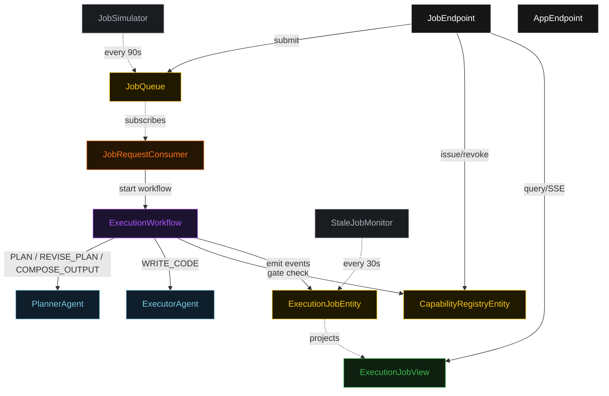
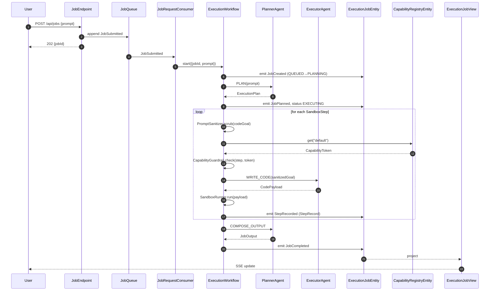
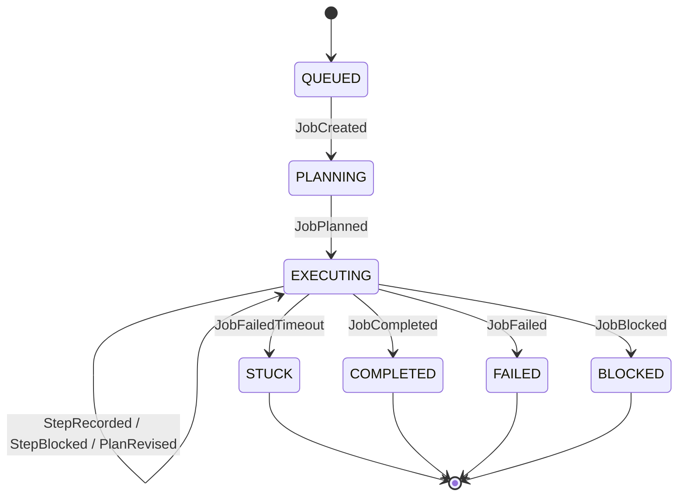
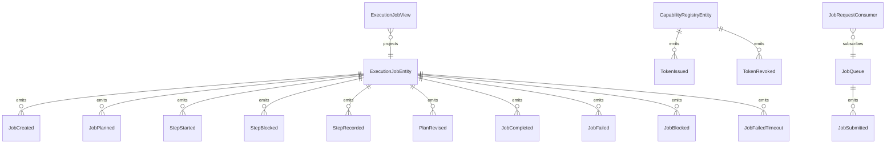

# PLAN — code-mode-sandbox

Architectural sketch consumed by `/akka:plan` (or skipped if `/akka:specify` covers it). Diagrams render on the generated system's Architecture tab.

---

## Component graph

## Interaction sequence — J1 (happy path)

## State machine — `ExecutionJobEntity`

## Entity model

## Component table — Java file targets

| Component | Path (generated) |
|---|---|
| `PlannerAgent` | `application/PlannerAgent.java` |
| `ExecutorAgent` | `application/ExecutorAgent.java` |
| `ExecutionWorkflow` | `application/ExecutionWorkflow.java` |
| `ExecutionJobEntity` | `application/ExecutionJobEntity.java` (state in `domain/ExecutionJob.java`, events in `domain/JobEvent.java`) |
| `CapabilityRegistryEntity` | `application/CapabilityRegistryEntity.java` |
| `JobQueue` | `application/JobQueue.java` |
| `ExecutionJobView` | `application/ExecutionJobView.java` |
| `JobRequestConsumer` | `application/JobRequestConsumer.java` |
| `JobSimulator` | `application/JobSimulator.java` |
| `StaleJobMonitor` | `application/StaleJobMonitor.java` |
| `PromptSanitizer` | `application/PromptSanitizer.java` |
| `CapabilityGuardrail` | `application/CapabilityGuardrail.java` |
| `SandboxRunner` | `application/SandboxRunner.java` |
| `PlannerTasks` | `application/PlannerTasks.java` |
| `ExecutorTasks` | `application/ExecutorTasks.java` |
| `JobEndpoint` | `api/JobEndpoint.java` |
| `AppEndpoint` | `api/AppEndpoint.java` |
| Bootstrap | `Bootstrap.java` |

## Concurrency notes

- **Workflow step timeouts:** `planStep` 60 s, `revisePlanStep` 45 s, `sanitizePromptStep` 5 s, `gateStep` 10 s, `executeStep` 90 s (covers executor call + sandbox run), `decideStep` 30 s, `composeStep` 60 s. Default recovery: `maxRetries(2).failoverTo(ExecutionWorkflow::error)`.
- **Replan budget:** the Planner may emit a revised plan at most twice without a successful step in between; a third consecutive revision is treated as a job failure.
- **Failure budget:** the executor may retry the same `(ordinal, codeGoal)` at most three times; a fourth attempt is treated as a step failure leading to job failure.
- **Gate poll:** every `gateStep` reads `CapabilityRegistryEntity.get("default")` synchronously — no caching. A token revoked while a step is in `executeStep` is caught on the next loop iteration.
- **Idempotency:** `JobEndpoint.submit` uses `(prompt, requestedBy)` over a 10 s window to deduplicate `POST /api/jobs`.
- **Stuck detection:** `StaleJobMonitor` ticks every 30 s; `JobFailedTimeout` is non-fatal to other jobs. The workflow's `decideStep` checks the entity's status and exits if it reads `STUCK`.
- **Sanitizer determinism:** `PromptSanitizer.scrub` is pure and never inspects external state. The same codeGoal always yields the same sanitized string, keeping `StepRecord` events deterministic and replayable.
