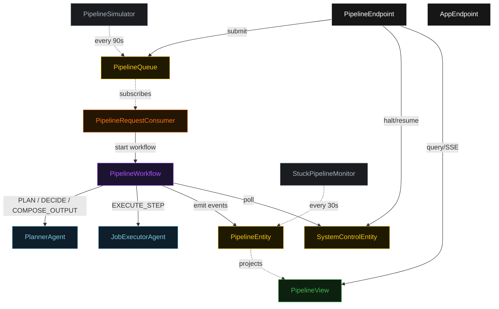
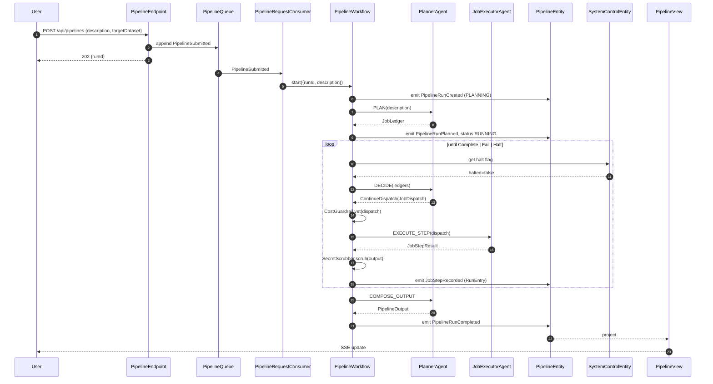
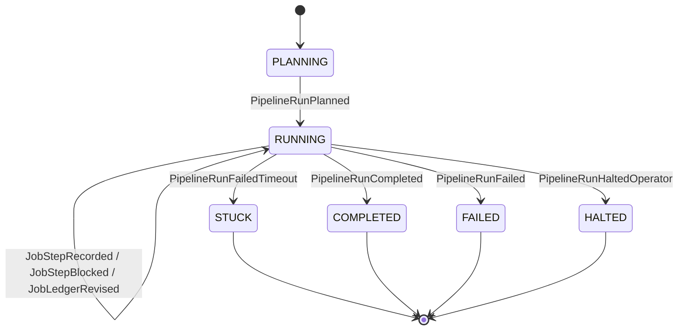
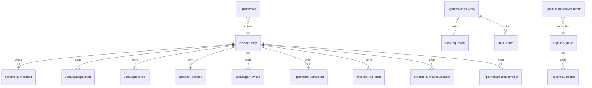

# PLAN — data-processing-planner

Architectural sketch consumed by `/akka:plan` (or skipped if `/akka:specify` covers it). Diagrams render on the generated system's Architecture tab.

---

## Component graph

## Interaction sequence — J1 (happy path)

## State machine — `PipelineEntity`

## Entity model

## Component table — Java file targets

| Component | Path (generated) |
|---|---|
| `PlannerAgent` | `application/PlannerAgent.java` |
| `JobExecutorAgent` | `application/JobExecutorAgent.java` |
| `PipelineWorkflow` | `application/PipelineWorkflow.java` |
| `PipelineEntity` | `application/PipelineEntity.java` (state in `domain/PipelineRun.java`, events in `domain/PipelineEvent.java`) |
| `SystemControlEntity` | `application/SystemControlEntity.java` |
| `PipelineQueue` | `application/PipelineQueue.java` |
| `PipelineView` | `application/PipelineView.java` |
| `PipelineRequestConsumer` | `application/PipelineRequestConsumer.java` |
| `PipelineSimulator` | `application/PipelineSimulator.java` |
| `StuckPipelineMonitor` | `application/StuckPipelineMonitor.java` |
| `CostGuardrail` | `application/CostGuardrail.java` |
| `SecretScrubber` | `application/SecretScrubber.java` |
| `PlannerTasks` | `application/PlannerTasks.java` |
| `ExecutorTasks` | `application/ExecutorTasks.java` |
| `PipelineEndpoint` | `api/PipelineEndpoint.java` |
| `AppEndpoint` | `api/AppEndpoint.java` |
| Bootstrap | `Bootstrap.java` |

## Concurrency notes

- **Workflow step timeouts:** `planStep` 60 s, `proposeStep` 45 s, `executeStep` 180 s (covers job simulation plus generous slack for slow LLM), `decideStep` 45 s, `composeOutputStep` 60 s. Default recovery: `maxRetries(2).failoverTo(PipelineWorkflow::error)`.
- **Replan budget:** the planner may emit `RevisePlan` at most twice in a row without a `ContinueDispatch` in between; a third consecutive `RevisePlan` is treated as `Fail`.
- **Failure budget:** the planner may emit `ContinueDispatch` on the same `(engine, stepSpec)` at most two times; a third attempt is treated as `Fail`.
- **Halt poll:** every `checkHaltStep` reads `SystemControlEntity.get` synchronously — no caching. An operator halt arriving during an `executeStep` lets the in-flight step finish; the loop exits at the next `checkHaltStep`.
- **Idempotency:** `PipelineEndpoint.submit` uses `(description, targetDataset, requestedBy)` over a 10 s window to dedupe `POST /api/pipelines`.
- **Stuck detection:** `StuckPipelineMonitor` ticks every 30 s; runs `RUNNING` for > 8 minutes are marked `STUCK`. The workflow's `decideStep` checks the entity's status and exits if it reads `STUCK`.
- **Sanitizer determinism:** `SecretScrubber.scrub` is pure; the same input always yields the same scrubbed output, keeping `RunEntry` events deterministic and replayable.
