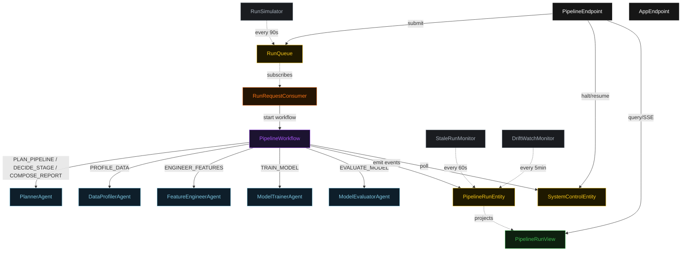
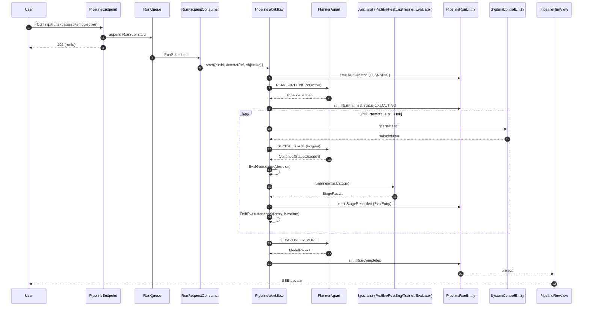
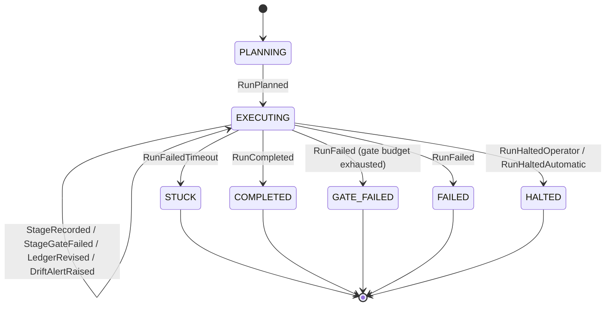
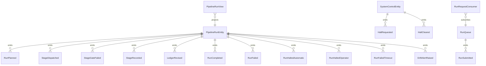

# PLAN — mle-pipeline

Architectural sketch consumed by `/akka:plan` (or skipped if `/akka:specify` covers it). Diagrams render on the generated system's Architecture tab.

---

## Component graph

## Interaction sequence — J1 (happy path)

## State machine — `PipelineRunEntity`

## Entity model

## Component table — Java file targets

| Component | Path (generated) |
|---|---|
| `PlannerAgent` | `application/PlannerAgent.java` |
| `DataProfilerAgent` | `application/DataProfilerAgent.java` |
| `FeatureEngineerAgent` | `application/FeatureEngineerAgent.java` |
| `ModelTrainerAgent` | `application/ModelTrainerAgent.java` |
| `ModelEvaluatorAgent` | `application/ModelEvaluatorAgent.java` |
| `PipelineWorkflow` | `application/PipelineWorkflow.java` |
| `PipelineRunEntity` | `application/PipelineRunEntity.java` (state in `domain/PipelineRun.java`, events in `domain/RunEvent.java`) |
| `SystemControlEntity` | `application/SystemControlEntity.java` |
| `RunQueue` | `application/RunQueue.java` |
| `PipelineRunView` | `application/PipelineRunView.java` |
| `RunRequestConsumer` | `application/RunRequestConsumer.java` |
| `RunSimulator` | `application/RunSimulator.java` |
| `StaleRunMonitor` | `application/StaleRunMonitor.java` |
| `DriftWatchMonitor` | `application/DriftWatchMonitor.java` |
| `EvalGate` | `application/EvalGate.java` |
| `DriftEvaluator` | `application/DriftEvaluator.java` |
| `PlannerTasks` | `application/PlannerTasks.java` |
| `SpecialistTasks` | `application/SpecialistTasks.java` |
| `PipelineEndpoint` | `api/PipelineEndpoint.java` |
| `AppEndpoint` | `api/AppEndpoint.java` |
| Bootstrap | `Bootstrap.java` |

## Concurrency notes

- **Workflow step timeouts:** `planStep` 60 s, `proposeStep` 45 s, `dispatchStep` 120 s (covers any specialist call), `decideStep` 45 s, `promoteStep` 60 s. Default recovery: `maxRetries(2).failoverTo(PipelineWorkflow::error)`.
- **Replan budget:** the planner may emit `Replan` at most three times in a row without a `Continue`; a fourth consecutive `Replan` is treated as `Fail`.
- **Gate budget:** the workflow tolerates at most two consecutive `StageGateFailed` records; a third triggers the Planner's `Fail` path.
- **Halt poll:** every `checkHaltStep` reads `SystemControlEntity.get` synchronously — no caching. An operator halt arriving during a `dispatchStep` lets the in-flight stage finish; the loop exits at the next `checkHaltStep`.
- **Idempotency:** `PipelineEndpoint.submit` dedupes `POST /api/runs` by `(datasetRef, objective)` over a 10 s window.
- **Stuck detection:** `StaleRunMonitor` ticks every 60 s; tasks `EXECUTING` for > 10 minutes are marked `STUCK`. The workflow's `decideStep` checks entity status and exits if it reads `STUCK`.
- **Drift evaluation determinism:** `DriftEvaluator.check` is pure; the same `(MetricBundle, baseline)` pair always produces the same alerts, keeping `DriftAlertRaised` events deterministic and replayable.
