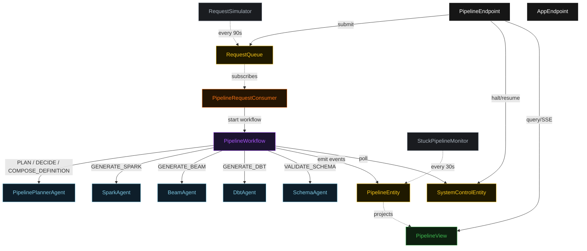
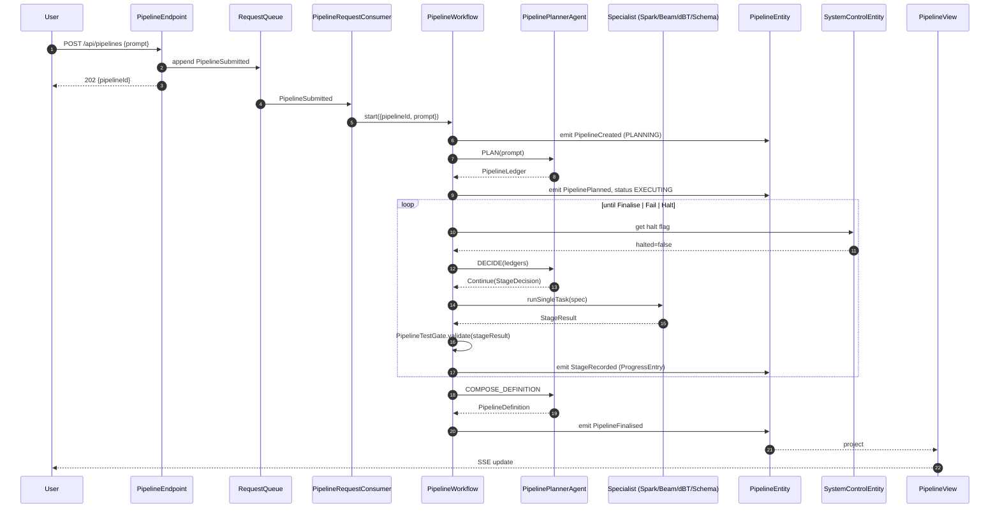
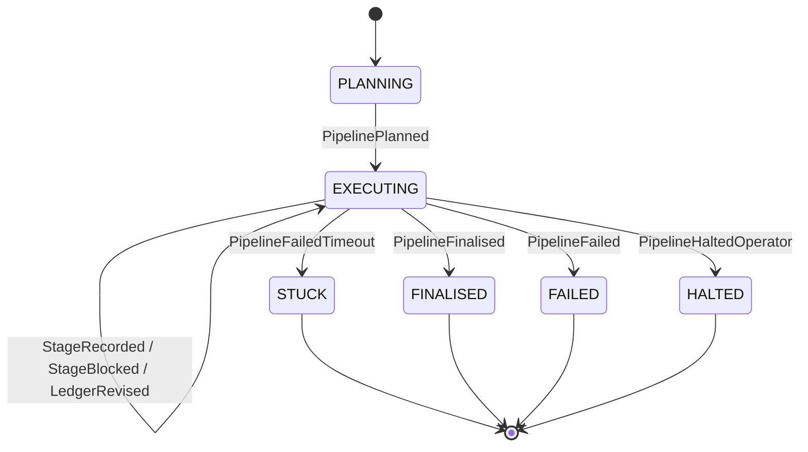
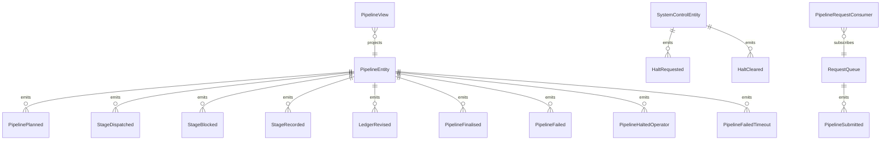

# PLAN — plumber-data-engineering-assistant

Architectural sketch consumed by `/akka:plan` (or skipped if `/akka:specify` covers it). Diagrams render on the generated system's Architecture tab.

---

## Component graph

## Interaction sequence — J1 (happy path)

## State machine — `PipelineEntity`

## Entity model

## Component table — Java file targets

| Component | Path (generated) |
|---|---|
| `PipelinePlannerAgent` | `application/PipelinePlannerAgent.java` |
| `SparkAgent` | `application/SparkAgent.java` |
| `BeamAgent` | `application/BeamAgent.java` |
| `DbtAgent` | `application/DbtAgent.java` |
| `SchemaAgent` | `application/SchemaAgent.java` |
| `PipelineWorkflow` | `application/PipelineWorkflow.java` |
| `PipelineEntity` | `application/PipelineEntity.java` (state in `domain/Pipeline.java`, events in `domain/PipelineEvent.java`) |
| `SystemControlEntity` | `application/SystemControlEntity.java` |
| `RequestQueue` | `application/RequestQueue.java` |
| `PipelineView` | `application/PipelineView.java` |
| `PipelineRequestConsumer` | `application/PipelineRequestConsumer.java` |
| `RequestSimulator` | `application/RequestSimulator.java` |
| `StuckPipelineMonitor` | `application/StuckPipelineMonitor.java` |
| `PipelineTestGate` | `application/PipelineTestGate.java` |
| `SecretScrubber` | `application/SecretScrubber.java` |
| `PlannerTasks` | `application/PlannerTasks.java` |
| `EngineTasks` | `application/EngineTasks.java` |
| `PipelineEndpoint` | `api/PipelineEndpoint.java` |
| `AppEndpoint` | `api/AppEndpoint.java` |
| Bootstrap | `Bootstrap.java` |

## Concurrency notes

- **Workflow step timeouts:** `planStep` 60 s, `proposeStep` 45 s, `dispatchStep` 120 s (generous slack for a slow LLM), `testGateStep` 30 s, `decideStep` 45 s, `composeDefinitionStep` 60 s. Default recovery: `maxRetries(2).failoverTo(PipelineWorkflow::error)`.
- **Replan budget:** the planner may emit `Replan` at most twice in a row without a `Continue` in between; a third consecutive `Replan` is treated as `Fail`.
- **Failure budget:** the planner may emit `Continue` on the same `(engine, stageKind)` at most three times; a fourth attempt is treated as `Fail`.
- **Halt poll:** every `checkHaltStep` reads `SystemControlEntity.get` synchronously — no caching. An operator halt arriving during a `dispatchStep` lets the in-flight stage finish; the loop exits at the next `checkHaltStep`.
- **Idempotency:** `PipelineEndpoint.submit` uses `(prompt, requestedBy)` over a 10 s window to dedupe `POST /api/pipelines`.
- **Stuck detection:** `StuckPipelineMonitor` ticks every 30 s; `PipelineFailedTimeout` is non-fatal to other pipelines. The workflow's `decideStep` checks the entity's status and exits when it reads `STUCK`.
- **Secret scrubber determinism:** `SecretScrubber.scrub` is pure; the same input always yields the same output, keeping `ProgressEntry` events deterministic and replayable.
