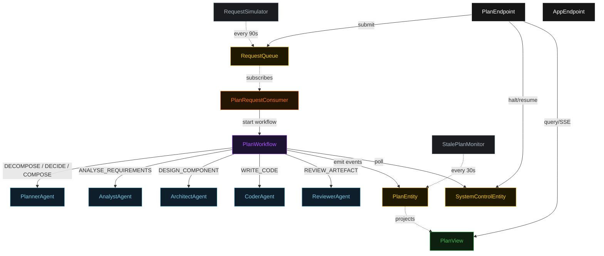
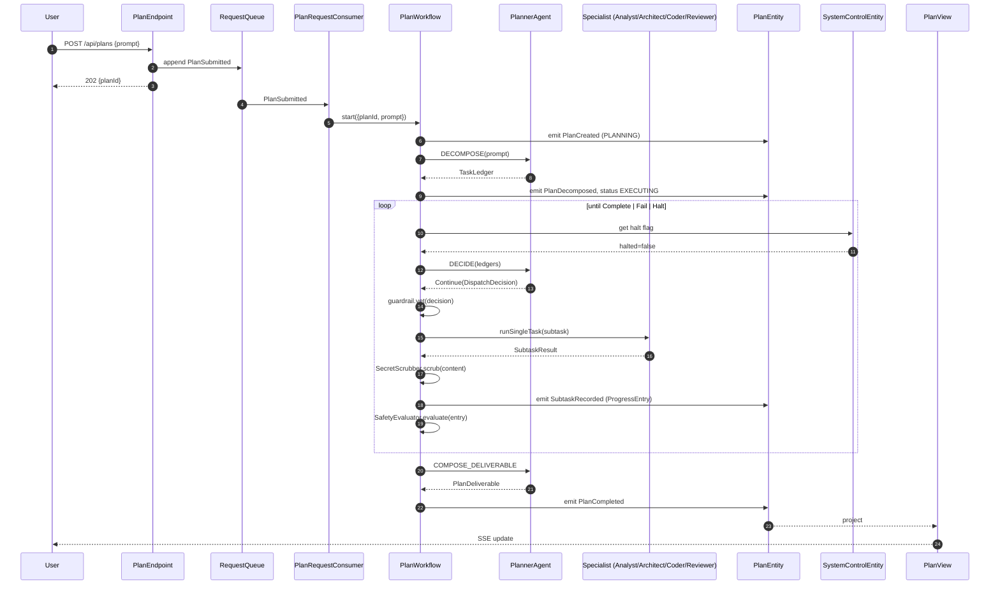
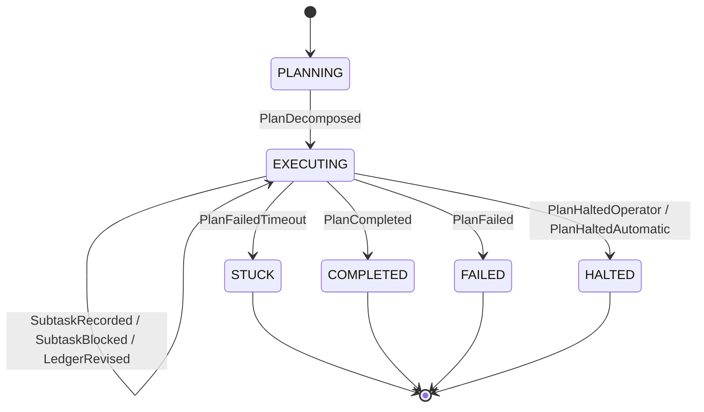
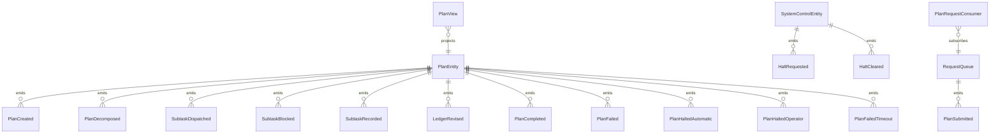

# PLAN — sdlc-task-planner

Architectural sketch consumed by `/akka:plan` (or skipped if `/akka:specify` covers it). Diagrams render on the generated system's Architecture tab.

---

## Component graph

## Interaction sequence — J1 (happy path)

## State machine — `PlanEntity`

## Entity model

## Component table — Java file targets

| Component | Path (generated) |
|---|---|
| `PlannerAgent` | `application/PlannerAgent.java` |
| `AnalystAgent` | `application/AnalystAgent.java` |
| `ArchitectAgent` | `application/ArchitectAgent.java` |
| `CoderAgent` | `application/CoderAgent.java` |
| `ReviewerAgent` | `application/ReviewerAgent.java` |
| `PlanWorkflow` | `application/PlanWorkflow.java` |
| `PlanEntity` | `application/PlanEntity.java` (state in `domain/Plan.java`, events in `domain/PlanEvent.java`) |
| `SystemControlEntity` | `application/SystemControlEntity.java` |
| `RequestQueue` | `application/RequestQueue.java` |
| `PlanView` | `application/PlanView.java` |
| `PlanRequestConsumer` | `application/PlanRequestConsumer.java` |
| `RequestSimulator` | `application/RequestSimulator.java` |
| `StalePlanMonitor` | `application/StalePlanMonitor.java` |
| `DispatchGuardrail` | `application/DispatchGuardrail.java` |
| `SecretScrubber` | `application/SecretScrubber.java` |
| `SafetyEvaluator` | `application/SafetyEvaluator.java` |
| `PlannerTasks` | `application/PlannerTasks.java` |
| `SpecialistTasks` | `application/SpecialistTasks.java` |
| `PlanEndpoint` | `api/PlanEndpoint.java` |
| `AppEndpoint` | `api/AppEndpoint.java` |
| Bootstrap | `Bootstrap.java` |

## Concurrency notes

- **Workflow step timeouts:** `decomposeStep` 60 s, `proposeStep` 45 s, `dispatchStep` 120 s (covers any specialist call, including a generous slack for a slow LLM), `decideStep` 45 s, `completeStep` 60 s. Default recovery: `maxRetries(2).failoverTo(PlanWorkflow::error)`.
- **Replan budget:** the planner may emit `Replan` at most twice in a row without a `Continue` in between; a third consecutive `Replan` is treated as `Fail`.
- **Failure budget:** the planner may emit `Continue` on the same `(specialist, subtask)` at most three times; a fourth attempt is treated as `Fail`.
- **Halt poll:** every `checkHaltStep` reads `SystemControlEntity.get` synchronously — no caching. An operator halt arriving during a `dispatchStep` lets the in-flight sub-task finish; the loop exits at the next `checkHaltStep`.
- **Idempotency:** `PlanEndpoint.submit` uses `(prompt, requestedBy)` over a 10 s window to dedupe `POST /api/plans`.
- **Stuck detection:** `StalePlanMonitor` ticks every 30 s; `PlanFailedTimeout` is non-fatal to other plans. The workflow's `decideStep` checks the entity's status and exits if it reads `STUCK`.
- **Sanitizer determinism:** `SecretScrubber.scrub` is pure; it never inspects external state. The same input always yields the same scrubbed output, keeping `ProgressEntry` events deterministic and replayable.
