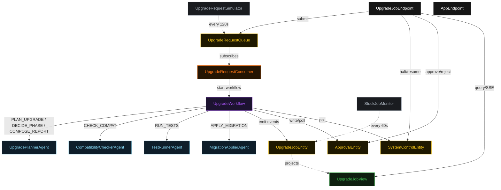
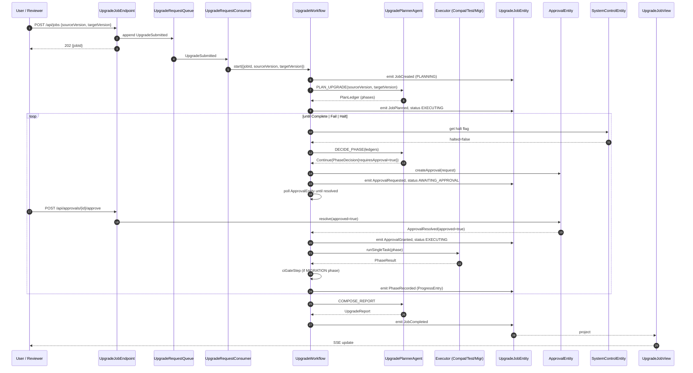
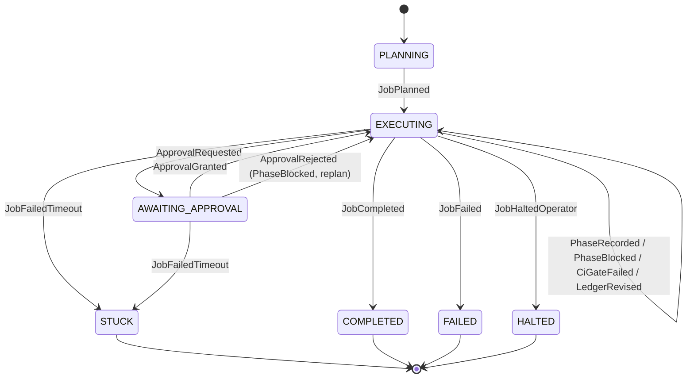
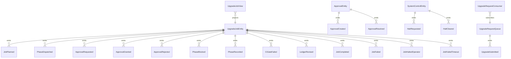

# PLAN — version-upgrade-planner

Architectural sketch consumed by `/akka:plan`. Diagrams render on the generated system's Architecture tab.

---

## Component graph

## Interaction sequence — J1 (happy path with approval gate)

## State machine — `UpgradeJobEntity`

## Entity model

## Component table — Java file targets

| Component | Path (generated) |
|---|---|
| `UpgradePlannerAgent` | `application/UpgradePlannerAgent.java` |
| `CompatibilityCheckerAgent` | `application/CompatibilityCheckerAgent.java` |
| `TestRunnerAgent` | `application/TestRunnerAgent.java` |
| `MigrationApplierAgent` | `application/MigrationApplierAgent.java` |
| `UpgradeWorkflow` | `application/UpgradeWorkflow.java` |
| `UpgradeJobEntity` | `application/UpgradeJobEntity.java` (state in `domain/UpgradeJob.java`, events in `domain/UpgradeJobEvent.java`) |
| `ApprovalEntity` | `application/ApprovalEntity.java` |
| `SystemControlEntity` | `application/SystemControlEntity.java` |
| `UpgradeRequestQueue` | `application/UpgradeRequestQueue.java` |
| `UpgradeJobView` | `application/UpgradeJobView.java` |
| `UpgradeRequestConsumer` | `application/UpgradeRequestConsumer.java` |
| `UpgradeRequestSimulator` | `application/UpgradeRequestSimulator.java` |
| `StuckJobMonitor` | `application/StuckJobMonitor.java` |
| `PlannerTasks` | `application/PlannerTasks.java` |
| `ExecutorTasks` | `application/ExecutorTasks.java` |
| `UpgradeJobEndpoint` | `api/UpgradeJobEndpoint.java` |
| `AppEndpoint` | `api/AppEndpoint.java` |
| Bootstrap | `Bootstrap.java` |

## Concurrency notes

- **Workflow step timeouts:** `planStep` 90 s, `plannerDecideStep` 60 s, `approvalGateStep` 3600 s (human response window), `dispatchStep` 180 s, `ciGateStep` 120 s, `composeReportStep` 60 s.
- **Approval gate:** the `approvalGateStep` polls `ApprovalEntity.get` in a bounded retry loop with back-off. The 3600 s step timeout is the outer bound; the `StuckJobMonitor` catches jobs that exceed 10 minutes of combined wall-clock `EXECUTING`+`AWAITING_APPROVAL` time.
- **Replan budget:** the planner may emit `Replan` at most twice in a row without a `Continue` in between; a third consecutive `Replan` is treated as `Fail`.
- **Failure budget:** at most three consecutive attempts on the same `(executor, phaseId)` pair; a fourth becomes `Fail`.
- **CI gate:** non-blocking on first failure — the gate appends `CiGateFailed` and returns to the planner rather than terminating immediately. The planner may add a rollback phase.
- **Halt poll:** every `checkHaltStep` reads `SystemControlEntity.get` synchronously; an operator halt mid-phase lets the phase finish.
- **Stuck detection:** `StuckJobMonitor` ticks every 60 s; `AWAITING_APPROVAL` jobs count toward the 10-minute threshold.
