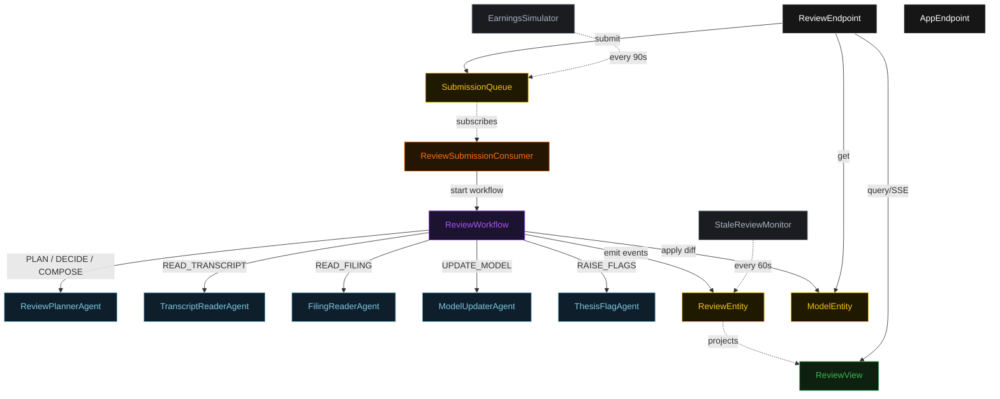
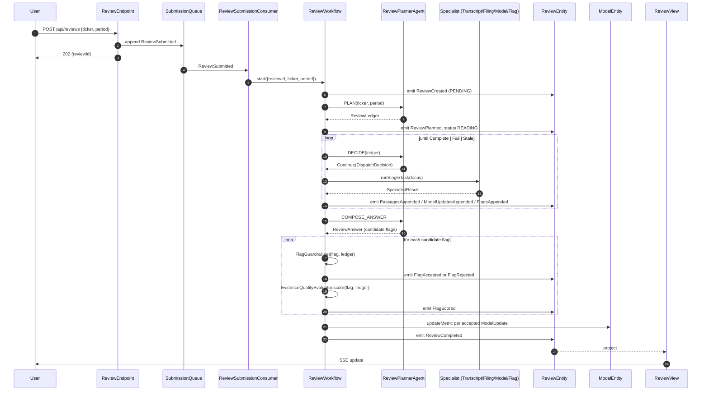
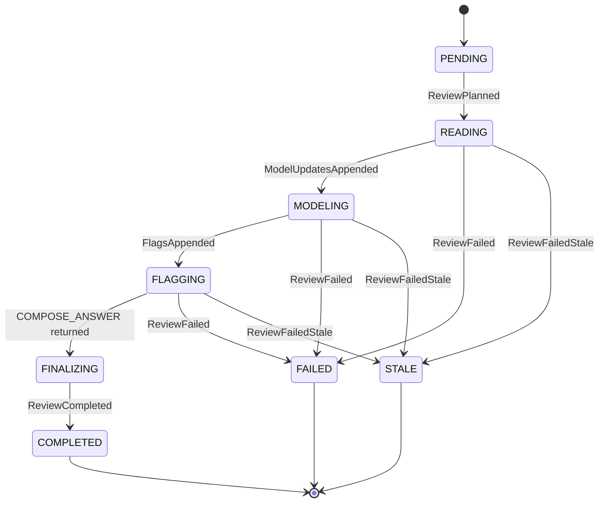
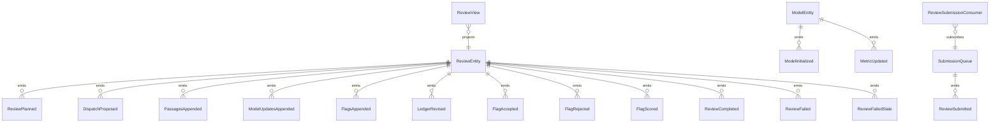

# PLAN — earnings-reviewer

Architectural sketch consumed by `/akka:plan` (or skipped if `/akka:specify` covers it). Diagrams render on the generated system's Architecture tab.

---

## Component graph

## Interaction sequence — J1 (happy path)

## State machine — `ReviewEntity`

## Entity model

## Component table — Java file targets

| Component | Path (generated) |
|---|---|
| `ReviewPlannerAgent` | `application/ReviewPlannerAgent.java` |
| `TranscriptReaderAgent` | `application/TranscriptReaderAgent.java` |
| `FilingReaderAgent` | `application/FilingReaderAgent.java` |
| `ModelUpdaterAgent` | `application/ModelUpdaterAgent.java` |
| `ThesisFlagAgent` | `application/ThesisFlagAgent.java` |
| `ReviewWorkflow` | `application/ReviewWorkflow.java` |
| `ReviewEntity` | `application/ReviewEntity.java` (state in `domain/Review.java`, events in `domain/ReviewEvent.java`) |
| `ModelEntity` | `application/ModelEntity.java` |
| `SubmissionQueue` | `application/SubmissionQueue.java` |
| `ReviewView` | `application/ReviewView.java` |
| `ReviewSubmissionConsumer` | `application/ReviewSubmissionConsumer.java` |
| `EarningsSimulator` | `application/EarningsSimulator.java` |
| `StaleReviewMonitor` | `application/StaleReviewMonitor.java` |
| `FlagGuardrail` | `application/FlagGuardrail.java` |
| `EvidenceQualityEvaluator` | `application/EvidenceQualityEvaluator.java` |
| `PlannerTasks` | `application/PlannerTasks.java` |
| `SpecialistTasks` | `application/SpecialistTasks.java` |
| `ReviewEndpoint` | `api/ReviewEndpoint.java` |
| `AppEndpoint` | `api/AppEndpoint.java` |
| Bootstrap | `Bootstrap.java` |

## Mermaid theme overrides (Lesson 24)

The generated `static-resources/index.html` includes the Akka theme variables AND CSS overrides — `transitionLabelColor #cccccc`, edge-label `foreignObject { overflow: visible }`, and explicit text colours on state-diagram nodes. Without these the state machine above renders unreadable.

## Concurrency notes

- **Workflow step timeouts:** `planStep` 60 s, `proposeStep` 45 s, `dispatchStep` 120 s, `decideStep` 45 s, `finalizeStep` 60 s, `completeStep` 60 s. Default recovery: `maxRetries(2).failoverTo(ReviewWorkflow::error)`.
- **Replan budget:** the planner may emit `Replan` at most twice in a row without a `Continue` in between; a third consecutive `Replan` becomes `Fail`.
- **Failure budget:** the planner may emit `Continue` on the same `(specialist, focus)` at most three times; a fourth becomes `Fail`.
- **Guardrail revise opportunity:** if every candidate flag is rejected by the guardrail, the planner is given one — and only one — opportunity to revise the candidate list. A second rejection sequence ends the review with empty `acceptedFlags`.
- **Idempotency:** `ReviewEndpoint.submit` deduplicates `(ticker, period, submittedBy)` over a 30 s window.
- **Stale detection:** `StaleReviewMonitor` ticks every 60 s; reviews in non-terminal states for > 5 minutes are marked `STALE`. The workflow's `decideStep` checks the entity status and exits if it reads `STALE`.
- **Model write fence:** `ModelEntity.updateMetric` runs only inside `applyModelStep`, after the guardrail and eval have cleared. A failed review never touches the model.
- **Determinism:** `FlagGuardrail.vet` and `EvidenceQualityEvaluator.score` are pure functions of the flag plus the ledger; the same input always yields the same verdict and score, which keeps the resulting `FlagAccepted` / `FlagRejected` / `FlagScored` events replayable.
