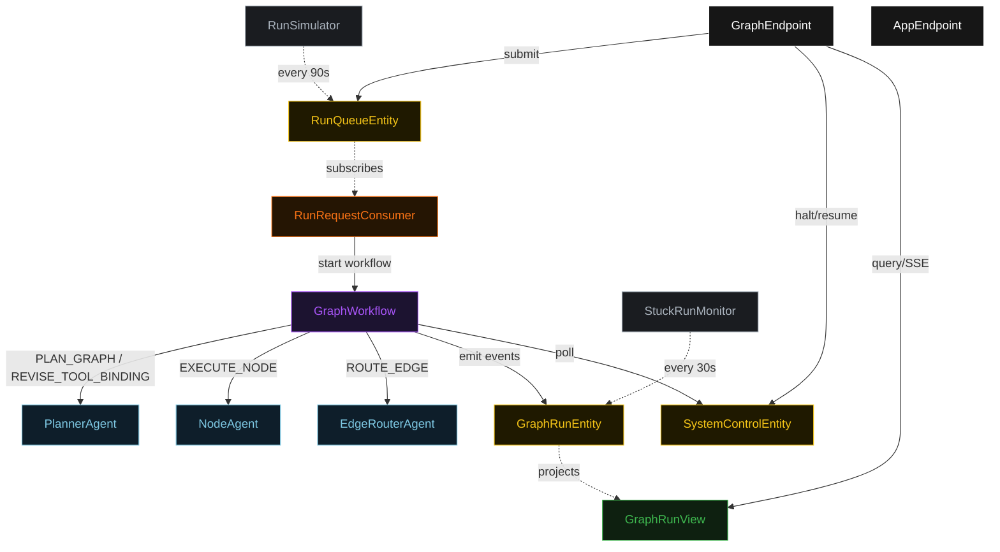
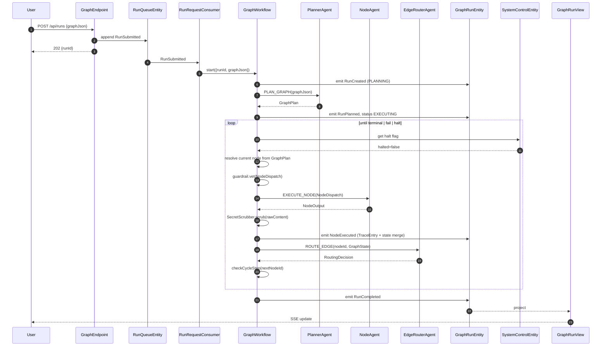
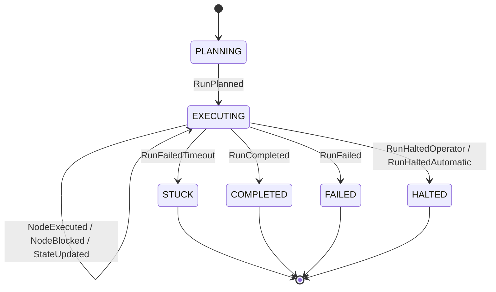
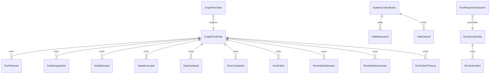

# PLAN — akka-stategraph-bridge

Architectural sketch consumed by `/akka:plan` (or skipped if `/akka:specify` covers it). Diagrams render on the generated system's Architecture tab.

---

## Component graph

## Interaction sequence — J1 (happy path)

## State machine — `GraphRunEntity`

## Entity model

## Component table — Java file targets

| Component | Path (generated) |
|---|---|
| `PlannerAgent` | `application/PlannerAgent.java` |
| `NodeAgent` | `application/NodeAgent.java` |
| `EdgeRouterAgent` | `application/EdgeRouterAgent.java` |
| `GraphWorkflow` | `application/GraphWorkflow.java` |
| `GraphRunEntity` | `application/GraphRunEntity.java` (state in `domain/GraphRun.java`, events in `domain/GraphRunEvent.java`) |
| `SystemControlEntity` | `application/SystemControlEntity.java` |
| `RunQueueEntity` | `application/RunQueueEntity.java` |
| `GraphRunView` | `application/GraphRunView.java` |
| `RunRequestConsumer` | `application/RunRequestConsumer.java` |
| `RunSimulator` | `application/RunSimulator.java` |
| `StuckRunMonitor` | `application/StuckRunMonitor.java` |
| `ToolCallGuardrail` | `application/ToolCallGuardrail.java` |
| `SecretScrubber` | `application/SecretScrubber.java` |
| `PlannerTasks` | `application/PlannerTasks.java` |
| `NodeTasks` | `application/NodeTasks.java` |
| `GraphEndpoint` | `api/GraphEndpoint.java` |
| `AppEndpoint` | `api/AppEndpoint.java` |
| Bootstrap | `Bootstrap.java` |

## Concurrency notes

- **Workflow step timeouts:** `planStep` 60 s, `executeNodeStep` 120 s (covers agent call + fixture lookup), `routeStep` 45 s, `completeStep` 60 s. Default recovery: `maxRetries(2).failoverTo(GraphWorkflow::error)`.
- **Cycle budget:** each `NodeDef.maxVisits` is declared in the graph definition (default 3). `checkCycleStep` increments a per-node visit map held in workflow-local state; exceeding the limit transitions to `failStep`.
- **Guardrail revision budget:** the planner may attempt `REVISE_TOOL_BINDING` at most twice per blocked node; a third block on the same node transitions to `failStep`.
- **Halt poll:** every `checkHaltStep` reads `SystemControlEntity.get` synchronously — no caching. An operator halt arriving during `executeNodeStep` lets the in-flight node finish; the loop exits at the next `checkHaltStep`.
- **Idempotency:** `GraphEndpoint.submit` deduplicates `POST /api/runs` by `(graphJson hash, requestedBy)` over a 10 s window.
- **Stuck detection:** `StuckRunMonitor` ticks every 30 s; `RunFailedTimeout` is non-fatal to other runs. The workflow's `decideStep` checks entity status and exits when it reads `STUCK`.
- **Sanitizer determinism:** `SecretScrubber.scrub` is pure and stateless; identical input always yields identical scrubbed output, keeping `NodeExecuted` events deterministic and replayable.
