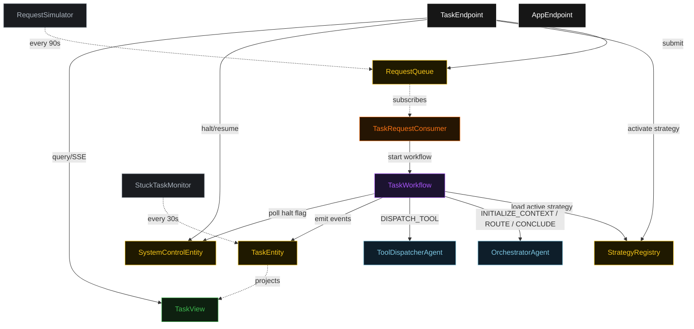
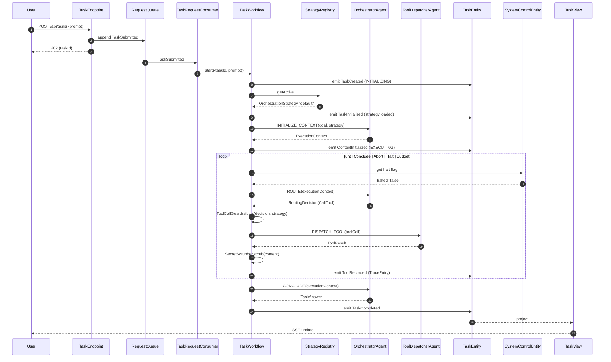
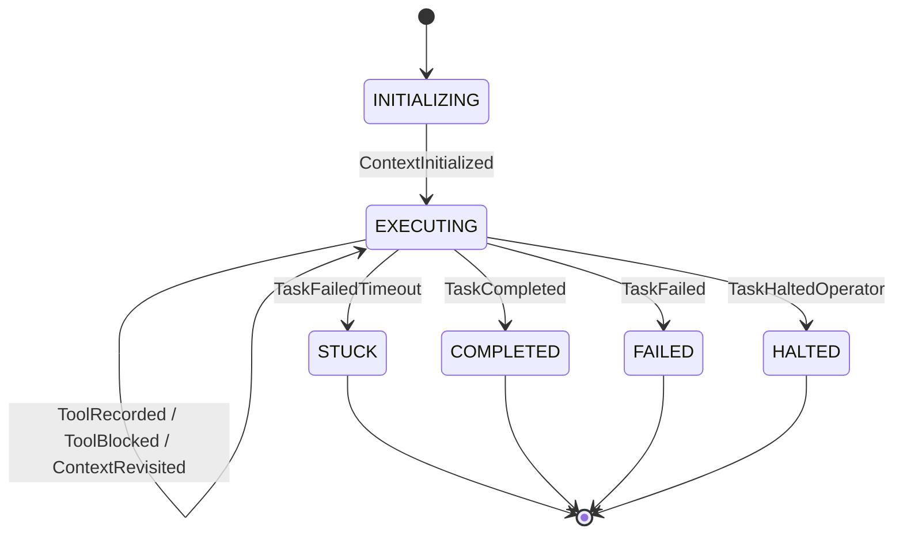
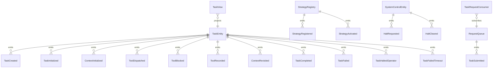

# PLAN — custom-orchestration-agent

Architectural sketch consumed by `/akka:plan` (or skipped if `/akka:specify` covers it). Diagrams render on the generated system's Architecture tab.

---

## Component graph

## Interaction sequence — J1 (happy path)

## State machine — `TaskEntity`

## Entity model

## Component table — Java file targets

| Component | Path (generated) |
|---|---|
| `OrchestratorAgent` | `application/OrchestratorAgent.java` |
| `ToolDispatcherAgent` | `application/ToolDispatcherAgent.java` |
| `TaskWorkflow` | `application/TaskWorkflow.java` |
| `TaskEntity` | `application/TaskEntity.java` (state in `domain/Task.java`, events in `domain/TaskEvent.java`) |
| `StrategyRegistry` | `application/StrategyRegistry.java` |
| `SystemControlEntity` | `application/SystemControlEntity.java` |
| `RequestQueue` | `application/RequestQueue.java` |
| `TaskView` | `application/TaskView.java` |
| `TaskRequestConsumer` | `application/TaskRequestConsumer.java` |
| `RequestSimulator` | `application/RequestSimulator.java` |
| `StuckTaskMonitor` | `application/StuckTaskMonitor.java` |
| `ToolCallGuardrail` | `application/ToolCallGuardrail.java` |
| `SecretScrubber` | `application/SecretScrubber.java` |
| `OrchestratorTasks` | `application/OrchestratorTasks.java` |
| `DispatcherTasks` | `application/DispatcherTasks.java` |
| `TaskEndpoint` | `api/TaskEndpoint.java` |
| `AppEndpoint` | `api/AppEndpoint.java` |
| Bootstrap | `Bootstrap.java` |

## Concurrency notes

- **Workflow step timeouts:** `initContextStep` 45 s, `routeStep` 45 s, `dispatchStep` 90 s, `concludeStep` 60 s. Default recovery: `maxRetries(2).failoverTo(TaskWorkflow::error)`.
- **Iteration budget:** `strategy.maxRouteIterations` caps the number of `CallTool` ticks; exceeding it transitions to `failStep` with reason `"iteration budget exhausted"`.
- **Revisit budget:** `strategy.maxRevisits` caps the number of `Revisit` decisions; exceeding it forces the next route tick to skip `Revisit` options.
- **Halt poll:** every `checkHaltStep` reads `SystemControlEntity.get` synchronously — no caching. An operator halt arriving during a `dispatchStep` lets the in-flight tool call finish; the loop exits at the next `checkHaltStep`.
- **Strategy isolation:** a `TaskWorkflow` reads the strategy once in `loadStrategyStep` and holds it in workflow state. Swapping the active strategy mid-task does not affect in-flight workflows.
- **Idempotency:** `TaskEndpoint.submit` deduplicates `(prompt, requestedBy)` over a 10 s window.
- **Stuck detection:** `StuckTaskMonitor` ticks every 30 s; tasks `EXECUTING` for > 5 minutes are marked `STUCK`.
- **Sanitizer determinism:** `SecretScrubber.scrub` is pure; the same input always yields the same scrubbed output, keeping `TraceEntry` events deterministic and replayable.
