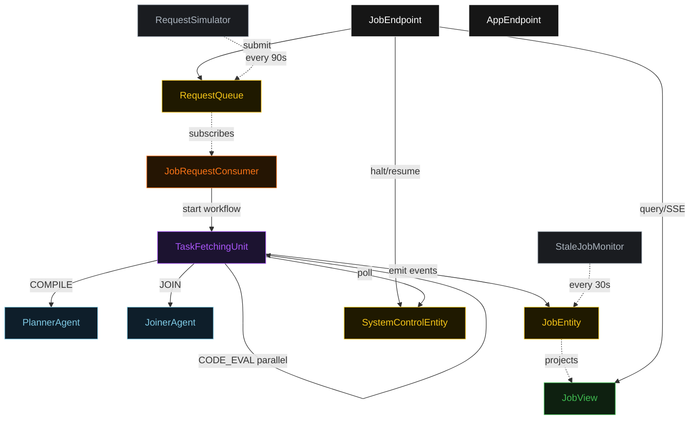
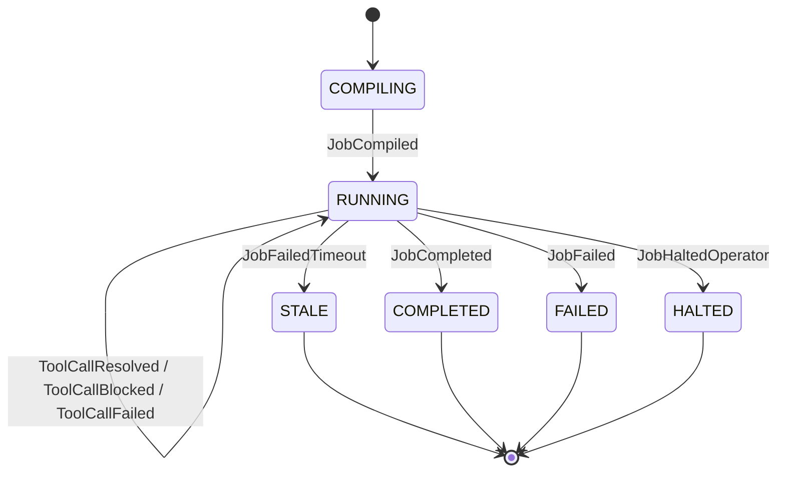
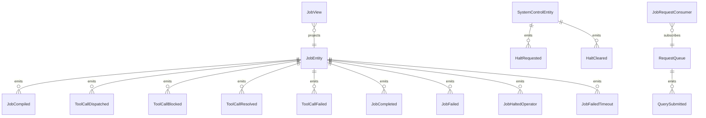

# PLAN — llm-compiler-dag

Architectural sketch consumed by `/akka:plan` (or skipped if `/akka:specify` covers it). Diagrams render on the generated system's Architecture tab.

---

## Component graph



## Interaction sequence — J1 (happy path with parallel dispatch)

```mermaid
sequenceDiagram
  autonumber
  participant U as User
  participant API as JobEndpoint
  participant Q as RequestQueue
  participant C as JobRequestConsumer
  participant W as TaskFetchingUnit
  participant P as PlannerAgent
  participant T1 as Tool Branch A
  participant T2 as Tool Branch B
  participant E as JobEntity
  participant CTL as SystemControlEntity
  participant J as JoinerAgent
  participant V as JobView

  U->>API: POST /api/jobs {query}
  API->>Q: append QuerySubmitted
  API-->>U: 202 {jobId}
  Q->>C: QuerySubmitted
  C->>W: start({jobId, query})
  W->>E: emit JobCreated (COMPILING)
  W->>P: COMPILE(query)
  P-->>W: CompilationPlan (DAG of ToolCall nodes)
  W->>E: emit JobCompiled, status RUNNING
  W->>CTL: get halt flag
  CTL-->>W: halted=false
  W->>W: guardStep.vet(frontierNodes)
  par parallel dispatch
    W->>T1: SEARCH("akka 3.6.0 release")
    W->>T2: CALCULATOR("42 * 17")
  end
  T1-->>W: ToolResult(callId=c1, ok=true)
  T2-->>W: ToolResult(callId=c2, ok=true)
  W->>W: SecretScrubber.scrub(each output)
  W->>E: emit ToolCallResolved x2
  Note over W: frontier re-evaluated; c3 depends on c1 ✓
  W->>W: guardStep.vet([c3])
  W->>T1: LOOKUP("akka-version-minor")
  T1-->>W: ToolResult(callId=c3, ok=true)
  W->>W: SecretScrubber.scrub(output)
  W->>E: emit ToolCallResolved
  Note over W: frontier empty → join
  W->>J: JOIN(ResultSet)
  J-->>W: QueryAnswer
  W->>E: emit JobCompleted
  E-->>V: project
  V-->>U: SSE update
```

## State machine — `JobEntity`



## Entity model



## Component table — Java file targets

| Component | Path (generated) |
|---|---|
| `PlannerAgent` | `application/PlannerAgent.java` |
| `JoinerAgent` | `application/JoinerAgent.java` |
| `TaskFetchingUnit` | `application/TaskFetchingUnit.java` |
| `JobEntity` | `application/JobEntity.java` (state in `domain/Job.java`, events in `domain/JobEvent.java`) |
| `SystemControlEntity` | `application/SystemControlEntity.java` |
| `RequestQueue` | `application/RequestQueue.java` |
| `JobView` | `application/JobView.java` |
| `JobRequestConsumer` | `application/JobRequestConsumer.java` |
| `RequestSimulator` | `application/RequestSimulator.java` |
| `StaleJobMonitor` | `application/StaleJobMonitor.java` |
| `DispatchGuardrail` | `application/DispatchGuardrail.java` |
| `SecretScrubber` | `application/SecretScrubber.java` |
| `PlannerTasks` | `application/PlannerTasks.java` |
| `JoinerTasks` | `application/JoinerTasks.java` |
| `JobEndpoint` | `api/JobEndpoint.java` |
| `AppEndpoint` | `api/AppEndpoint.java` |
| Bootstrap | `Bootstrap.java` |

## Concurrency notes

- **Parallel dispatch:** `parallelDispatchStep` fans out one Akka workflow branch per approved frontier node. All branches run concurrently; the step waits for the last to complete before sanitize.
- **DAG frontier rule:** a node is eligible when every id in its `dependsOn` list is present in `resolvedIds`. The frontier set is recomputed after every batch of `ToolCallResolved` events.
- **Guardrail and skipped nodes:** a `SKIPPED` node's `callId` is added to `resolvedIds` immediately so dependent nodes that do not strictly need the skipped output can still be dispatched. Dependents that required the skipped output are treated as `FAILED`.
- **Step timeouts:** `compileStep` 60 s, `guardStep` 30 s, `parallelDispatchStep` 120 s, `joinStep` 60 s. Default recovery: `maxRetries(2).failoverTo(TaskFetchingUnit::error)`.
- **Halt poll:** every `checkHaltStep` reads `SystemControlEntity.get` synchronously — no caching. An operator halt arriving during a `parallelDispatchStep` lets the entire current batch finish; the loop exits at the next `checkHaltStep`.
- **Failure budget:** if the error count for a single job exceeds 3 `ToolCallFailed` events, the workflow transitions to `failStep`.
- **Stale detection:** `StaleJobMonitor` ticks every 30 s; `JobFailedTimeout` is non-fatal to other jobs. The workflow's `frontierStep` checks the entity's status and exits when `status == STALE`.
- **Sanitizer determinism:** `SecretScrubber.scrub` is pure; the same input always yields the same scrubbed output, keeping events deterministic and replayable.
