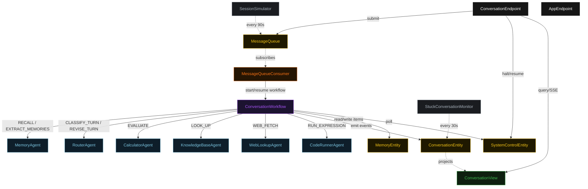
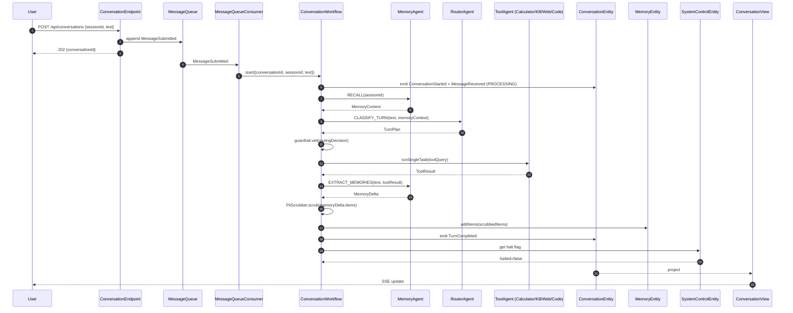
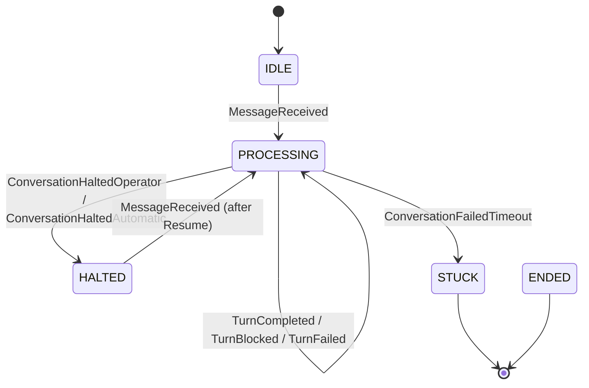
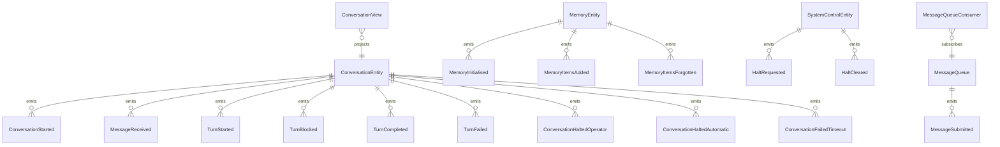

# PLAN — memory-tool-router

Architectural sketch consumed by `/akka:plan` (or skipped if `/akka:specify` covers it). Diagrams render on the generated system's Architecture tab.

---

## Component graph

## Interaction sequence — J1 (happy path)

## State machine — `ConversationEntity`

## Entity model

## Component table — Java file targets

| Component | Path (generated) |
|---|---|
| `RouterAgent` | `application/RouterAgent.java` |
| `MemoryAgent` | `application/MemoryAgent.java` |
| `CalculatorAgent` | `application/CalculatorAgent.java` |
| `KnowledgeBaseAgent` | `application/KnowledgeBaseAgent.java` |
| `WebLookupAgent` | `application/WebLookupAgent.java` |
| `CodeRunnerAgent` | `application/CodeRunnerAgent.java` |
| `ConversationWorkflow` | `application/ConversationWorkflow.java` |
| `ConversationEntity` | `application/ConversationEntity.java` (state in `domain/Conversation.java`, events in `domain/ConversationEvent.java`) |
| `MemoryEntity` | `application/MemoryEntity.java` (state in `domain/MemoryStore.java`, events in `domain/MemoryEvent.java`) |
| `SystemControlEntity` | `application/SystemControlEntity.java` |
| `MessageQueue` | `application/MessageQueue.java` |
| `ConversationView` | `application/ConversationView.java` |
| `MessageQueueConsumer` | `application/MessageQueueConsumer.java` |
| `SessionSimulator` | `application/SessionSimulator.java` |
| `StuckConversationMonitor` | `application/StuckConversationMonitor.java` |
| `ToolDispatchGuardrail` | `application/ToolDispatchGuardrail.java` |
| `PiiScrubber` | `application/PiiScrubber.java` |
| `RouterTasks` | `application/RouterTasks.java` |
| `MemoryTasks` | `application/MemoryTasks.java` |
| `ToolTasks` | `application/ToolTasks.java` |
| `ConversationEndpoint` | `api/ConversationEndpoint.java` |
| `AppEndpoint` | `api/AppEndpoint.java` |
| Bootstrap | `Bootstrap.java` |

## Concurrency notes

- **Workflow step timeouts:** `recallStep` 30 s, `routeStep` 45 s, `executeStep` 90 s (covers any tool call including a slow LLM), `extractMemoriesStep` 30 s, `replyStep` 30 s. Default recovery: `maxRetries(2).failoverTo(ConversationWorkflow::error)`.
- **Tool routing:** the workflow's `executeStep` switches on `RoutingDecision.tool`; `NONE` skips execution entirely and falls through to `extractMemoriesStep` with an empty `ToolResult`.
- **Halt poll:** every `checkHaltStep` reads `SystemControlEntity.get` synchronously — no caching. A halt arriving during `executeStep` lets the in-flight tool call finish; the loop exits at the next `checkHaltStep`.
- **Memory isolation:** `MemoryEntity` is keyed by `sessionId`, not `conversationId`. Two conversations in the same session share the same memory store; different sessions are fully isolated.
- **PII scrubber determinism:** `PiiScrubber.scrub` is pure; it never inspects external state. The same input always yields the same scrubbed output, keeping `MemoryItemsAdded` events deterministic and replayable.
- **Idempotency:** `ConversationEndpoint.submit` deduplicates on `(sessionId, text)` over a 10 s window.
- **Stuck detection:** `StuckConversationMonitor` ticks every 30 s; conversations `PROCESSING` for > 4 minutes are marked `STUCK`. The workflow's next step reads the status and exits.
