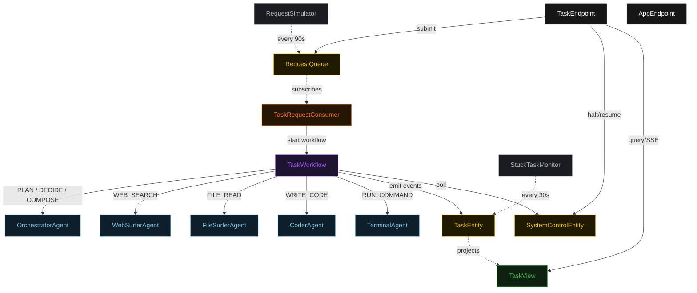
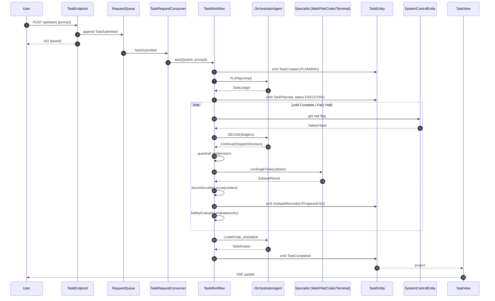
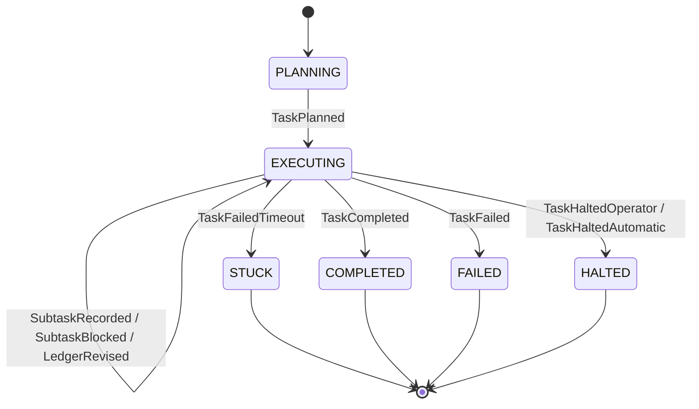
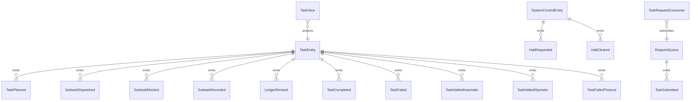

# PLAN — orchestrator-web-file-code

Architectural sketch consumed by `/akka:plan` (or skipped if `/akka:specify` covers it). Diagrams render on the generated system's Architecture tab.

---

## Component graph

## Interaction sequence — J1 (happy path)

## State machine — `TaskEntity`

## Entity model

## Component table — Java file targets

| Component | Path (generated) |
|---|---|
| `OrchestratorAgent` | `application/OrchestratorAgent.java` |
| `WebSurferAgent` | `application/WebSurferAgent.java` |
| `FileSurferAgent` | `application/FileSurferAgent.java` |
| `CoderAgent` | `application/CoderAgent.java` |
| `TerminalAgent` | `application/TerminalAgent.java` |
| `TaskWorkflow` | `application/TaskWorkflow.java` |
| `TaskEntity` | `application/TaskEntity.java` (state in `domain/Task.java`, events in `domain/TaskEvent.java`) |
| `SystemControlEntity` | `application/SystemControlEntity.java` |
| `RequestQueue` | `application/RequestQueue.java` |
| `TaskView` | `application/TaskView.java` |
| `TaskRequestConsumer` | `application/TaskRequestConsumer.java` |
| `RequestSimulator` | `application/RequestSimulator.java` |
| `StuckTaskMonitor` | `application/StuckTaskMonitor.java` |
| `DispatchGuardrail` | `application/DispatchGuardrail.java` |
| `SecretScrubber` | `application/SecretScrubber.java` |
| `SafetyEvaluator` | `application/SafetyEvaluator.java` |
| `OrchestratorTasks` | `application/OrchestratorTasks.java` |
| `SpecialistTasks` | `application/SpecialistTasks.java` |
| `TaskEndpoint` | `api/TaskEndpoint.java` |
| `AppEndpoint` | `api/AppEndpoint.java` |
| Bootstrap | `Bootstrap.java` |

## Concurrency notes

- **Workflow step timeouts:** `planStep` 60 s, `proposeStep` 45 s, `dispatchStep` 120 s (covers any specialist call, including a generous slack for a slow LLM), `decideStep` 45 s, `completeStep` 60 s. Default recovery: `maxRetries(2).failoverTo(TaskWorkflow::error)`.
- **Replan budget:** the orchestrator may emit `Replan` at most twice in a row without a `Continue` in between; a third consecutive `Replan` is treated as `Fail`.
- **Failure budget:** the orchestrator may emit `Continue` on the same `(specialist, subtask)` at most three times; a fourth attempt is treated as `Fail`.
- **Halt poll:** every `checkHaltStep` reads `SystemControlEntity.get` synchronously — no caching. An operator halt arriving during a `dispatchStep` lets the in-flight subtask finish; the loop exits at the next `checkHaltStep`.
- **Idempotency:** `TaskEndpoint.submit` uses `(prompt, requestedBy)` over a 10 s window to dedupe `POST /api/tasks`.
- **Stuck detection:** `StuckTaskMonitor` ticks every 30 s; `TaskFailedTimeout` is non-fatal to other tasks. The workflow's `decideStep` checks the entity's status and exits if it reads `STUCK`.
- **Sanitizer determinism:** `SecretScrubber.scrub` is pure; it never inspects external state. The same input always yields the same scrubbed output, which keeps `ProgressEntry` events deterministic and replayable.
