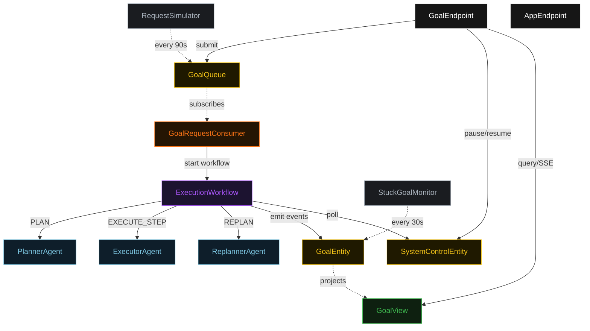
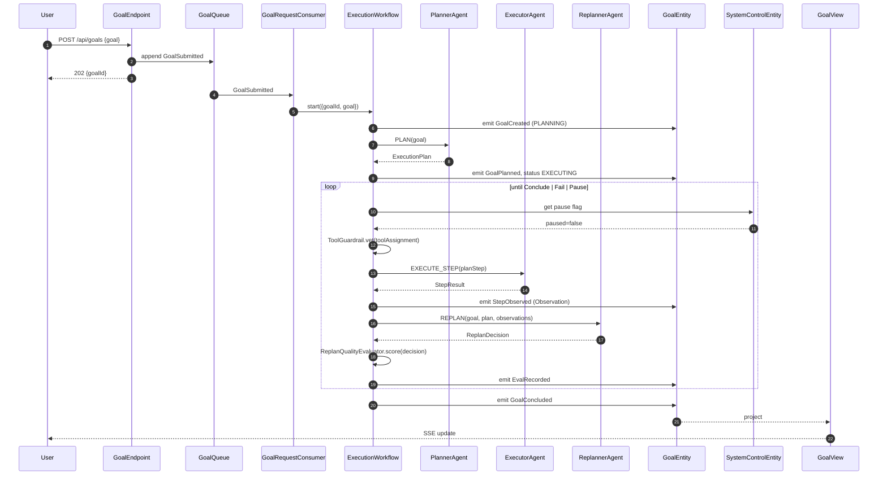
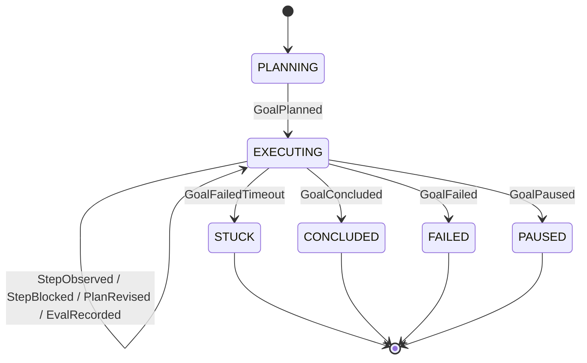
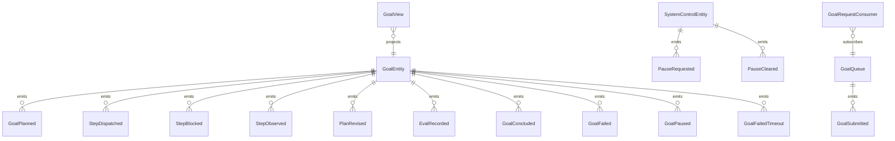

# PLAN — plan-execute-replan

Architectural sketch consumed by `/akka:plan` (or skipped if `/akka:specify` covers it). Diagrams render on the generated system's Architecture tab.

---

## Component graph

## Interaction sequence — J1 (happy path)

## State machine — `GoalEntity`

## Entity model

## Component table — Java file targets

| Component | Path (generated) |
|---|---|
| `PlannerAgent` | `application/PlannerAgent.java` |
| `ExecutorAgent` | `application/ExecutorAgent.java` |
| `ReplannerAgent` | `application/ReplannerAgent.java` |
| `ExecutionWorkflow` | `application/ExecutionWorkflow.java` |
| `GoalEntity` | `application/GoalEntity.java` (state in `domain/Goal.java`, events in `domain/GoalEvent.java`) |
| `SystemControlEntity` | `application/SystemControlEntity.java` |
| `GoalQueue` | `application/GoalQueue.java` |
| `GoalView` | `application/GoalView.java` |
| `GoalRequestConsumer` | `application/GoalRequestConsumer.java` |
| `RequestSimulator` | `application/RequestSimulator.java` |
| `StuckGoalMonitor` | `application/StuckGoalMonitor.java` |
| `ToolGuardrail` | `application/ToolGuardrail.java` |
| `ReplanQualityEvaluator` | `application/ReplanQualityEvaluator.java` |
| `PlannerTasks` | `application/PlannerTasks.java` |
| `ExecutorTasks` | `application/ExecutorTasks.java` |
| `ReplannerTasks` | `application/ReplannerTasks.java` |
| `GoalEndpoint` | `api/GoalEndpoint.java` |
| `AppEndpoint` | `api/AppEndpoint.java` |
| Bootstrap | `Bootstrap.java` |

## Concurrency notes

- **Workflow step timeouts:** `planStep` 60 s, `executeStep` 90 s, `replanStep` 45 s, `evalStep` 30 s, `concludeStep` 60 s. Default recovery: `maxRetries(2).failoverTo(ExecutionWorkflow::error)`.
- **Revision budget:** the Replanner may emit `Revise` at most three times; a fourth revision is treated as `Fail`.
- **Step failure budget:** each individual step may fail (STEP_FAILED or STEP_BLOCKED) at most twice before the Replanner is forced to `Revise` or `Fail`.
- **Pause poll:** every `checkPauseStep` reads `SystemControlEntity.get` synchronously — no caching. A pause arriving during an `executeStep` lets the in-flight step finish; the loop exits at the next `checkPauseStep`.
- **Idempotency:** `GoalEndpoint.submit` uses `(goal, requestedBy)` over a 10 s window to deduplicate `POST /api/goals`.
- **Stuck detection:** `StuckGoalMonitor` ticks every 30 s; goals `EXECUTING` for > 5 minutes are marked `STUCK`. The workflow's `decideStep` checks the entity's status and exits when it reads `STUCK`.
- **Evaluator determinism:** `ReplanQualityEvaluator.score` is pure — same inputs always produce the same score and rationale. The `EvalRecord` event is therefore deterministic and replayable.
