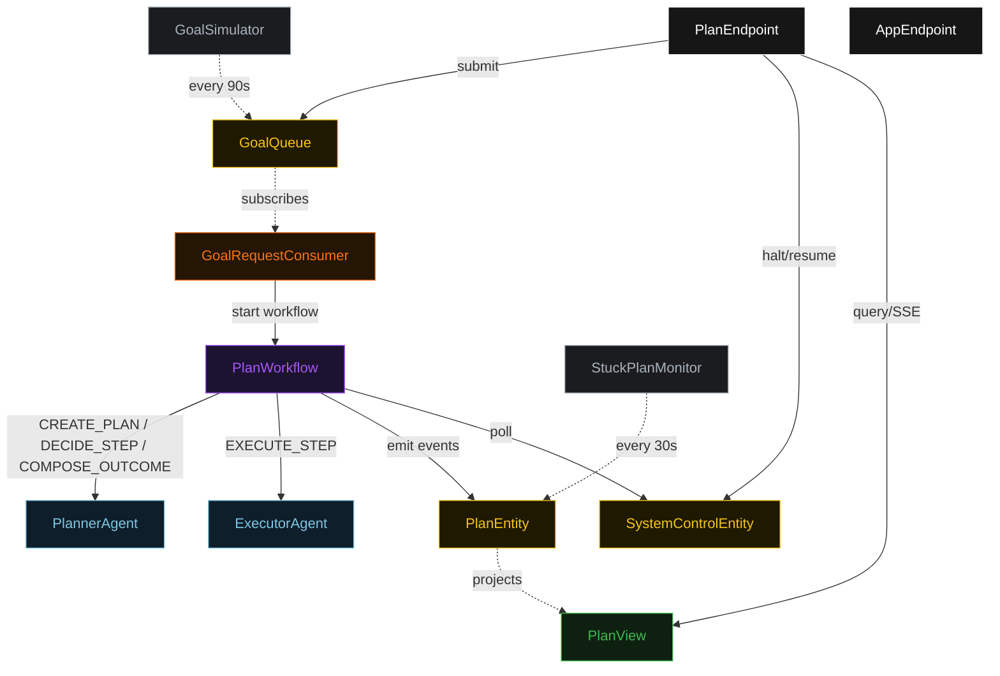
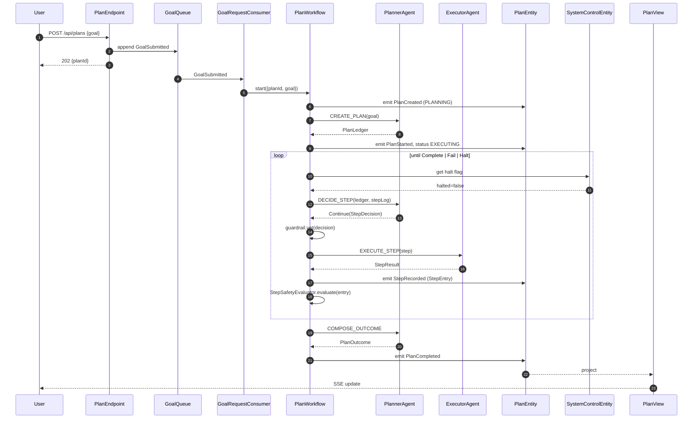
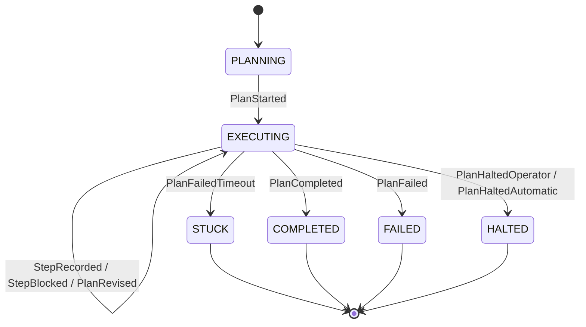
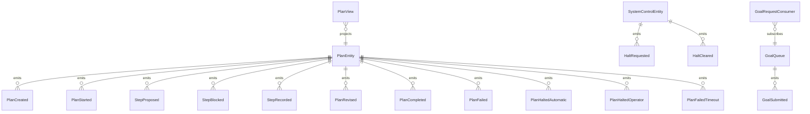

# PLAN — planner-executor-general-planner-executor

Architectural sketch consumed by `/akka:plan` (or skipped if `/akka:specify` covers it). Diagrams render on the generated system's Architecture tab.

---

## Component graph

## Interaction sequence — J1 (happy path)

## State machine — `PlanEntity`

## Entity model

## Component table — Java file targets

| Component | Path (generated) |
|---|---|
| `PlannerAgent` | `application/PlannerAgent.java` |
| `ExecutorAgent` | `application/ExecutorAgent.java` |
| `PlanWorkflow` | `application/PlanWorkflow.java` |
| `PlanEntity` | `application/PlanEntity.java` (state in `domain/Plan.java`, events in `domain/PlanEvent.java`) |
| `SystemControlEntity` | `application/SystemControlEntity.java` |
| `GoalQueue` | `application/GoalQueue.java` |
| `PlanView` | `application/PlanView.java` |
| `GoalRequestConsumer` | `application/GoalRequestConsumer.java` |
| `GoalSimulator` | `application/GoalSimulator.java` |
| `StuckPlanMonitor` | `application/StuckPlanMonitor.java` |
| `StepGuardrail` | `application/StepGuardrail.java` |
| `StepSafetyEvaluator` | `application/StepSafetyEvaluator.java` |
| `PlannerTasks` | `application/PlannerTasks.java` |
| `ExecutorTasks` | `application/ExecutorTasks.java` |
| `PlanEndpoint` | `api/PlanEndpoint.java` |
| `AppEndpoint` | `api/AppEndpoint.java` |
| Bootstrap | `Bootstrap.java` |

## Concurrency notes

- **Workflow step timeouts:** `createPlanStep` 60 s, `proposeStep` 45 s, `executeStep` 120 s, `decideStep` 45 s, `composeOutcomeStep` 60 s. Default recovery: `maxRetries(2).failoverTo(PlanWorkflow::error)`.
- **Replan budget:** the planner may emit `Replan` at most twice in a row without a `Continue` in between; a third consecutive `Replan` is treated as `Fail`.
- **Failure budget:** the planner may emit `Continue` on the same step text at most three times; a fourth attempt is treated as `Fail`.
- **Halt poll:** every `checkHaltStep` reads `SystemControlEntity.get` synchronously — no caching. An operator halt arriving during `executeStep` lets the in-flight step finish; the loop exits at the next `checkHaltStep`.
- **Idempotency:** `PlanEndpoint.submit` uses `(goal, requestedBy)` over a 10 s window to deduplicate `POST /api/plans`.
- **Stuck detection:** `StuckPlanMonitor` ticks every 30 s; plans `EXECUTING` for > 5 minutes are marked `STUCK`.
- **Guardrail determinism:** `StepGuardrail.vet` is pure; the same `StepDecision` always yields the same verdict, keeping events deterministic and replayable.
