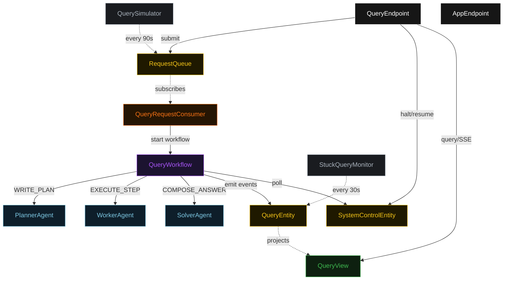
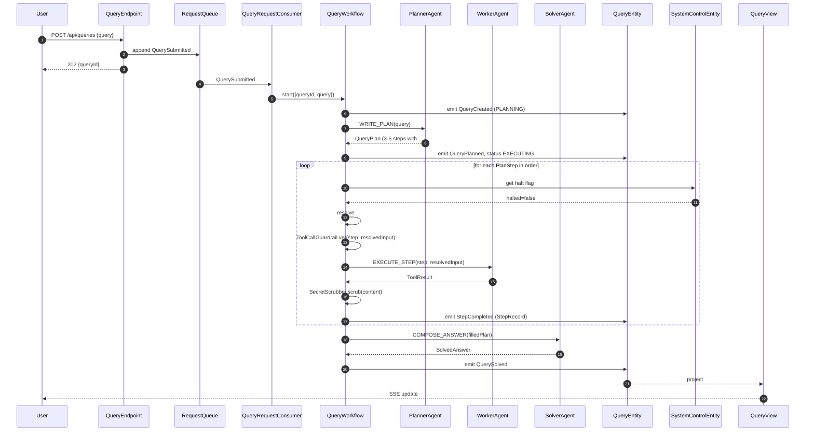
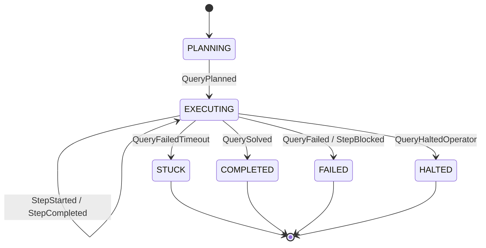
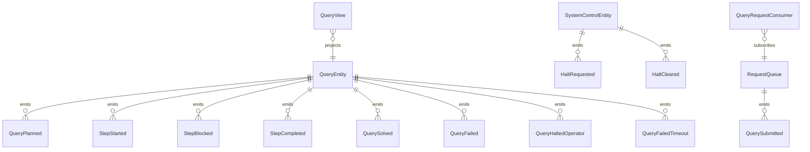

# PLAN — rewoo-fixed-plan

Architectural sketch consumed by `/akka:plan` (or skipped if `/akka:specify` covers it). Diagrams render on the generated system's Architecture tab.

---

## Component graph

## Interaction sequence — J1 (happy path)

## State machine — `QueryEntity`

## Entity model

## Component table — Java file targets

| Component | Path (generated) |
|---|---|
| `PlannerAgent` | `application/PlannerAgent.java` |
| `WorkerAgent` | `application/WorkerAgent.java` |
| `SolverAgent` | `application/SolverAgent.java` |
| `QueryWorkflow` | `application/QueryWorkflow.java` |
| `QueryEntity` | `application/QueryEntity.java` (state in `domain/Query.java`, events in `domain/QueryEvent.java`) |
| `SystemControlEntity` | `application/SystemControlEntity.java` |
| `RequestQueue` | `application/RequestQueue.java` |
| `QueryView` | `application/QueryView.java` |
| `QueryRequestConsumer` | `application/QueryRequestConsumer.java` |
| `QuerySimulator` | `application/QuerySimulator.java` |
| `StuckQueryMonitor` | `application/StuckQueryMonitor.java` |
| `ToolCallGuardrail` | `application/ToolCallGuardrail.java` |
| `SecretScrubber` | `application/SecretScrubber.java` |
| `PlannerTasks` | `application/PlannerTasks.java` |
| `WorkerTasks` | `application/WorkerTasks.java` |
| `SolverTasks` | `application/SolverTasks.java` |
| `QueryEndpoint` | `api/QueryEndpoint.java` |
| `AppEndpoint` | `api/AppEndpoint.java` |
| Bootstrap | `Bootstrap.java` |

## Concurrency notes

- **Workflow step timeouts:** `planStep` 60 s, `resolveStep` 15 s, `guardrailStep` 10 s, `executeStep` 90 s (covers any tool simulation plus agent round trip), `solveStep` 60 s. Default recovery: `maxRetries(2).failoverTo(QueryWorkflow::error)`.
- **Fixed-plan discipline:** the `QueryPlan` is immutable once emitted by `QueryPlanned`. The Worker reads steps in index order; it never rewrites the plan. Variable resolution is purely substitutional — it cannot add, remove, or reorder steps.
- **Guardrail is blocking:** a `StepBlocked` event transitions the query directly to `FAILED`. There is no replan branch in this pattern; plan revision would defeat the purpose of reasoning-before-observation.
- **Halt poll:** every `checkHaltStep` reads `SystemControlEntity.get` synchronously. An operator halt arriving mid-`executeStep` lets the tool call finish; the loop exits at the next `checkHaltStep`.
- **Sanitizer determinism:** `SecretScrubber.scrub` is pure. The same raw tool output always yields the same scrubbed string, making `StepCompleted` events deterministic and replayable.
- **Stuck detection:** `StuckQueryMonitor` ticks every 30 s; queries in `EXECUTING` for more than 5 minutes receive a `QueryFailedTimeout` command.
- **Idempotency:** `QueryEndpoint.submit` deduplicates `POST /api/queries` on `(query, requestedBy)` over a 10 s window.
