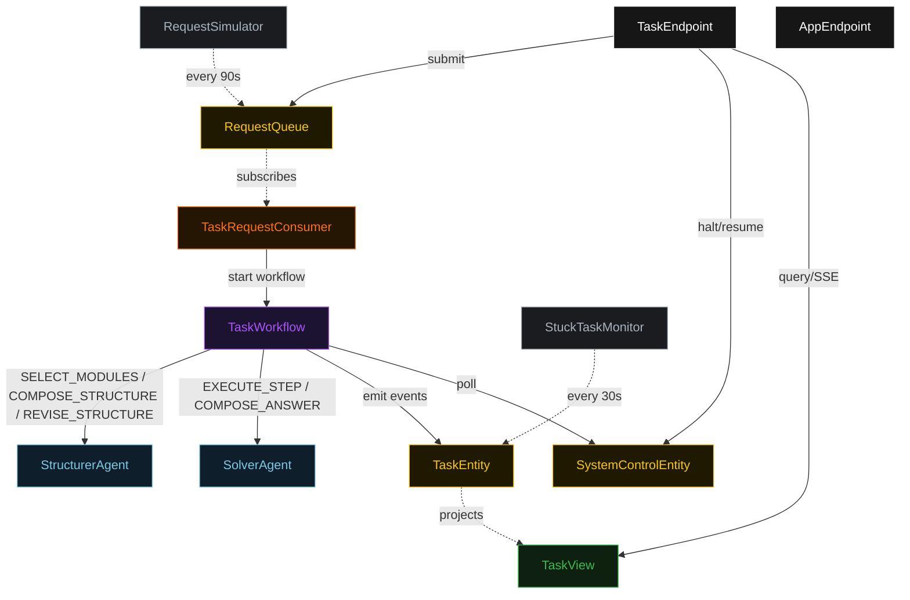
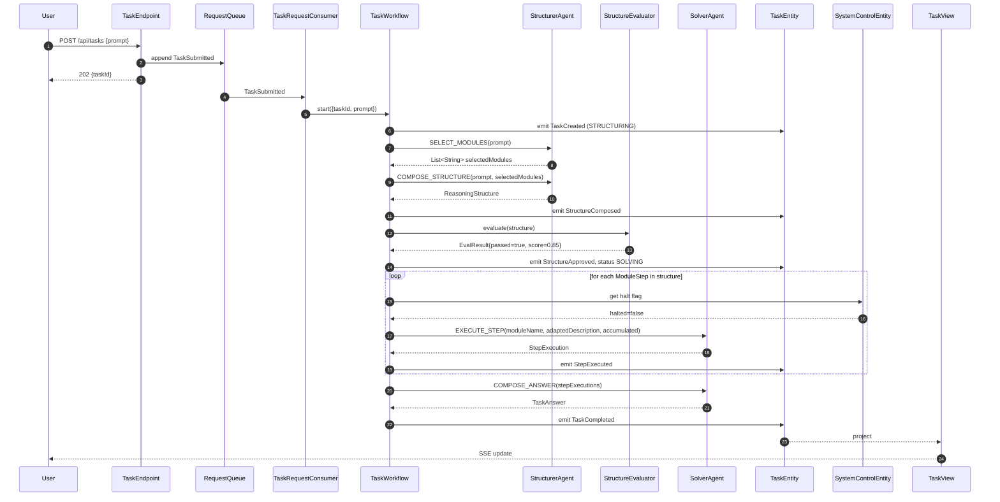
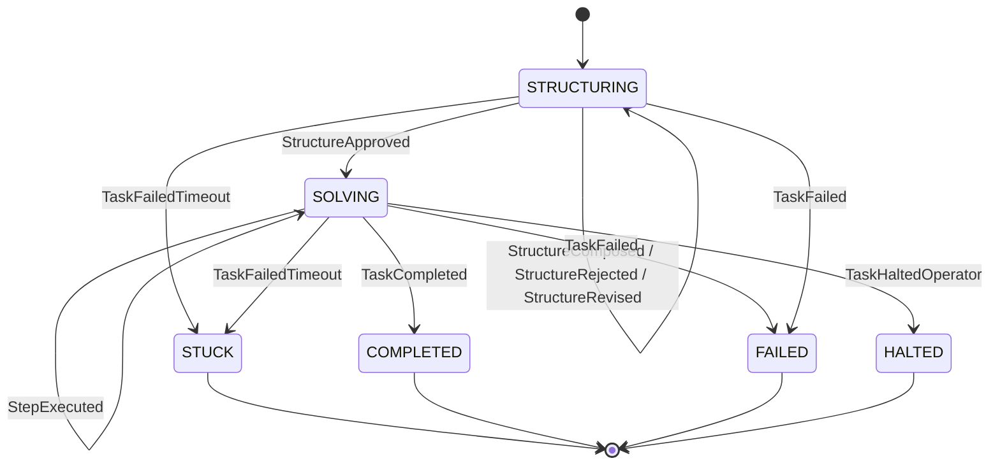
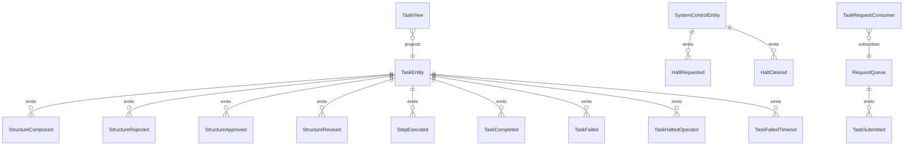

# PLAN — self-discover-modules

Architectural sketch consumed by `/akka:plan` (or skipped if `/akka:specify` covers it). Diagrams render on the generated system's Architecture tab.

---

## Component graph

## Interaction sequence — J1 (happy path)

## State machine — `TaskEntity`

## Entity model

## Component table — Java file targets

| Component | Path (generated) |
|---|---|
| `StructurerAgent` | `application/StructurerAgent.java` |
| `SolverAgent` | `application/SolverAgent.java` |
| `TaskWorkflow` | `application/TaskWorkflow.java` |
| `TaskEntity` | `application/TaskEntity.java` (state in `domain/Task.java`, events in `domain/TaskEvent.java`) |
| `SystemControlEntity` | `application/SystemControlEntity.java` |
| `RequestQueue` | `application/RequestQueue.java` |
| `TaskView` | `application/TaskView.java` |
| `TaskRequestConsumer` | `application/TaskRequestConsumer.java` |
| `RequestSimulator` | `application/RequestSimulator.java` |
| `StuckTaskMonitor` | `application/StuckTaskMonitor.java` |
| `StructureEvaluator` | `application/StructureEvaluator.java` |
| `StructurerTasks` | `application/StructurerTasks.java` |
| `SolverTasks` | `application/SolverTasks.java` |
| `TaskEndpoint` | `api/TaskEndpoint.java` |
| `AppEndpoint` | `api/AppEndpoint.java` |
| Bootstrap | `Bootstrap.java` |

## Concurrency notes

- **Workflow step timeouts:** `selectStep` 45 s, `composeStep` 60 s, `reviseStep` 60 s, `executeStepN` 90 s (covers a multi-sentence observation from the Solver), `composeAnswerStep` 60 s. Default recovery: `maxRetries(2).failoverTo(TaskWorkflow::error)`.
- **Revision budget:** the Structurer may revise the structure at most twice before the workflow transitions to `failStep` on a third rejection.
- **Step iteration:** the workflow iterates through `structure.adaptedSteps` in index order. Each iteration is a separate workflow step so that a halt check occurs between steps.
- **Halt poll:** every `checkHaltStep` reads `SystemControlEntity.get` synchronously — no caching. An operator halt arriving during an `executeStepN` lets the in-flight step finish; the loop exits at the next `checkHaltStep`.
- **Idempotency:** `TaskEndpoint.submit` uses `(prompt, requestedBy)` over a 10 s window to dedupe `POST /api/tasks`.
- **Stuck detection:** `StuckTaskMonitor` ticks every 30 s; tasks in `STRUCTURING` or `SOLVING` for > 5 minutes are marked `STUCK`.
- **Evaluator determinism:** `StructureEvaluator.evaluate` is pure — same structure always yields the same score and rejection reason, keeping events deterministic and replayable.
