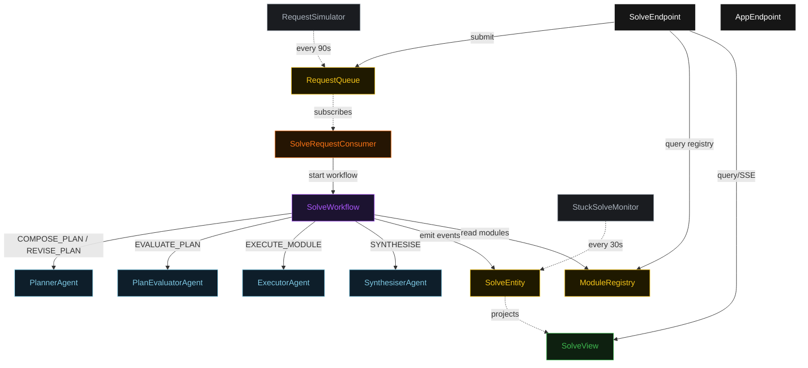
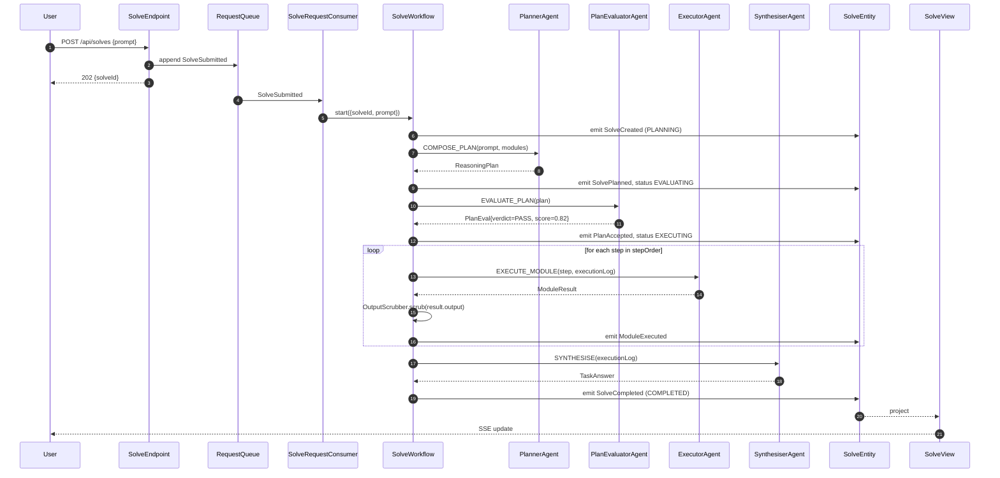
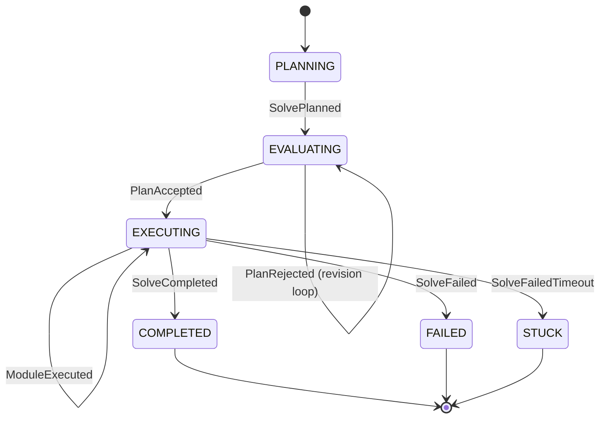
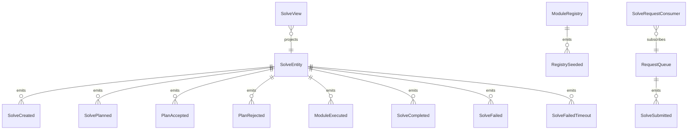

# PLAN — self-discover-planner

Architectural sketch consumed by `/akka:plan` (or skipped if `/akka:specify` covers it). Diagrams render on the generated system's Architecture tab.

---

## Component graph

## Interaction sequence — J1 (happy path)

## State machine — `SolveEntity`

## Entity model

## Component table — Java file targets

| Component | Path (generated) |
|---|---|
| `PlannerAgent` | `application/PlannerAgent.java` |
| `PlanEvaluatorAgent` | `application/PlanEvaluatorAgent.java` |
| `ExecutorAgent` | `application/ExecutorAgent.java` |
| `SynthesiserAgent` | `application/SynthesiserAgent.java` |
| `SolveWorkflow` | `application/SolveWorkflow.java` |
| `SolveEntity` | `application/SolveEntity.java` (state in `domain/Solve.java`, events in `domain/SolveEvent.java`) |
| `ModuleRegistry` | `application/ModuleRegistry.java` |
| `RequestQueue` | `application/RequestQueue.java` |
| `SolveView` | `application/SolveView.java` |
| `SolveRequestConsumer` | `application/SolveRequestConsumer.java` |
| `RequestSimulator` | `application/RequestSimulator.java` |
| `StuckSolveMonitor` | `application/StuckSolveMonitor.java` |
| `OutputScrubber` | `application/OutputScrubber.java` |
| `PlannerTasks` | `application/PlannerTasks.java` |
| `EvaluatorTasks` | `application/EvaluatorTasks.java` |
| `ExecutorTasks` | `application/ExecutorTasks.java` |
| `SynthesiserTasks` | `application/SynthesiserTasks.java` |
| `SolveEndpoint` | `api/SolveEndpoint.java` |
| `AppEndpoint` | `api/AppEndpoint.java` |
| Bootstrap | `Bootstrap.java` |

## Concurrency notes

- **Workflow step timeouts:** `composePlanStep` 60 s, `revisePlanStep` 60 s, `evaluatePlanStep` 45 s, `executeModuleStep` 90 s (per module call), `synthesiseStep` 60 s, `completeStep` 30 s. Default recovery: `maxRetries(2).failoverTo(SolveWorkflow::error)`.
- **Revision budget:** the evaluator may return `FAIL` at most twice. A third rejection transitions the workflow to `failStep` with a `failureReason` of `"plan rejected after maximum revisions"`.
- **Module loop:** `executeModuleStep` iterates the `stepOrder` list sequentially; each iteration is a separate workflow step call. The `ExecutionLog` passed to each `ExecutorAgent` call contains all previously recorded steps so the agent can use prior outputs as inputs.
- **Idempotency:** `SolveEndpoint.submit` deduplicates `POST /api/solves` on `(prompt, requestedBy)` over a 10 s window.
- **Stuck detection:** `StuckSolveMonitor` ticks every 30 s; `SolveFailedTimeout` is non-fatal to other solves.
- **Scrubber determinism:** `OutputScrubber.scrub` is pure. The same input always yields the same scrubbed output, keeping `ModuleExecuted` events deterministic and replayable.
- **Registry read:** `SolveWorkflow.composePlanStep` reads `ModuleRegistry.getModules()` once and passes the module list as context to `PlannerAgent`. The registry is not polled mid-solve.
