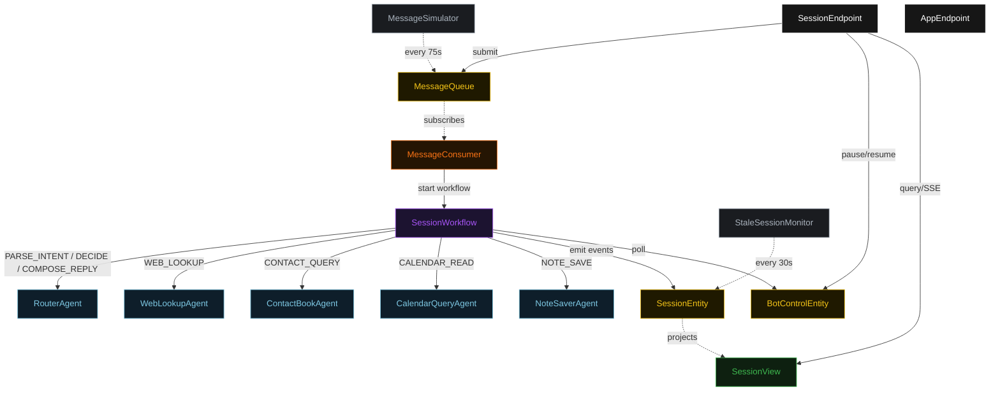
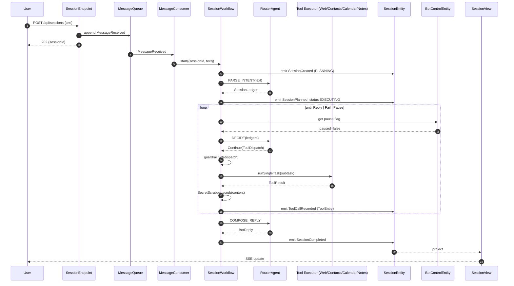
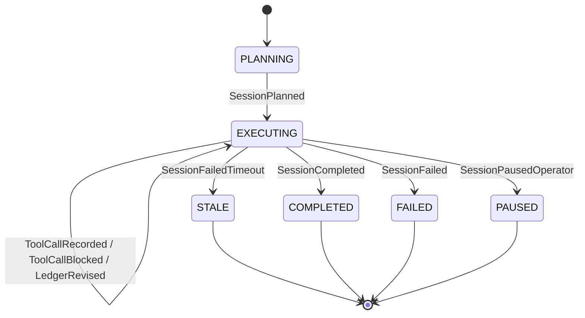
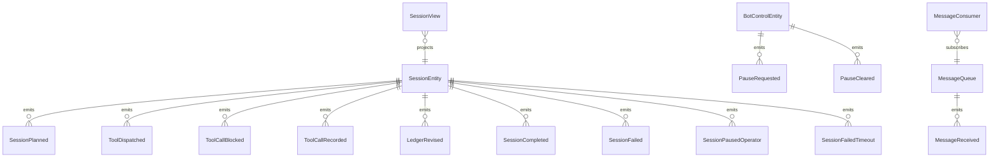

# PLAN — telegram-tool-bot

Architectural sketch consumed by `/akka:plan` (or skipped if `/akka:specify` covers it). Diagrams render on the generated system's Architecture tab.

---

## Component graph

## Interaction sequence — J1 (happy path)

## State machine — `SessionEntity`

## Entity model

## Component table — Java file targets

| Component | Path (generated) |
|---|---|
| `RouterAgent` | `application/RouterAgent.java` |
| `WebLookupAgent` | `application/WebLookupAgent.java` |
| `ContactBookAgent` | `application/ContactBookAgent.java` |
| `CalendarQueryAgent` | `application/CalendarQueryAgent.java` |
| `NoteSaverAgent` | `application/NoteSaverAgent.java` |
| `SessionWorkflow` | `application/SessionWorkflow.java` |
| `SessionEntity` | `application/SessionEntity.java` (state in `domain/Session.java`, events in `domain/SessionEvent.java`) |
| `BotControlEntity` | `application/BotControlEntity.java` |
| `MessageQueue` | `application/MessageQueue.java` |
| `SessionView` | `application/SessionView.java` |
| `MessageConsumer` | `application/MessageConsumer.java` |
| `MessageSimulator` | `application/MessageSimulator.java` |
| `StaleSessionMonitor` | `application/StaleSessionMonitor.java` |
| `ToolGuardrail` | `application/ToolGuardrail.java` |
| `SecretScrubber` | `application/SecretScrubber.java` |
| `RouterTasks` | `application/RouterTasks.java` |
| `ToolExecutorTasks` | `application/ToolExecutorTasks.java` |
| `SessionEndpoint` | `api/SessionEndpoint.java` |
| `AppEndpoint` | `api/AppEndpoint.java` |
| Bootstrap | `Bootstrap.java` |

## Concurrency notes

- **Workflow step timeouts:** `planStep` 60 s, `proposeStep` 45 s, `dispatchStep` 120 s (covers any tool call), `decideStep` 45 s, `replyStep` 60 s. Default recovery: `maxRetries(2).failoverTo(SessionWorkflow::error)`.
- **Replan budget:** the router may emit `Replan` at most twice in a row without a `Continue` in between; a third consecutive `Replan` is treated as `Fail`.
- **Failure budget:** the router may emit `Continue` on the same `(tool, subtask)` at most three times; a fourth attempt is treated as `Fail`.
- **Pause poll:** every `checkPauseStep` reads `BotControlEntity.get` synchronously — no caching. An operator pause arriving during a `dispatchStep` lets the in-flight tool call finish; the loop exits at the next `checkPauseStep`.
- **Idempotency:** `SessionEndpoint.submit` uses `(text, chatId)` over a 10 s window to dedupe `POST /api/sessions`.
- **Stale detection:** `StaleSessionMonitor` ticks every 30 s; `SessionFailedTimeout` is non-fatal to other sessions. The workflow's `decideStep` checks the entity's status and exits if it reads `STALE`.
- **Sanitizer determinism:** `SecretScrubber.scrub` is pure; it never inspects external state. The same input always yields the same scrubbed output, keeping `ToolEntry` events deterministic and replayable.
