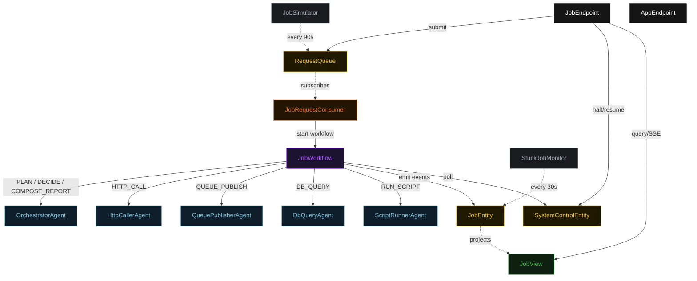
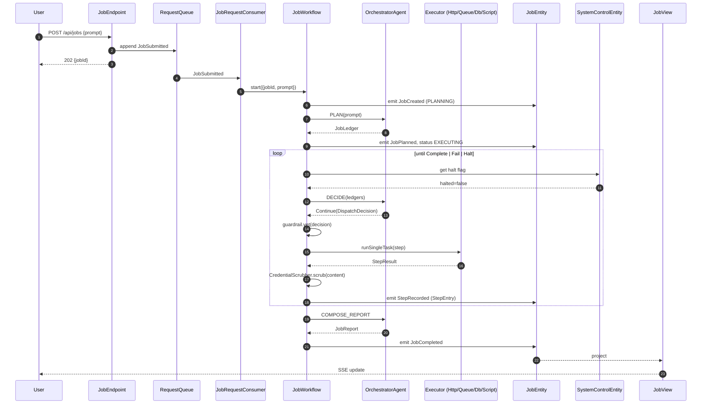
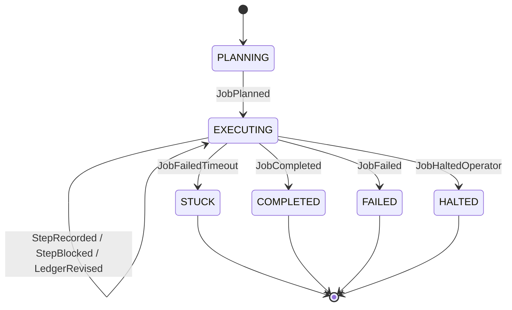
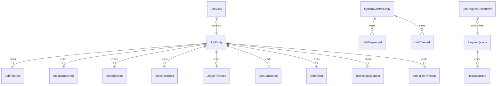

# PLAN — event-driven-planner-executor

Architectural sketch consumed by `/akka:plan` (or skipped if `/akka:specify` covers it). Diagrams render on the generated system's Architecture tab.

---

## Component graph

## Interaction sequence — J1 (happy path)

## State machine — `JobEntity`

## Entity model

## Component table — Java file targets

| Component | Path (generated) |
|---|---|
| `OrchestratorAgent` | `application/OrchestratorAgent.java` |
| `HttpCallerAgent` | `application/HttpCallerAgent.java` |
| `QueuePublisherAgent` | `application/QueuePublisherAgent.java` |
| `DbQueryAgent` | `application/DbQueryAgent.java` |
| `ScriptRunnerAgent` | `application/ScriptRunnerAgent.java` |
| `JobWorkflow` | `application/JobWorkflow.java` |
| `JobEntity` | `application/JobEntity.java` (state in `domain/Job.java`, events in `domain/JobEvent.java`) |
| `SystemControlEntity` | `application/SystemControlEntity.java` |
| `RequestQueue` | `application/RequestQueue.java` |
| `JobView` | `application/JobView.java` |
| `JobRequestConsumer` | `application/JobRequestConsumer.java` |
| `JobSimulator` | `application/JobSimulator.java` |
| `StuckJobMonitor` | `application/StuckJobMonitor.java` |
| `StepGuardrail` | `application/StepGuardrail.java` |
| `CredentialScrubber` | `application/CredentialScrubber.java` |
| `OrchestratorTasks` | `application/OrchestratorTasks.java` |
| `ExecutorTasks` | `application/ExecutorTasks.java` |
| `JobEndpoint` | `api/JobEndpoint.java` |
| `AppEndpoint` | `api/AppEndpoint.java` |
| Bootstrap | `Bootstrap.java` |

## Concurrency notes

- **Workflow step timeouts:** `planStep` 60 s, `proposeStep` 45 s, `dispatchStep` 120 s (covers any executor call, including slack for external latency), `decideStep` 45 s, `composeReportStep` 60 s. Default recovery: `maxRetries(2).failoverTo(JobWorkflow::error)`.
- **Replan budget:** the orchestrator may emit `Replan` at most twice in a row without a `Continue` in between; a third consecutive `Replan` is treated as `Fail`.
- **Failure budget:** the orchestrator may emit `Continue` on the same `(executor, step)` at most three times; a fourth attempt is treated as `Fail`.
- **Halt poll:** every `checkHaltStep` reads `SystemControlEntity.get` synchronously — no caching. An operator halt arriving during a `dispatchStep` lets the in-flight step finish; the loop exits at the next `checkHaltStep`.
- **Idempotency:** `JobEndpoint.submit` uses `(prompt, requestedBy)` over a 10 s window to dedupe `POST /api/jobs`.
- **Stuck detection:** `StuckJobMonitor` ticks every 30 s; `JobFailedTimeout` is non-fatal to other jobs. The workflow's `decideStep` checks the entity's status and exits if it reads `STUCK`.
- **Sanitizer determinism:** `CredentialScrubber.scrub` is pure; it never inspects external state. The same input always yields the same scrubbed output, which keeps `StepEntry` events deterministic and replayable.
