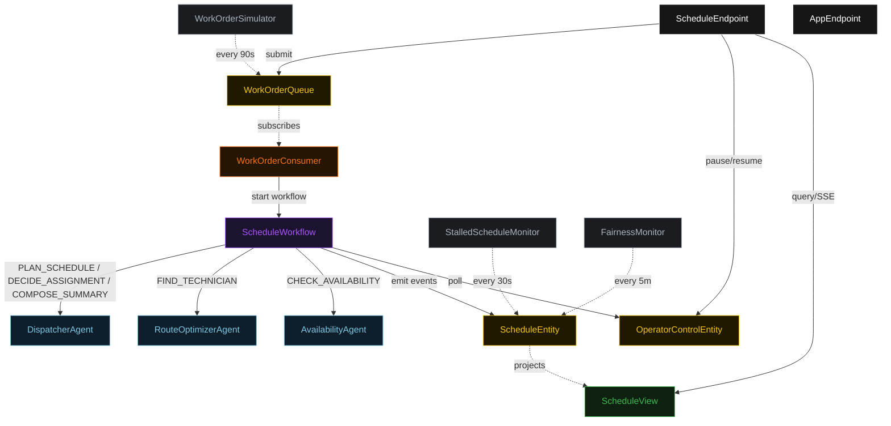
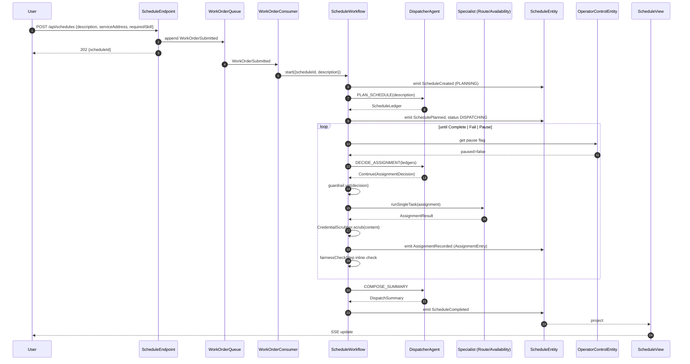
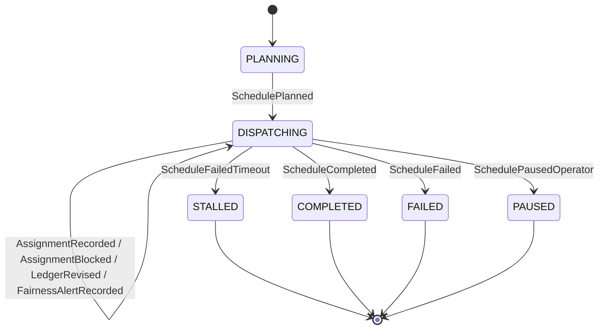
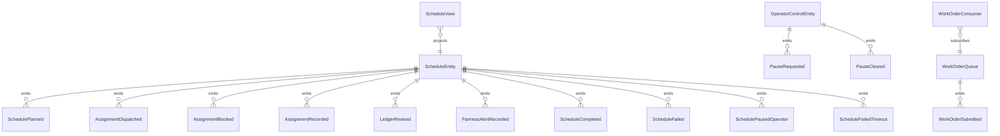

# PLAN — field-service-dispatcher

Architectural sketch consumed by `/akka:plan` (or skipped if `/akka:specify` covers it). Diagrams render on the generated system's Architecture tab.

---

## Component graph

## Interaction sequence — J1 (happy path)

## State machine — `ScheduleEntity`

## Entity model

## Component table — Java file targets

| Component | Path (generated) |
|---|---|
| `DispatcherAgent` | `application/DispatcherAgent.java` |
| `RouteOptimizerAgent` | `application/RouteOptimizerAgent.java` |
| `AvailabilityAgent` | `application/AvailabilityAgent.java` |
| `ScheduleWorkflow` | `application/ScheduleWorkflow.java` |
| `ScheduleEntity` | `application/ScheduleEntity.java` (state in `domain/Schedule.java`, events in `domain/ScheduleEvent.java`) |
| `OperatorControlEntity` | `application/OperatorControlEntity.java` |
| `WorkOrderQueue` | `application/WorkOrderQueue.java` |
| `ScheduleView` | `application/ScheduleView.java` |
| `WorkOrderConsumer` | `application/WorkOrderConsumer.java` |
| `WorkOrderSimulator` | `application/WorkOrderSimulator.java` |
| `StalledScheduleMonitor` | `application/StalledScheduleMonitor.java` |
| `FairnessMonitor` | `application/FairnessMonitor.java` |
| `AssignmentGuardrail` | `application/AssignmentGuardrail.java` |
| `CredentialScrubber` | `application/CredentialScrubber.java` |
| `DispatcherTasks` | `application/DispatcherTasks.java` |
| `SpecialistTasks` | `application/SpecialistTasks.java` |
| `ScheduleEndpoint` | `api/ScheduleEndpoint.java` |
| `AppEndpoint` | `api/AppEndpoint.java` |
| Bootstrap | `Bootstrap.java` |

## Concurrency notes

- **Workflow step timeouts:** `planStep` 60 s, `proposeStep` 45 s, `dispatchStep` 120 s (covers any specialist call), `decideStep` 45 s, `completeStep` 60 s. Default recovery: `maxRetries(2).failoverTo(ScheduleWorkflow::error)`.
- **Replan budget:** the dispatcher may emit `Replan` at most twice in a row without a `Continue` in between; a third consecutive `Replan` is treated as `Fail`.
- **Failure budget:** the dispatcher may emit `Continue` on the same `(specialist, assignment)` at most three times; a fourth attempt is treated as `Fail`.
- **Pause poll:** every `checkPauseStep` reads `OperatorControlEntity.get` synchronously — no caching. An operator pause arriving during a `dispatchStep` lets the in-flight step finish; the loop exits at the next `checkPauseStep`.
- **Idempotency:** `ScheduleEndpoint.submit` uses `(description, serviceAddress, requiredSkill)` over a 10 s window to deduplicate `POST /api/schedules`.
- **Stalled detection:** `StalledScheduleMonitor` ticks every 30 s; `ScheduleFailedTimeout` is non-fatal to other schedules.
- **Fairness monitor:** runs every 5 minutes; non-blocking to in-progress schedules; alerts are advisory records on the entity.
- **Scrubber determinism:** `CredentialScrubber.scrub` is pure; it never inspects external state. The same input always yields the same scrubbed output, keeping `AssignmentEntry` events deterministic and replayable.
