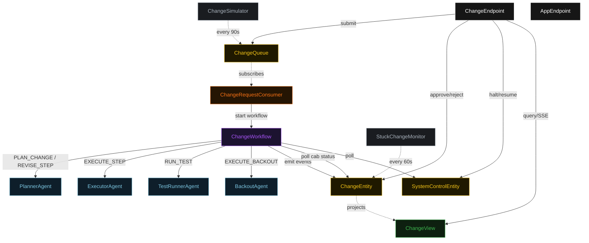
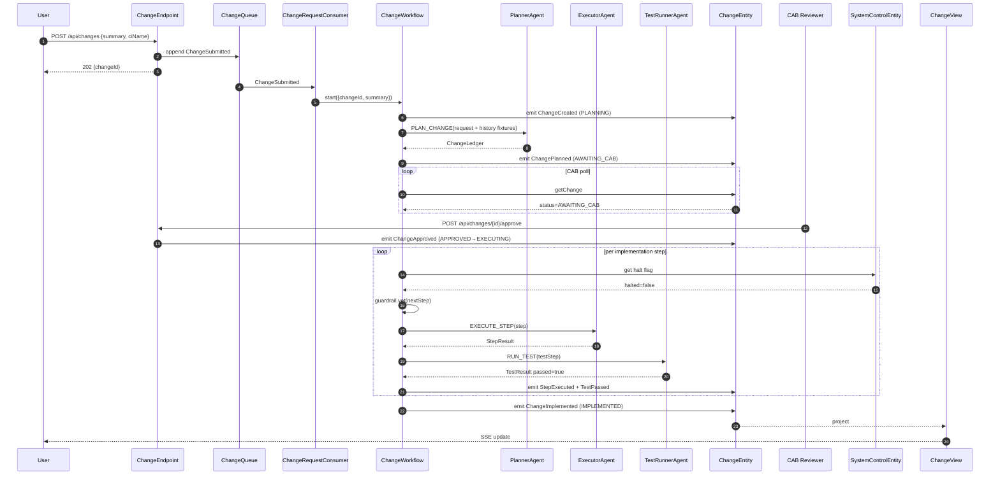
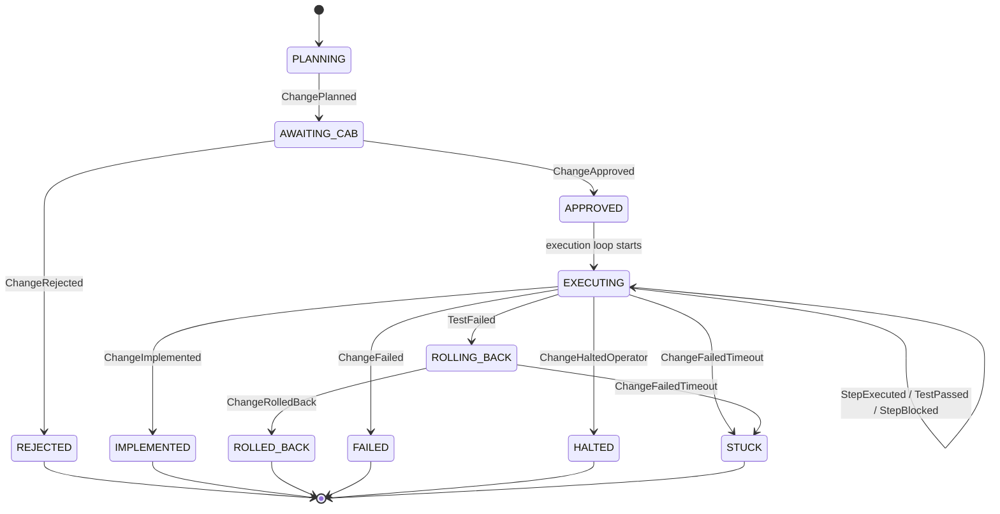
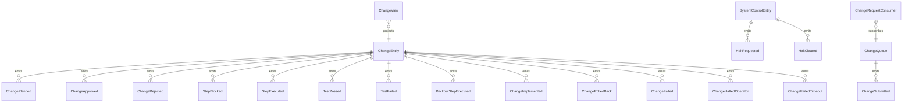

# PLAN — itsm-change-planner

Architectural sketch consumed by `/akka:plan` (or skipped if `/akka:specify` covers it). Diagrams render on the generated system's Architecture tab.

---

## Component graph

## Interaction sequence — J1 (happy path)

## State machine — `ChangeEntity`

## Entity model

## Component table — Java file targets

| Component | Path (generated) |
|---|---|
| `PlannerAgent` | `application/PlannerAgent.java` |
| `ExecutorAgent` | `application/ExecutorAgent.java` |
| `TestRunnerAgent` | `application/TestRunnerAgent.java` |
| `BackoutAgent` | `application/BackoutAgent.java` |
| `ChangeWorkflow` | `application/ChangeWorkflow.java` |
| `ChangeEntity` | `application/ChangeEntity.java` (state in `domain/Change.java`, events in `domain/ChangeEvent.java`) |
| `SystemControlEntity` | `application/SystemControlEntity.java` |
| `ChangeQueue` | `application/ChangeQueue.java` |
| `ChangeView` | `application/ChangeView.java` |
| `ChangeRequestConsumer` | `application/ChangeRequestConsumer.java` |
| `ChangeSimulator` | `application/ChangeSimulator.java` |
| `StuckChangeMonitor` | `application/StuckChangeMonitor.java` |
| `ProductionTouchGuardrail` | `application/ProductionTouchGuardrail.java` |
| `BackoutEvaluator` | `application/BackoutEvaluator.java` |
| `PlannerTasks` | `application/PlannerTasks.java` |
| `ExecutorTasks` | `application/ExecutorTasks.java` |
| `ChangeEndpoint` | `api/ChangeEndpoint.java` |
| `AppEndpoint` | `api/AppEndpoint.java` |
| Bootstrap | `Bootstrap.java` |

## Concurrency notes

- **Workflow step timeouts:** `planStep` 90 s, `executeStepStep` 120 s (executor agent call), `testStepStep` 120 s (test runner call), `backoutStep` 120 s per backout step. `cabApprovalPollStep` uses a short sleep-and-poll loop with no agent call; retry on entity read errors.
- **Replan budget:** the planner may be asked to revise a blocked step at most twice per step; a third rejection of the same step transitions the change to `FAILED`.
- **CAB timeout:** changes sitting in `AWAITING_CAB` for more than 48 hours are marked `STUCK` by `StuckChangeMonitor`.
- **Halt poll:** every `checkHaltStep` reads `SystemControlEntity.get` synchronously — no caching. An operator halt arriving during an `executeStepStep` lets the in-flight step pair finish; the loop exits at the next `checkHaltStep`.
- **Idempotency:** `ChangeEndpoint.submit` uses `(summary, ciName, requestedBy)` over a 30 s window to deduplicate `POST /api/changes`.
- **Backout ordering:** `BackoutAgent` processes backout steps in descending sequence order (reverse of implementation) so partial rollbacks undo work in the correct order.
- **Stuck detection:** `StuckChangeMonitor` ticks every 60 s; `ChangeFailedTimeout` is non-fatal to other changes. The workflow reads entity status at the top of each loop iteration and exits on `STUCK`.
