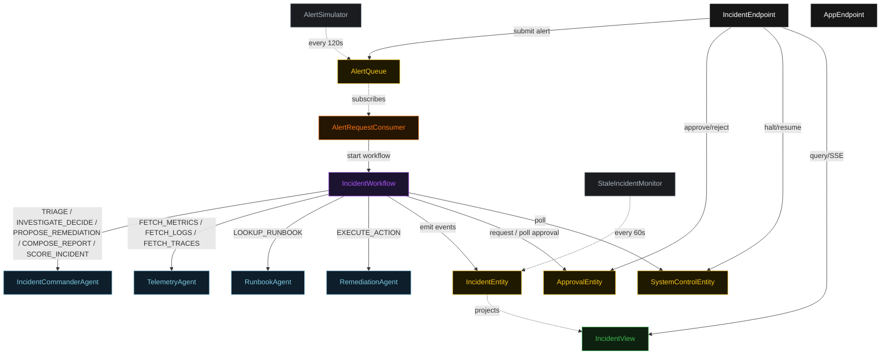
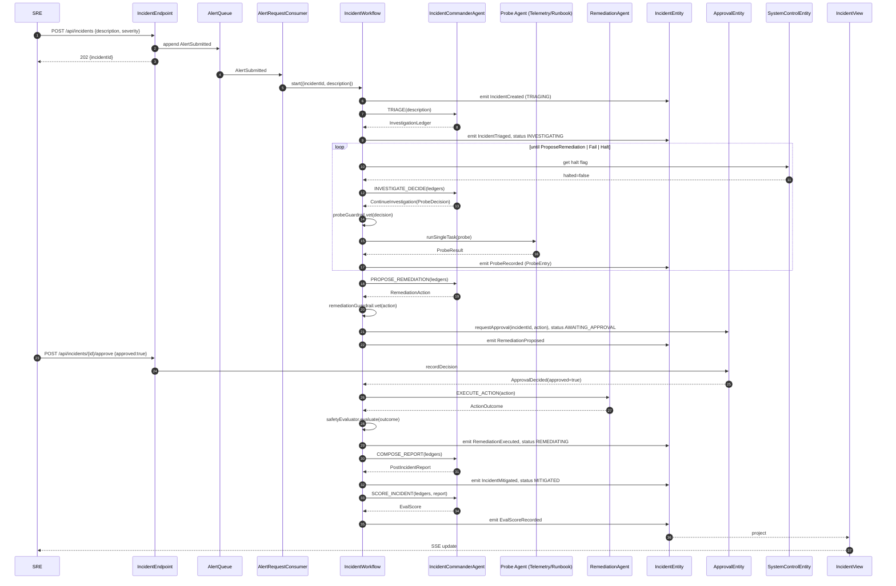
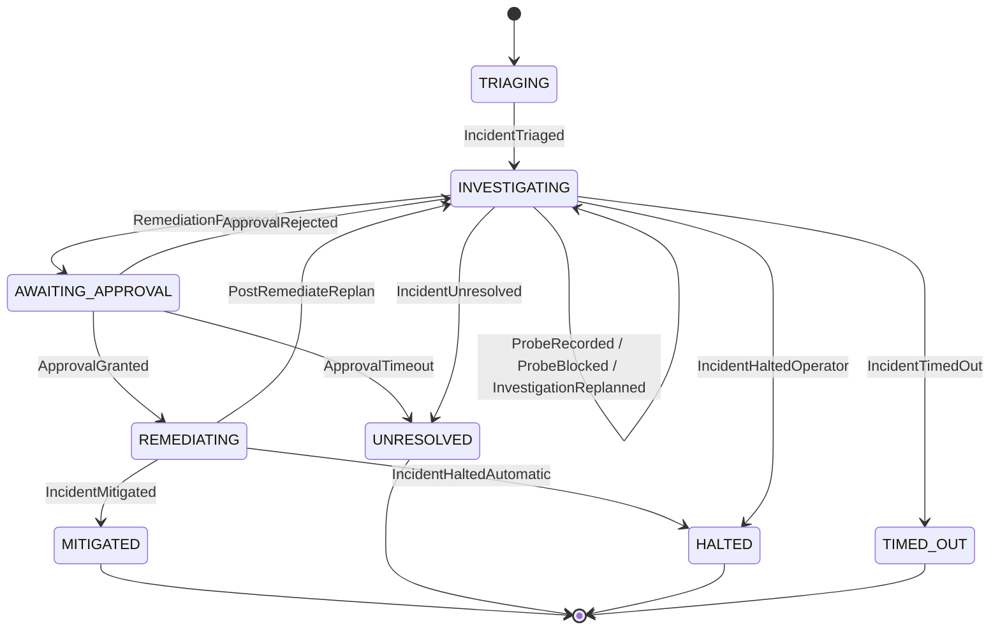

# PLAN — sre-incident-responder

Architectural sketch consumed by `/akka:plan` (or skipped if `/akka:specify` covers it). Diagrams render on the generated system's Architecture tab.

---

## Component graph

## Interaction sequence — J1 (happy path)

## State machine — `IncidentEntity`

## Entity model

```mermaid
erDiagram
  IncidentEntity ||--o{ IncidentCreated : emits
  IncidentEntity ||--o{ IncidentTriaged : emits
  IncidentEntity ||--o{ ProbeDispatched : emits
  IncidentEntity ||--o{ ProbeBlocked : emits
  IncidentEntity ||--o{ ProbeRecorded : emits
  IncidentEntity ||--o{ InvestigationReplanned : emits
  IncidentEntity ||--o{ RemediationProposed : emits
  IncidentEntity ||--o{ ApprovalGranted : emits
  IncidentEntity ||--o{ ApprovalRejected : emits
  IncidentEntity ||--o{ RemediationExecuted : emits
  IncidentEntity ||--o{ IncidentMitigated : emits
  IncidentEntity ||--o{ IncidentUnresolved : emits
  IncidentEntity ||--o{ IncidentHaltedAutomatic : emits
  IncidentEntity ||--o{ IncidentHaltedOperator : emits
  IncidentEntity ||--o{ IncidentTimedOut : emits
  IncidentEntity ||--o{ EvalScoreRecorded : emits
  IncidentView }o--|| IncidentEntity : projects
  ApprovalEntity ||--o{ ApprovalRequested : emits
  ApprovalEntity ||--o{ ApprovalDecided : emits
  SystemControlEntity ||--o{ HaltRequested : emits
  SystemControlEntity ||--o{ HaltCleared : emits
  AlertQueue ||--o{ AlertSubmitted : emits
  AlertRequestConsumer }o--|| AlertQueue : subscribes
```

## Component table — Java file targets

| Component | Path (generated) |
|---|---|
| `IncidentCommanderAgent` | `application/IncidentCommanderAgent.java` |
| `TelemetryAgent` | `application/TelemetryAgent.java` |
| `RunbookAgent` | `application/RunbookAgent.java` |
| `RemediationAgent` | `application/RemediationAgent.java` |
| `IncidentWorkflow` | `application/IncidentWorkflow.java` |
| `IncidentEntity` | `application/IncidentEntity.java` (state in `domain/Incident.java`, events in `domain/IncidentEvent.java`) |
| `ApprovalEntity` | `application/ApprovalEntity.java` |
| `SystemControlEntity` | `application/SystemControlEntity.java` |
| `AlertQueue` | `application/AlertQueue.java` |
| `IncidentView` | `application/IncidentView.java` |
| `AlertRequestConsumer` | `application/AlertRequestConsumer.java` |
| `AlertSimulator` | `application/AlertSimulator.java` |
| `StaleIncidentMonitor` | `application/StaleIncidentMonitor.java` |
| `ProbeGuardrail` | `application/ProbeGuardrail.java` |
| `RemediationGuardrail` | `application/RemediationGuardrail.java` |
| `SafetyEvaluator` | `application/SafetyEvaluator.java` |
| `CommanderTasks` | `application/CommanderTasks.java` |
| `ProbeTasks` | `application/ProbeTasks.java` |
| `RemediationTasks` | `application/RemediationTasks.java` |
| `IncidentEndpoint` | `api/IncidentEndpoint.java` |
| `AppEndpoint` | `api/AppEndpoint.java` |
| Bootstrap | `Bootstrap.java` |

## Concurrency notes

- **Workflow step timeouts:** `triageStep` 60 s, `proposeProbeStep` 45 s, `dispatchProbeStep` 90 s (covers telemetry and runbook calls), `investigateDecideStep` 45 s, `proposeRemediationStep` 60 s, `awaitApprovalStep` 30 minutes, `executeRemediationStep` 120 s, `composeReportStep` 90 s, `scoreIncidentStep` 60 s. Default recovery: `maxRetries(2).failoverTo(IncidentWorkflow::error)`.
- **Replan budget:** the commander may emit `ReplanInvestigation` at most twice in a row without a `ContinueInvestigation`; a third consecutive replan is treated as `FailInvestigation`.
- **Failure budget:** the commander may emit `ContinueInvestigation` on the same `(probeKind, target)` pair at most three times; a fourth attempt is treated as `FailInvestigation`.
- **Approval timeout:** `awaitApprovalStep` expires after 30 minutes; on expiry the workflow routes to `unresolvedStep` with reason `"approval-timeout"`.
- **Halt poll:** every `checkHaltStep` reads `SystemControlEntity.get` synchronously — no caching. An operator halt arriving during a `dispatchProbeStep` lets the in-flight probe finish; the loop exits at the next `checkHaltStep`.
- **Idempotency:** `IncidentEndpoint.submit` uses `(description, reportedBy)` over a 30 s window to deduplicate `POST /api/incidents`.
- **Stale detection:** `StaleIncidentMonitor` ticks every 60 s; incidents `INVESTIGATING` for > 10 minutes are marked `TIMED_OUT`. The workflow's `investigateDecideStep` checks the entity's status and exits if it reads `TIMED_OUT`.
- **Safety halt determinism:** `SafetyEvaluator.evaluate` is pure; same input always yields the same outcome, keeping `IncidentEntity` events deterministic and replayable.
