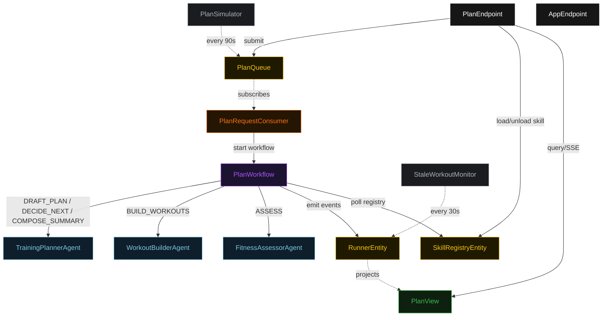
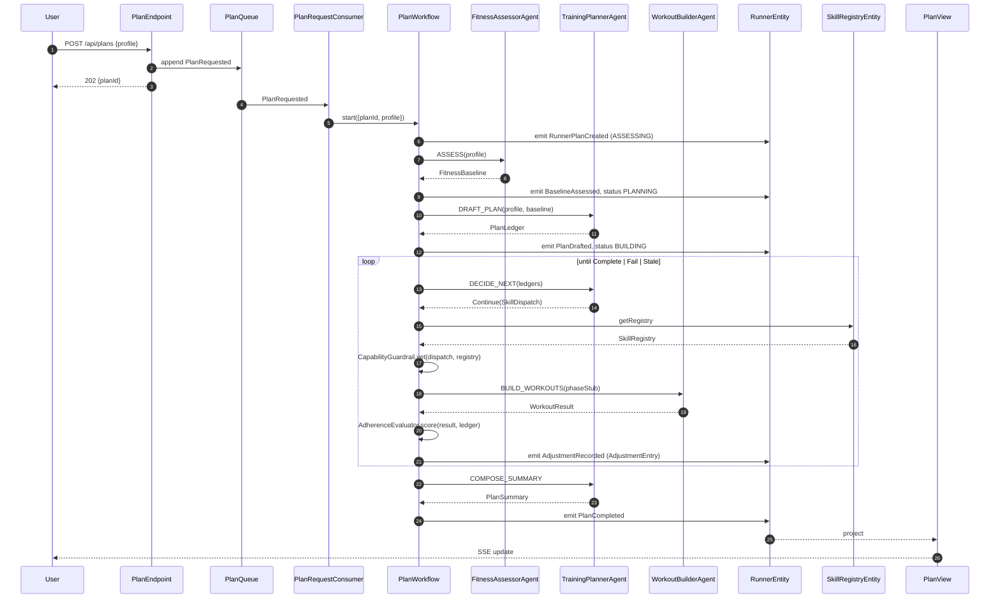
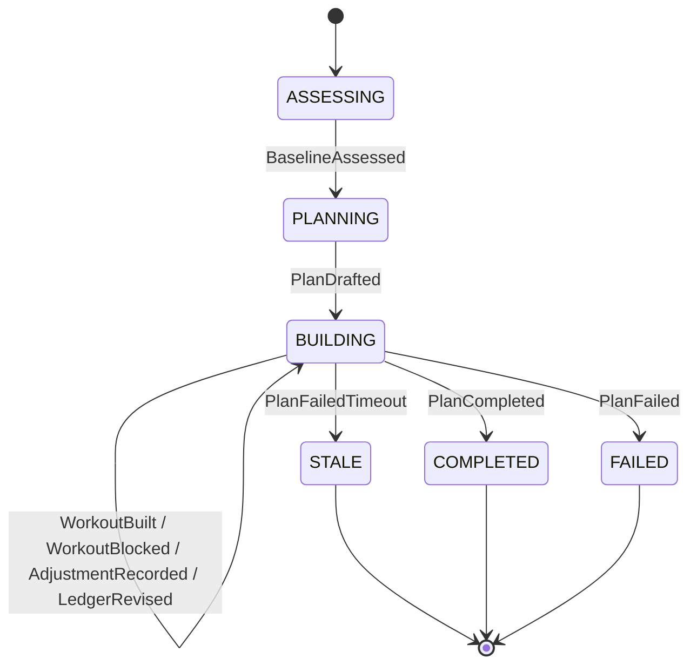
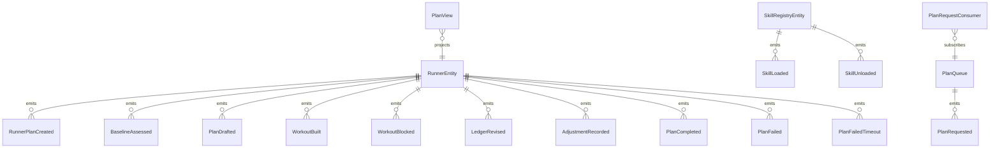

# PLAN — marathon-planner

Architectural sketch consumed by `/akka:plan` (or skipped if `/akka:specify` covers it). Diagrams render on the generated system's Architecture tab.

---

## Component graph

## Interaction sequence — J1 (happy path)

## State machine — `RunnerEntity`

## Entity model

## Component table — Java file targets

| Component | Path (generated) |
|---|---|
| `TrainingPlannerAgent` | `application/TrainingPlannerAgent.java` |
| `WorkoutBuilderAgent` | `application/WorkoutBuilderAgent.java` |
| `FitnessAssessorAgent` | `application/FitnessAssessorAgent.java` |
| `PlanWorkflow` | `application/PlanWorkflow.java` |
| `RunnerEntity` | `application/RunnerEntity.java` (state in `domain/RunnerPlan.java`, events in `domain/PlanEvent.java`) |
| `SkillRegistryEntity` | `application/SkillRegistryEntity.java` |
| `PlanQueue` | `application/PlanQueue.java` |
| `PlanView` | `application/PlanView.java` |
| `PlanRequestConsumer` | `application/PlanRequestConsumer.java` |
| `PlanSimulator` | `application/PlanSimulator.java` |
| `StaleWorkoutMonitor` | `application/StaleWorkoutMonitor.java` |
| `CapabilityGuardrail` | `application/CapabilityGuardrail.java` |
| `AdherenceEvaluator` | `application/AdherenceEvaluator.java` |
| `PlannerTasks` | `application/PlannerTasks.java` |
| `ExecutorTasks` | `application/ExecutorTasks.java` |
| `PlanEndpoint` | `api/PlanEndpoint.java` |
| `AppEndpoint` | `api/AppEndpoint.java` |
| Bootstrap | `Bootstrap.java` |

## Concurrency notes

- **Workflow step timeouts:** `assessStep` 60 s, `planStep` 60 s, `guardStep` 10 s, `dispatchStep` 120 s, `evalStep` 30 s, `decideStep` 45 s, `summariseStep` 60 s. Default recovery: `maxRetries(2).failoverTo(PlanWorkflow::error)`.
- **Replan budget:** the planner may emit `Replan` at most twice in a row without a `Continue` in between; a third consecutive `Replan` becomes `Fail`.
- **Failure budget:** the planner may dispatch the same `(skill, task)` at most three times; a fourth attempt becomes `Fail`.
- **Registry poll:** every `guardStep` reads `SkillRegistryEntity.getRegistry` synchronously — no caching. A skill removed between loop ticks is caught on the next iteration.
- **Adherence threshold:** configurable via `application.conf adherence.threshold = 0.6`. Values below threshold trigger `LowAdherenceSignal`; the planner sees it on its next `DECIDE_NEXT` call.
- **Stale detection:** `StaleWorkoutMonitor` ticks every 30 s; plans in `BUILDING` for > 5 minutes are marked `STALE`. The workflow's `decideStep` checks the entity's status and exits when it reads `STALE`.
- **Idempotency:** `PlanEndpoint.submit` uses `(runnerId, goalRace, goalRaceDate)` over a 10 s window to deduplicate `POST /api/plans`.
- **AdherenceEvaluator determinism:** `AdherenceEvaluator.score` is pure — the same inputs always yield the same score, keeping `AdjustmentEntry` events deterministic and replayable.
