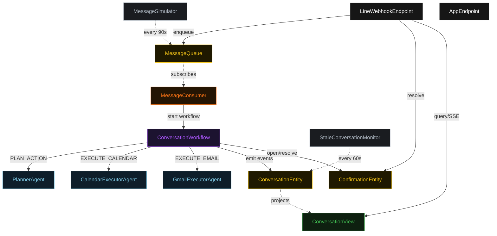
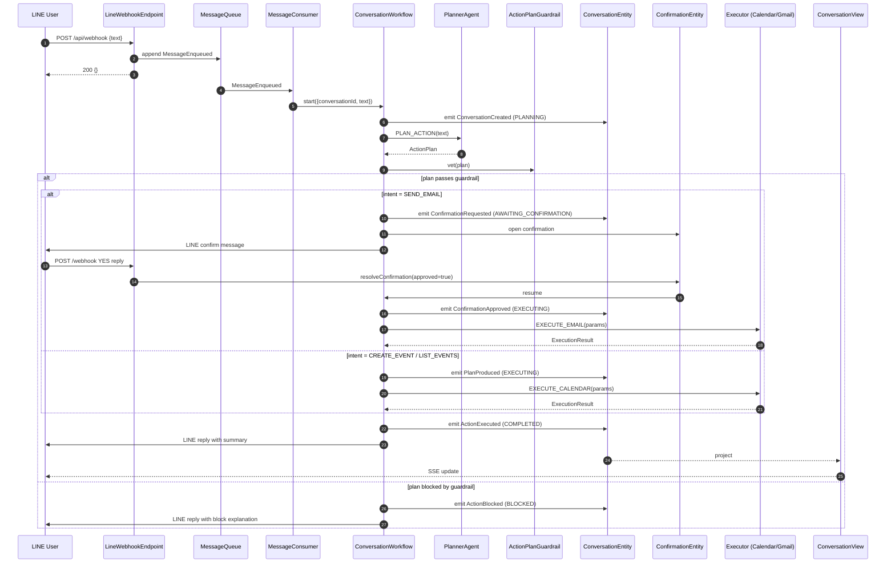
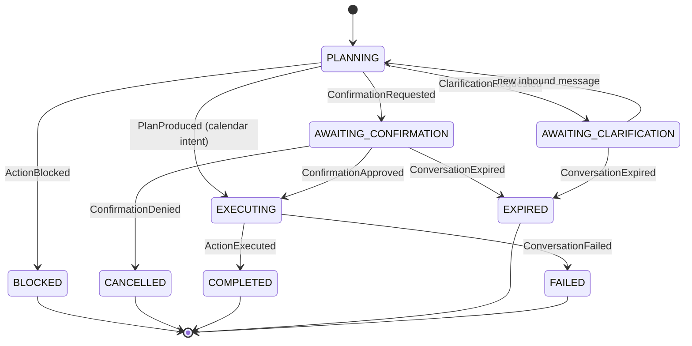
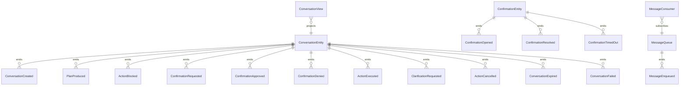

# PLAN — line-personal-assistant

Architectural sketch consumed by `/akka:plan` (or skipped if `/akka:specify` covers it). Diagrams render on the generated system's Architecture tab.

---

## Component graph

## Interaction sequence — J1/J2 (happy path with email confirmation)

## State machine — `ConversationEntity`

## Entity model

## Component table — Java file targets

| Component | Path (generated) |
|---|---|
| `PlannerAgent` | `application/PlannerAgent.java` |
| `CalendarExecutorAgent` | `application/CalendarExecutorAgent.java` |
| `GmailExecutorAgent` | `application/GmailExecutorAgent.java` |
| `ConversationWorkflow` | `application/ConversationWorkflow.java` |
| `ConversationEntity` | `application/ConversationEntity.java` (state in `domain/Conversation.java`, events in `domain/ConversationEvent.java`) |
| `ConfirmationEntity` | `application/ConfirmationEntity.java` |
| `MessageQueue` | `application/MessageQueue.java` |
| `ConversationView` | `application/ConversationView.java` |
| `MessageConsumer` | `application/MessageConsumer.java` |
| `MessageSimulator` | `application/MessageSimulator.java` |
| `StaleConversationMonitor` | `application/StaleConversationMonitor.java` |
| `ActionPlanGuardrail` | `application/ActionPlanGuardrail.java` |
| `PlannerTasks` | `application/PlannerTasks.java` |
| `ExecutorTasks` | `application/ExecutorTasks.java` |
| `LineWebhookEndpoint` | `api/LineWebhookEndpoint.java` |
| `AppEndpoint` | `api/AppEndpoint.java` |
| Bootstrap | `Bootstrap.java` |

## Concurrency notes

- **Workflow step timeouts:** `planStep` 45 s, `executeStep` 60 s, `confirmRequestStep` 20 s, `replyStep` 20 s. Default recovery: `maxRetries(2).failoverTo(ConversationWorkflow::error)`.
- **Confirmation window:** `awaitConfirmStep` polls `ConfirmationEntity.get` every 3 s; the `StaleConversationMonitor` independently expires the entity at 10 minutes. The workflow exits on `APPROVED`, `DENIED`, or `EXPIRED`.
- **Halt-by-expiry:** `StaleConversationMonitor` ticks every 60 s and applies `expireConversation` to all conversations in `AWAITING_CONFIRMATION` or `AWAITING_CLARIFICATION` older than 10 minutes.
- **Idempotency:** `LineWebhookEndpoint` deduplicates on `X-Line-Message-Id` header; duplicate webhooks from the LINE platform are silently dropped.
- **Guardrail determinism:** `ActionPlanGuardrail.vet` is a pure function; it never inspects external state.
