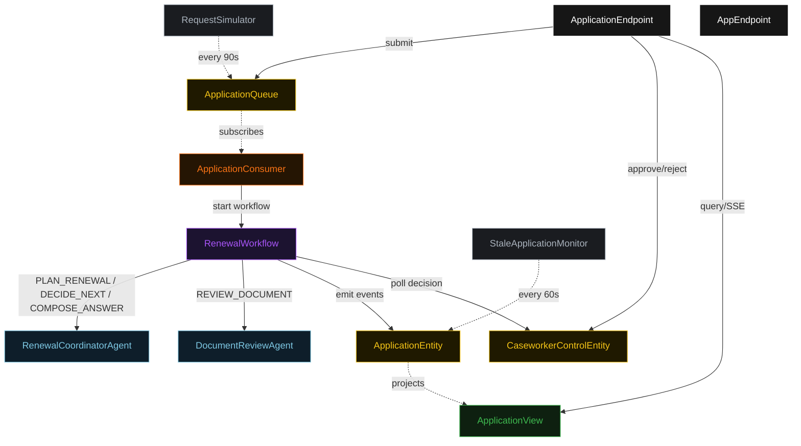
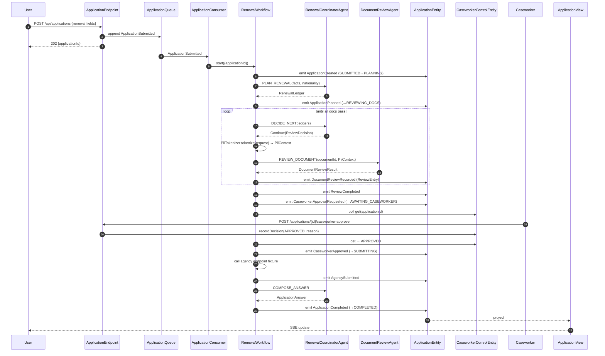
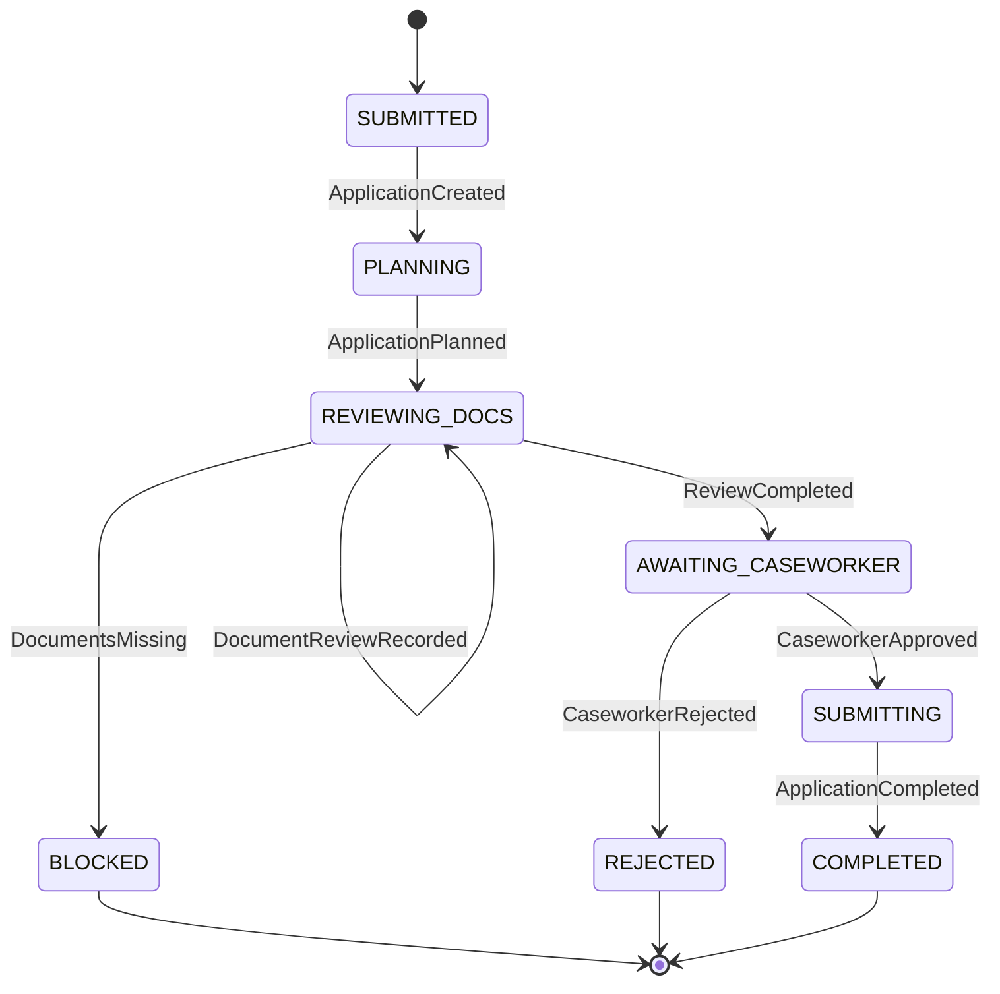
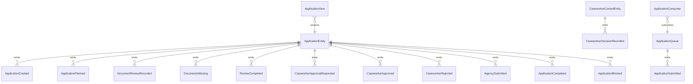

# PLAN — passport-renewal-coordinator

Architectural sketch consumed by `/akka:plan` (or skipped if `/akka:specify` covers it). Diagrams render on the generated system's Architecture tab.

---

## Component graph

## Interaction sequence — J1 (happy path)

## State machine — `ApplicationEntity`

## Entity model

## Component table — Java file targets

| Component | Path (generated) |
|---|---|
| `RenewalCoordinatorAgent` | `application/RenewalCoordinatorAgent.java` |
| `DocumentReviewAgent` | `application/DocumentReviewAgent.java` |
| `RenewalWorkflow` | `application/RenewalWorkflow.java` |
| `ApplicationEntity` | `application/ApplicationEntity.java` (state in `domain/Application.java`, events in `domain/ApplicationEvent.java`) |
| `CaseworkerControlEntity` | `application/CaseworkerControlEntity.java` |
| `ApplicationQueue` | `application/ApplicationQueue.java` |
| `ApplicationView` | `application/ApplicationView.java` |
| `ApplicationConsumer` | `application/ApplicationConsumer.java` |
| `RequestSimulator` | `application/RequestSimulator.java` |
| `StaleApplicationMonitor` | `application/StaleApplicationMonitor.java` |
| `PiiTokenizer` | `application/PiiTokenizer.java` |
| `CoordinatorTasks` | `application/CoordinatorTasks.java` |
| `ReviewerTasks` | `application/ReviewerTasks.java` |
| `ApplicationEndpoint` | `api/ApplicationEndpoint.java` |
| `AppEndpoint` | `api/AppEndpoint.java` |
| Bootstrap | `Bootstrap.java` |

## Concurrency notes

- **Workflow step timeouts:** `planStep` 60 s, `proposeStep` 45 s, `documentReviewStep` 90 s, `agencySubmitStep` 30 s, `completeStep` 60 s. `caseworkerWaitStep` has no timeout — it is a deliberate indefinite gate; the caseworker must act. Default recovery: `maxRetries(2).failoverTo(RenewalWorkflow::error)`.
- **Missing-doc halt:** if `DocumentReviewResult.ok=false`, the workflow immediately transitions to `blockedStep` without further loop iterations. The `blockReason` names the document and the `missingReason`.
- **Caseworker poll:** `caseworkerWaitStep` reads `CaseworkerControlEntity.get(applicationId)` every 5 s. No caching. A decision recorded between poll ticks is picked up on the next tick.
- **PII isolation:** `piiTokenizeStep` executes in the workflow between `proposeStep` and `documentReviewStep`. The `RenewalRequest`'s raw fields never leave the tokenize step — only `PiiContext` is forwarded to subsequent steps and to agent calls.
- **Idempotency:** `ApplicationEndpoint.submit` uses `(applicantId, expiryDate)` over a 30 s window to deduplicate `POST /api/applications`.
- **Stale detection:** `StaleApplicationMonitor` ticks every 60 s; applications in `REVIEWING_DOCS` for more than 10 minutes are marked `BLOCKED`. The workflow's next `recordStep` checks entity status and exits if `BLOCKED`.
