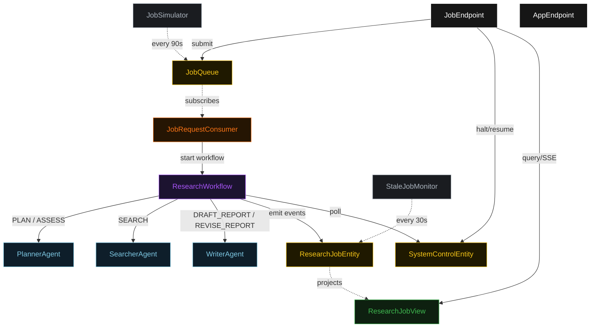
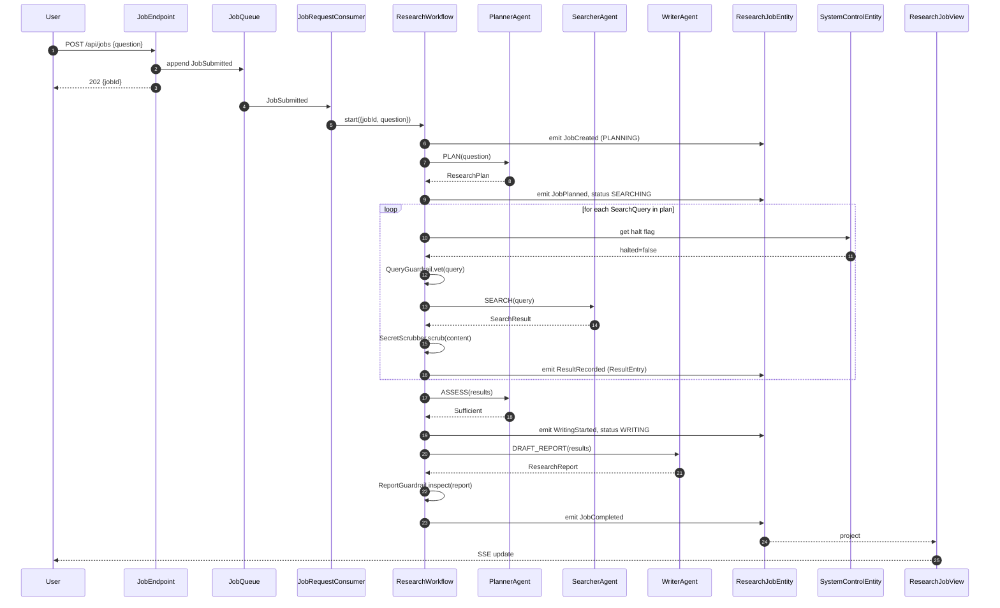
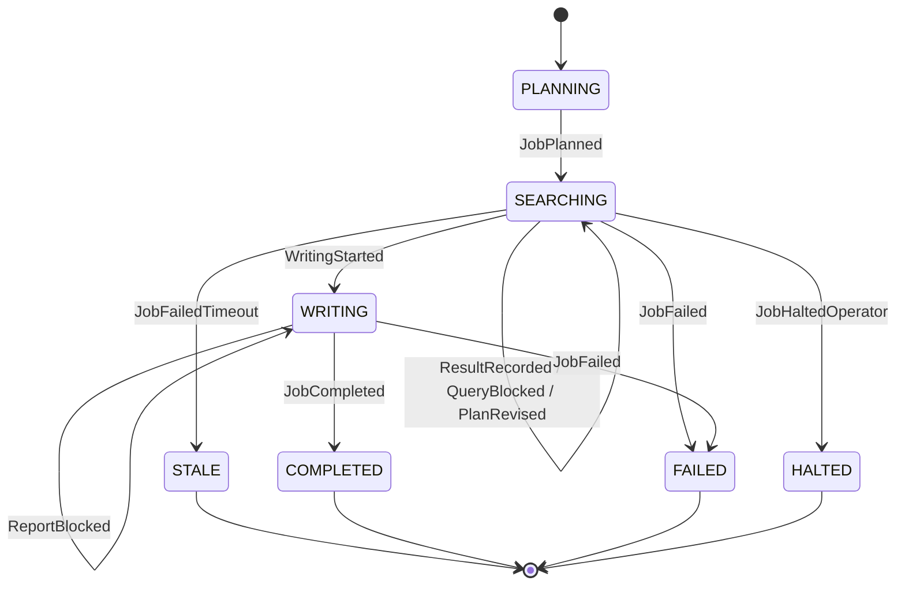
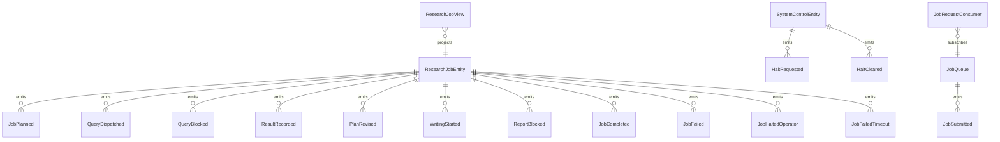

# PLAN — akka-research-bot

Architectural sketch consumed by `/akka:plan` (or skipped if `/akka:specify` covers it). Diagrams render on the generated system's Architecture tab.

---

## Component graph

## Interaction sequence — J1 (happy path)

## State machine — `ResearchJobEntity`

## Entity model

## Component table — Java file targets

| Component | Path (generated) |
|---|---|
| `PlannerAgent` | `application/PlannerAgent.java` |
| `SearcherAgent` | `application/SearcherAgent.java` |
| `WriterAgent` | `application/WriterAgent.java` |
| `ResearchWorkflow` | `application/ResearchWorkflow.java` |
| `ResearchJobEntity` | `application/ResearchJobEntity.java` (state in `domain/ResearchJob.java`, events in `domain/JobEvent.java`) |
| `SystemControlEntity` | `application/SystemControlEntity.java` |
| `JobQueue` | `application/JobQueue.java` |
| `ResearchJobView` | `application/ResearchJobView.java` |
| `JobRequestConsumer` | `application/JobRequestConsumer.java` |
| `JobSimulator` | `application/JobSimulator.java` |
| `StaleJobMonitor` | `application/StaleJobMonitor.java` |
| `QueryGuardrail` | `application/QueryGuardrail.java` |
| `ReportGuardrail` | `application/ReportGuardrail.java` |
| `SecretScrubber` | `application/SecretScrubber.java` |
| `PlannerTasks` | `application/PlannerTasks.java` |
| `SearcherTasks` | `application/SearcherTasks.java` |
| `WriterTasks` | `application/WriterTasks.java` |
| `JobEndpoint` | `api/JobEndpoint.java` |
| `AppEndpoint` | `api/AppEndpoint.java` |
| Bootstrap | `Bootstrap.java` |

## Concurrency notes

- **Workflow step timeouts:** `planStep` 60 s, `searchStep` 90 s (one query per step; parallel fan-out is modelled as sequential steps over the query list), `assessStep` 45 s, `writeStep` 120 s (writer may produce a multi-section report), `reportGuardrailStep` 30 s. Default recovery: `maxRetries(2).failoverTo(ResearchWorkflow::error)`.
- **Replan budget:** the planner may return `NeedsMore` at most twice consecutively; a third consecutive `NeedsMore` is treated as `Fail`.
- **Report revision budget:** the writer may receive `REVISE_REPORT` at most twice; a third rejection by the report guardrail becomes `Fail`.
- **Halt poll:** every `checkHaltStep` reads `SystemControlEntity.get` synchronously — no caching. An operator halt arriving during a `searchStep` lets the in-flight search finish; the loop exits at the next `checkHaltStep`.
- **Idempotency:** `JobEndpoint.submit` uses `(question, requestedBy)` over a 10 s window to dedupe `POST /api/jobs`.
- **Stale detection:** `StaleJobMonitor` ticks every 30 s; tasks `SEARCHING` for > 5 minutes are marked `STALE`. The workflow's `checkHaltStep` checks the entity's status and exits if it reads `STALE`.
- **Sanitizer determinism:** `SecretScrubber.scrub` is pure; it never inspects external state. The same input always yields the same scrubbed output, keeping `ResultEntry` events deterministic and replayable.
