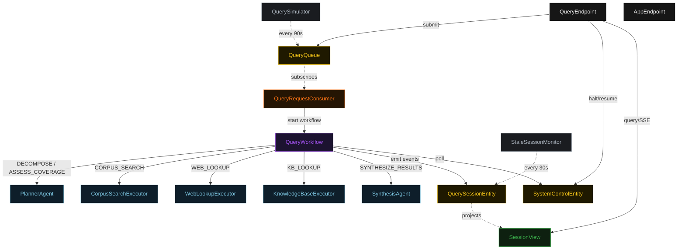
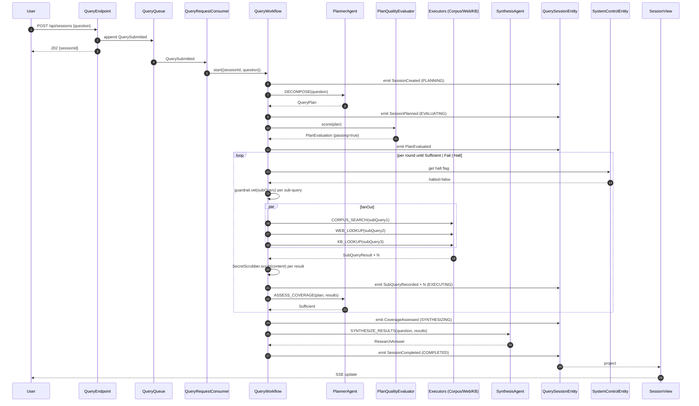
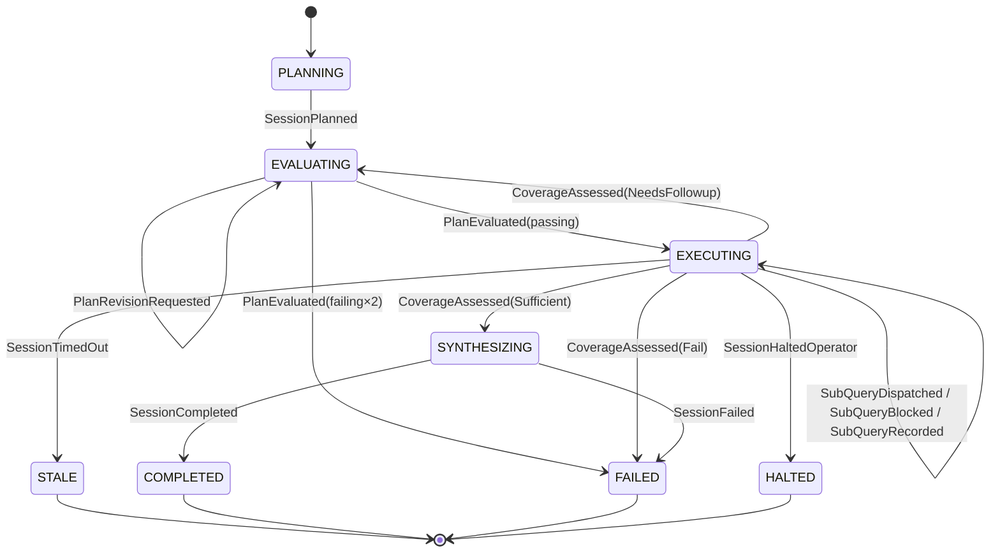
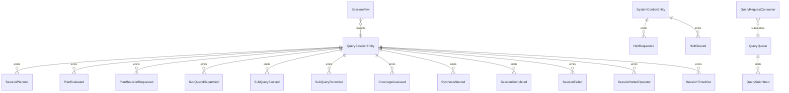

# PLAN — query-planner-parallel-executor

Architectural sketch consumed by `/akka:plan` (or skipped if `/akka:specify` covers it). Diagrams render on the generated system's Architecture tab.

---

## Component graph

## Interaction sequence — J1 (happy path)

## State machine — `QuerySessionEntity`

## Entity model

## Component table — Java file targets

| Component | Path (generated) |
|---|---|
| `PlannerAgent` | `application/PlannerAgent.java` |
| `CorpusSearchExecutor` | `application/CorpusSearchExecutor.java` |
| `WebLookupExecutor` | `application/WebLookupExecutor.java` |
| `KnowledgeBaseExecutor` | `application/KnowledgeBaseExecutor.java` |
| `SynthesisAgent` | `application/SynthesisAgent.java` |
| `QueryWorkflow` | `application/QueryWorkflow.java` |
| `QuerySessionEntity` | `application/QuerySessionEntity.java` (state in `domain/QuerySession.java`, events in `domain/SessionEvent.java`) |
| `SystemControlEntity` | `application/SystemControlEntity.java` |
| `QueryQueue` | `application/QueryQueue.java` |
| `SessionView` | `application/SessionView.java` |
| `QueryRequestConsumer` | `application/QueryRequestConsumer.java` |
| `QuerySimulator` | `application/QuerySimulator.java` |
| `StaleSessionMonitor` | `application/StaleSessionMonitor.java` |
| `SubQueryGuardrail` | `application/SubQueryGuardrail.java` |
| `SecretScrubber` | `application/SecretScrubber.java` |
| `PlanQualityEvaluator` | `application/PlanQualityEvaluator.java` |
| `PlannerTasks` | `application/PlannerTasks.java` |
| `ExecutorTasks` | `application/ExecutorTasks.java` |
| `QueryEndpoint` | `api/QueryEndpoint.java` |
| `AppEndpoint` | `api/AppEndpoint.java` |
| Bootstrap | `Bootstrap.java` |

## Concurrency notes

- **Fan-out:** all sub-queries in a round are dispatched in parallel via `CompletableFuture.allOf`. The `fanOutStep` timeout (180 s) covers the full round, not a single executor call.
- **Workflow step timeouts:** `planStep` 60 s, `evalStep` 30 s, `fanOutStep` 180 s, `coverageStep` 45 s, `synthesisStep` 90 s. Default recovery: `maxRetries(2).failoverTo(QueryWorkflow::error)`.
- **Round budget:** at most three rounds. A third coverage evaluation returning `NeedsFollowup` is treated as `Fail`.
- **Plan revision budget:** at most two consecutive low-quality plan evaluations. A third triggers `SessionFailed`.
- **Halt poll:** `checkHaltStep` reads `SystemControlEntity.get` synchronously before each round's fan-out. An operator halt arriving during `fanOutStep` lets the in-flight round finish; the loop exits at the next `checkHaltStep`.
- **Stale detection:** `StaleSessionMonitor` ticks every 30 s; `SessionTimedOut` is non-fatal to other sessions. The workflow's `coverageStep` checks entity status and exits when it reads `STALE`.
- **Sanitizer determinism:** `SecretScrubber.scrub` is pure; no external state. Same input always yields same scrubbed output, keeping `SubQueryRecorded` events deterministic and replayable.
- **Guardrail determinism:** `SubQueryGuardrail.vet` is pure. Rejection is logged as a `SubQueryBlocked` event; the planner sees the blocked sub-queries in its next `ASSESS_COVERAGE` call.
