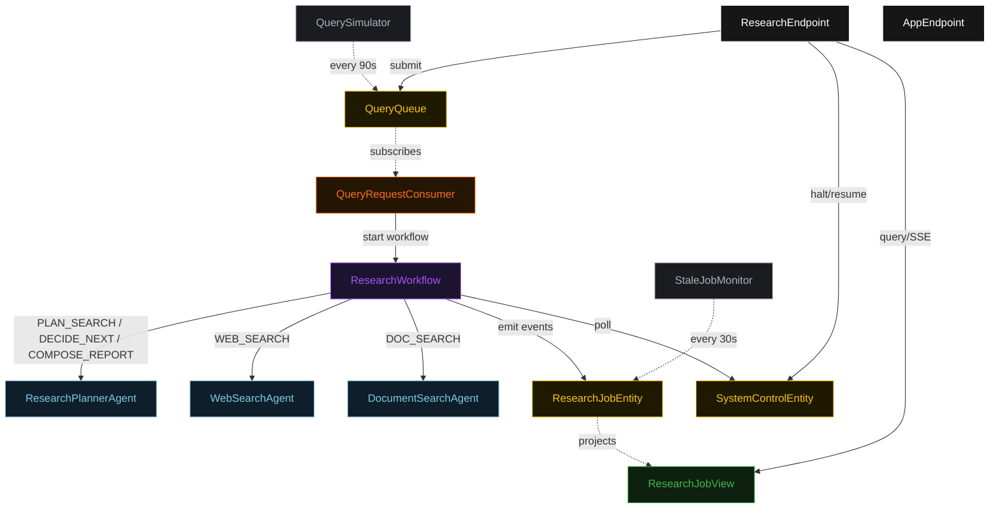
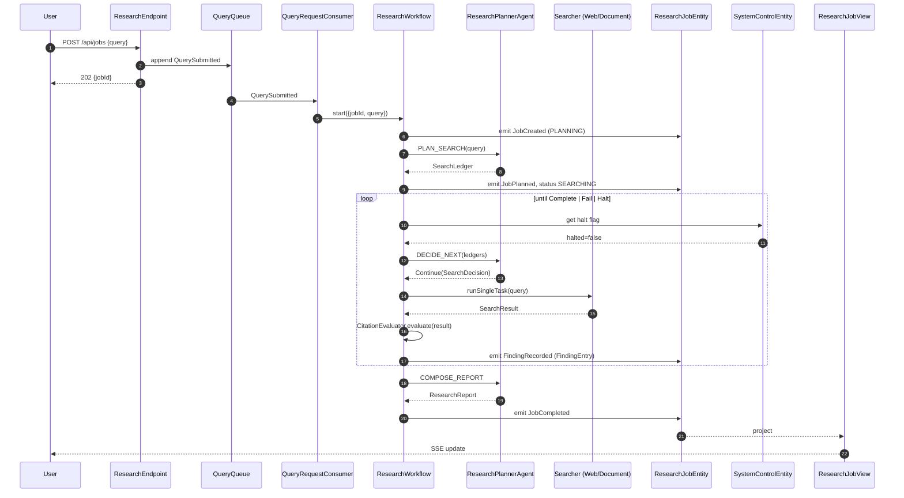
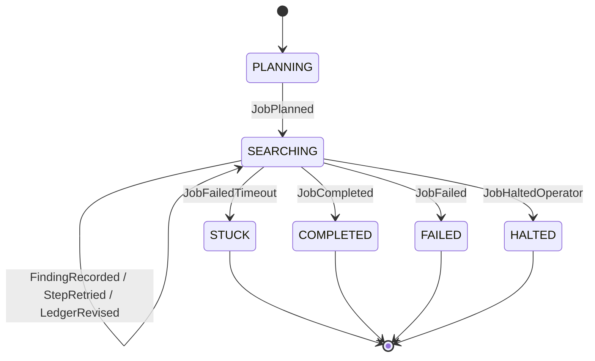
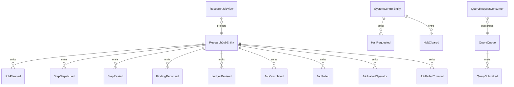

# PLAN — research-agent

Architectural sketch consumed by `/akka:plan` (or skipped if `/akka:specify` covers it). Diagrams render on the generated system's Architecture tab.

---

## Component graph

## Interaction sequence — J1 (happy path)

## State machine — `ResearchJobEntity`

## Entity model

## Component table — Java file targets

| Component | Path (generated) |
|---|---|
| `ResearchPlannerAgent` | `application/ResearchPlannerAgent.java` |
| `WebSearchAgent` | `application/WebSearchAgent.java` |
| `DocumentSearchAgent` | `application/DocumentSearchAgent.java` |
| `ResearchWorkflow` | `application/ResearchWorkflow.java` |
| `ResearchJobEntity` | `application/ResearchJobEntity.java` (state in `domain/ResearchJob.java`, events in `domain/JobEvent.java`) |
| `SystemControlEntity` | `application/SystemControlEntity.java` |
| `QueryQueue` | `application/QueryQueue.java` |
| `ResearchJobView` | `application/ResearchJobView.java` |
| `QueryRequestConsumer` | `application/QueryRequestConsumer.java` |
| `QuerySimulator` | `application/QuerySimulator.java` |
| `StaleJobMonitor` | `application/StaleJobMonitor.java` |
| `CitationEvaluator` | `application/CitationEvaluator.java` |
| `PlannerTasks` | `application/PlannerTasks.java` |
| `SearcherTasks` | `application/SearcherTasks.java` |
| `ResearchEndpoint` | `api/ResearchEndpoint.java` |
| `AppEndpoint` | `api/AppEndpoint.java` |
| Bootstrap | `Bootstrap.java` |

## Concurrency notes

- **Workflow step timeouts:** `planStep` 60 s, `proposeStep` 45 s, `dispatchStep` 120 s (covers any searcher call), `citationEvalStep` 15 s, `decideStep` 45 s, `composeReportStep` 60 s. Default recovery: `maxRetries(2).failoverTo(ResearchWorkflow::error)`.
- **Replan budget:** the planner may emit `Replan` at most twice in a row without a `Continue` in between; a third consecutive `Replan` is treated as `Fail`.
- **Failure budget:** the planner may emit `Continue` on the same `(searcher, query)` at most three times; a fourth attempt is treated as `Fail`.
- **Halt poll:** every `checkHaltStep` reads `SystemControlEntity.get` synchronously — no caching. An operator halt arriving during a `dispatchStep` lets the in-flight search step finish; the loop exits at the next `checkHaltStep`.
- **Idempotency:** `ResearchEndpoint.submit` uses `(query, requestedBy)` over a 10 s window to deduplicate `POST /api/jobs`.
- **Stale detection:** `StaleJobMonitor` ticks every 30 s; `JobFailedTimeout` is non-fatal to other jobs. The workflow's `decideStep` checks the entity's status and exits if it reads `STUCK`.
- **Citation evaluator determinism:** `CitationEvaluator.evaluate` is pure; it never inspects external state. The same content always yields the same verdict and confidence, keeping `FindingEntry` events deterministic and replayable.
