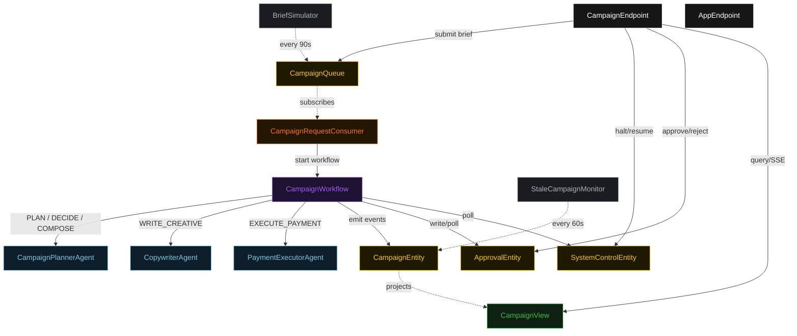
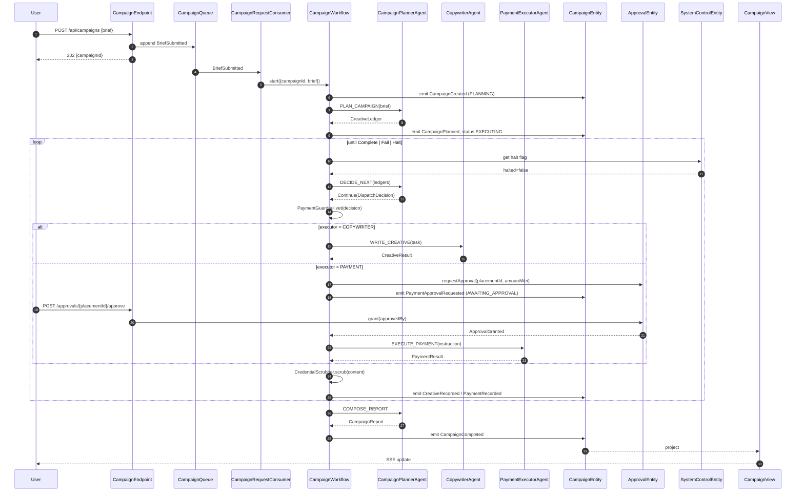
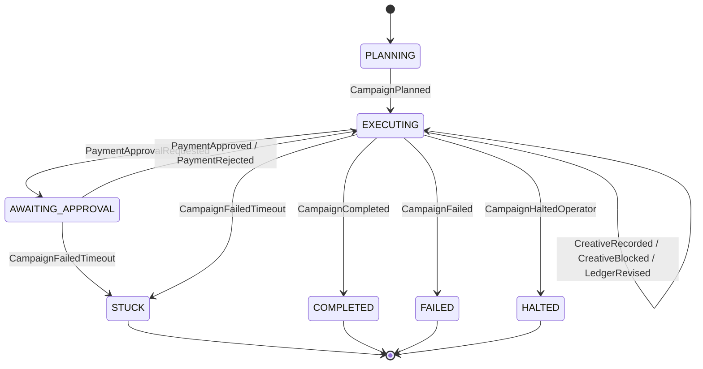

# PLAN — ad-spend-payment-agent

Architectural sketch consumed by `/akka:plan` (or skipped if `/akka:specify` covers it). Diagrams render on the generated system's Architecture tab.

---

## Component graph

## Interaction sequence — J1 (happy path)

## State machine — `CampaignEntity`

## Entity model

```mermaid
erDiagram
  CampaignEntity ||--o{ CampaignPlanned : emits
  CampaignEntity ||--o{ CreativeDispatched : emits
  CampaignEntity ||--o{ CreativeBlocked : emits
  CampaignEntity ||--o{ CreativeRecorded : emits
  CampaignEntity ||--o{ PaymentApprovalRequested : emits
  CampaignEntity ||--o{ PaymentApproved : emits
  CampaignEntity ||--o{ PaymentRejected : emits
  CampaignEntity ||--o{ PaymentRecorded : emits
  CampaignEntity ||--o{ LedgerRevised : emits
  CampaignEntity ||--o{ CampaignCompleted : emits
  CampaignEntity ||--o{ CampaignFailed : emits
  CampaignEntity ||--o{ CampaignHaltedOperator : emits
  CampaignEntity ||--o{ CampaignFailedTimeout : emits
  CampaignView }o--|| CampaignEntity : projects
  ApprovalEntity ||--o{ ApprovalRequested : emits
  ApprovalEntity ||--o{ ApprovalGranted : emits
  ApprovalEntity ||--o{ ApprovalRejected : emits
  SystemControlEntity ||--o{ HaltRequested : emits
  SystemControlEntity ||--o{ HaltCleared : emits
  CampaignQueue ||--o{ BriefSubmitted : emits
  CampaignRequestConsumer }o--|| CampaignQueue : subscribes
```

## Component table — Java file targets

| Component | Path (generated) |
|---|---|
| `CampaignPlannerAgent` | `application/CampaignPlannerAgent.java` |
| `CopywriterAgent` | `application/CopywriterAgent.java` |
| `PaymentExecutorAgent` | `application/PaymentExecutorAgent.java` |
| `CampaignWorkflow` | `application/CampaignWorkflow.java` |
| `CampaignEntity` | `application/CampaignEntity.java` (state in `domain/Campaign.java`, events in `domain/CampaignEvent.java`) |
| `ApprovalEntity` | `application/ApprovalEntity.java` (state in `domain/ApprovalRequest.java`, events in `domain/ApprovalEvent.java`) |
| `SystemControlEntity` | `application/SystemControlEntity.java` |
| `CampaignQueue` | `application/CampaignQueue.java` |
| `CampaignView` | `application/CampaignView.java` |
| `CampaignRequestConsumer` | `application/CampaignRequestConsumer.java` |
| `BriefSimulator` | `application/BriefSimulator.java` |
| `StaleCampaignMonitor` | `application/StaleCampaignMonitor.java` |
| `PaymentGuardrail` | `application/PaymentGuardrail.java` |
| `CredentialScrubber` | `application/CredentialScrubber.java` |
| `PlannerTasks` | `application/PlannerTasks.java` |
| `ExecutorTasks` | `application/ExecutorTasks.java` |
| `CampaignEndpoint` | `api/CampaignEndpoint.java` |
| `AppEndpoint` | `api/AppEndpoint.java` |
| Bootstrap | `Bootstrap.java` |

## Concurrency notes

- **Workflow step timeouts:** `planStep` 60 s, `proposeStep` 45 s, `approvalGateStep` 600 s (accommodates a human approver; the monitor will mark the campaign STUCK if no action is taken within 10 minutes), `dispatchStep` 120 s, `decideStep` 45 s, `composeReportStep` 60 s. Default recovery: `maxRetries(2).failoverTo(CampaignWorkflow::error)`.
- **Replan budget:** the planner may emit `Replan` at most twice consecutively; a third consecutive `Replan` is treated as `Fail`.
- **Failure budget:** the planner may emit `Continue` on the same `(executor, task)` pair at most three times; a fourth attempt is treated as `Fail`.
- **Halt poll:** `checkHaltStep` reads `SystemControlEntity.get` synchronously before every payment dispatch — no caching. An operator halt arriving while a copywriter task is in-flight lets the copywriter finish; the loop exits at the next `checkHaltStep`.
- **Approval gate idempotency:** `POST /approvals/{placementId}/approve` is idempotent; a second call on an already-granted approval returns `200` without re-emitting the event.
- **Budget accounting:** remaining budget is computed from `paymentLedger.entries` at every `guardrailStep` call — no cached total. This prevents double-spend from concurrent workflow invocations on the same campaign (campaigns are single-workflow by design, but the check is stateless for correctness).
- **Stuck detection:** `StaleCampaignMonitor` ticks every 60 s; `CampaignFailedTimeout` covers both `EXECUTING` and `AWAITING_APPROVAL` states to prevent approvals from silently hanging indefinitely.
- **Sanitizer determinism:** `CredentialScrubber.scrub` is pure; no external state. The same input always yields the same scrubbed output.
