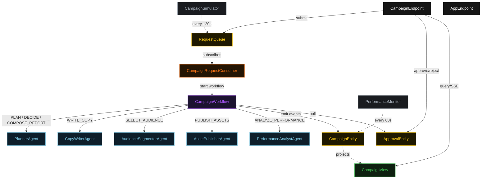
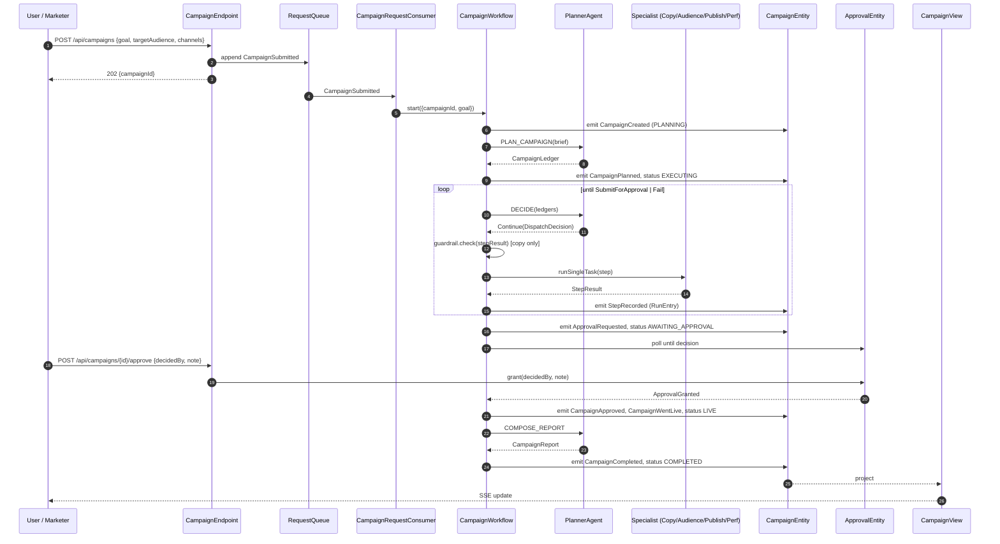
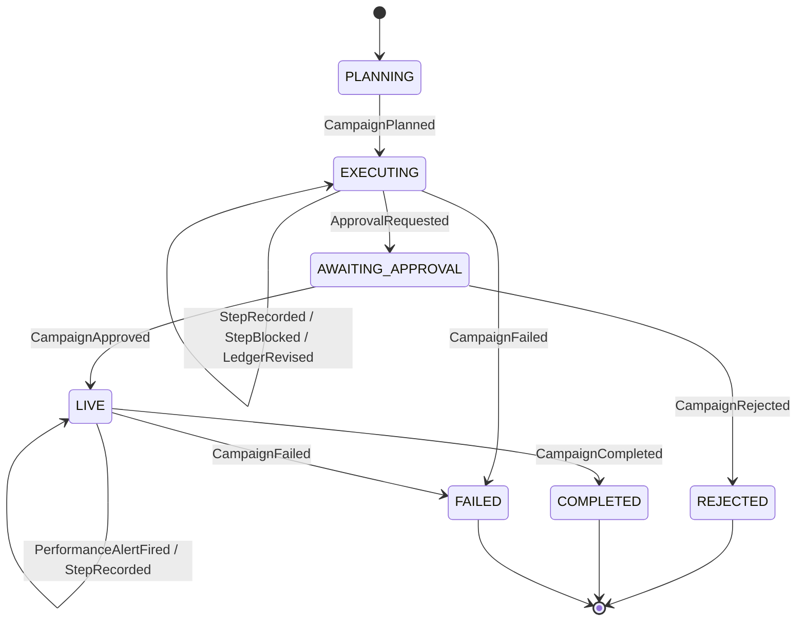
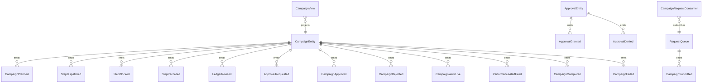

# PLAN — campaign-optimizer-loop

Architectural sketch consumed by `/akka:plan` (or skipped if `/akka:specify` covers it). Diagrams render on the generated system's Architecture tab.

---

## Component graph

## Interaction sequence — J1 (happy path, approval granted)

## State machine — `CampaignEntity`

## Entity model

## Component table — Java file targets

| Component | Path (generated) |
|---|---|
| `PlannerAgent` | `application/PlannerAgent.java` |
| `CopyWriterAgent` | `application/CopyWriterAgent.java` |
| `AudienceSegmenterAgent` | `application/AudienceSegmenterAgent.java` |
| `AssetPublisherAgent` | `application/AssetPublisherAgent.java` |
| `PerformanceAnalystAgent` | `application/PerformanceAnalystAgent.java` |
| `CampaignWorkflow` | `application/CampaignWorkflow.java` |
| `CampaignEntity` | `application/CampaignEntity.java` (state in `domain/Campaign.java`, events in `domain/CampaignEvent.java`) |
| `ApprovalEntity` | `application/ApprovalEntity.java` |
| `RequestQueue` | `application/RequestQueue.java` |
| `CampaignView` | `application/CampaignView.java` |
| `CampaignRequestConsumer` | `application/CampaignRequestConsumer.java` |
| `CampaignSimulator` | `application/CampaignSimulator.java` |
| `PerformanceMonitor` | `application/PerformanceMonitor.java` |
| `CopyGuardrail` | `application/CopyGuardrail.java` |
| `KpiThresholds` | `application/KpiThresholds.java` |
| `PlannerTasks` | `application/PlannerTasks.java` |
| `SpecialistTasks` | `application/SpecialistTasks.java` |
| `CampaignEndpoint` | `api/CampaignEndpoint.java` |
| `AppEndpoint` | `api/AppEndpoint.java` |
| Bootstrap | `Bootstrap.java` |

## Concurrency notes

- **Workflow step timeouts:** `planStep` 60 s, `proposeStep` 45 s, `dispatchStep` 120 s, `decideStep` 45 s, `composeReportStep` 60 s, `approvalGateStep` 1800 s (30-minute human window).
- **Replan budget:** the planner may emit `Replan` at most twice in a row without a `Continue` in between; a third consecutive `Replan` becomes `Fail`.
- **Failure budget:** the planner may emit `Continue` on the same `(specialist, step)` pair at most three times; a fourth attempt becomes `Fail`.
- **Approval gate:** `approvalGateStep` polls `ApprovalEntity.get` with a 1-second yield loop; after 30 minutes without a decision, the workflow emits `CampaignFailed` with `failureReason = "approval timeout"`.
- **Performance monitor race:** `PerformanceMonitor` emits `PerformanceAlertFired` directly on `CampaignEntity`; the workflow re-reads the entity at the top of its loop and detects the alert via `campaign.status == LIVE && pendingAlert`. The monitor is idempotent — it only fires once per 60 s window regardless of how many KPIs miss.
- **Idempotency:** `CampaignEndpoint.submit` deduplicates on `(goal, requestedBy)` over a 10 s window.
- **Guardrail scope:** `CopyGuardrail.check` runs only on `StepResult` from `CopyWriterAgent`. All other specialist results flow directly to `recordStep`.
