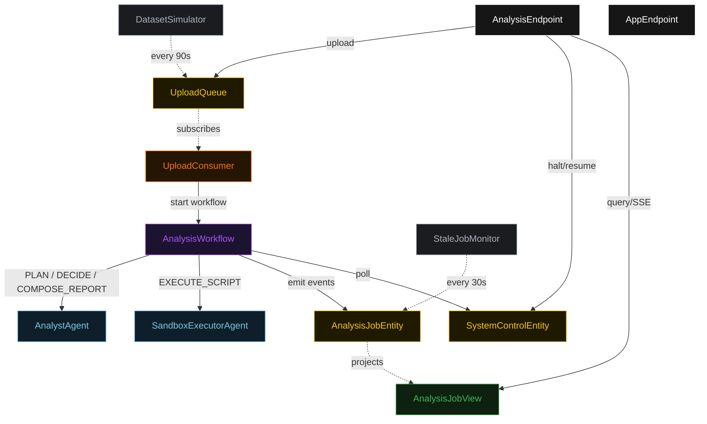
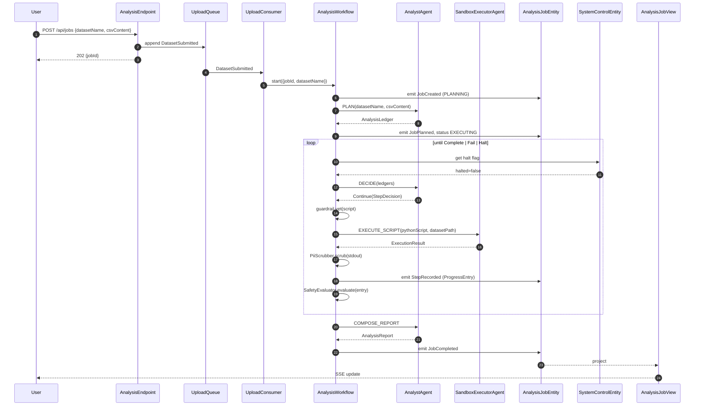
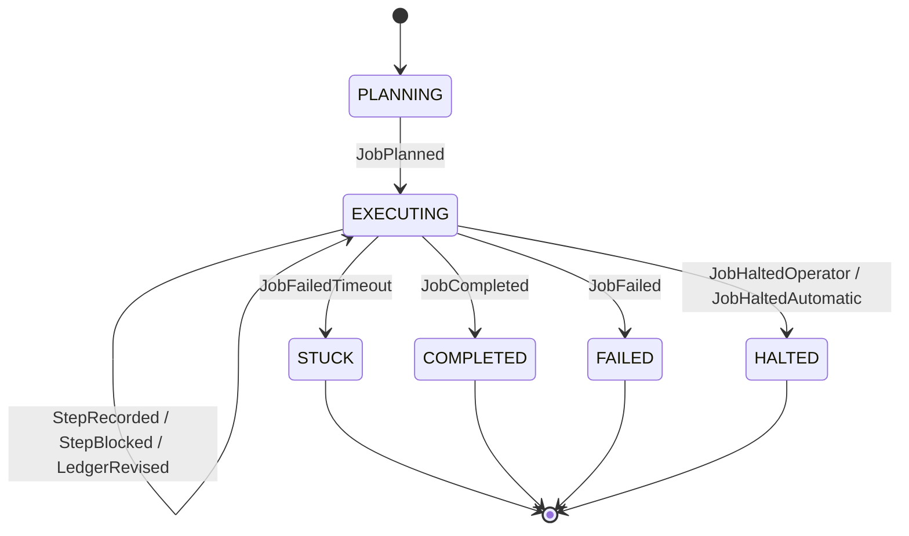
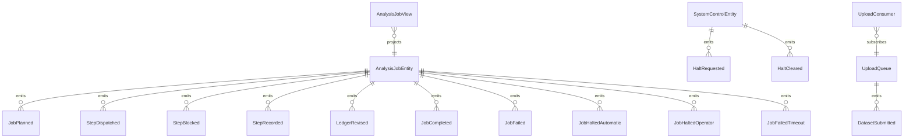

# PLAN — sandboxed-analyst-agent

Architectural sketch consumed by `/akka:plan` (or skipped if `/akka:specify` covers it). Diagrams render on the generated system's Architecture tab.

---

## Component graph

## Interaction sequence — J1 (happy path)

## State machine — `AnalysisJobEntity`

## Entity model

## Component table — Java file targets

| Component | Path (generated) |
|---|---|
| `AnalystAgent` | `application/AnalystAgent.java` |
| `SandboxExecutorAgent` | `application/SandboxExecutorAgent.java` |
| `AnalysisWorkflow` | `application/AnalysisWorkflow.java` |
| `AnalysisJobEntity` | `application/AnalysisJobEntity.java` (state in `domain/AnalysisJob.java`, events in `domain/AnalysisJobEvent.java`) |
| `SystemControlEntity` | `application/SystemControlEntity.java` |
| `UploadQueue` | `application/UploadQueue.java` |
| `AnalysisJobView` | `application/AnalysisJobView.java` |
| `UploadConsumer` | `application/UploadConsumer.java` |
| `DatasetSimulator` | `application/DatasetSimulator.java` |
| `StaleJobMonitor` | `application/StaleJobMonitor.java` |
| `ScriptGuardrail` | `application/ScriptGuardrail.java` |
| `PiiScrubber` | `application/PiiScrubber.java` |
| `SafetyEvaluator` | `application/SafetyEvaluator.java` |
| `AnalystTasks` | `application/AnalystTasks.java` |
| `ExecutorTasks` | `application/ExecutorTasks.java` |
| `AnalysisEndpoint` | `api/AnalysisEndpoint.java` |
| `AppEndpoint` | `api/AppEndpoint.java` |
| Bootstrap | `Bootstrap.java` |

## Concurrency notes

- **Workflow step timeouts:** `planStep` 60 s, `proposeStep` 45 s, `executeStep` 120 s (covers sandbox round-trip, including E2B cold-start latency), `decideStep` 45 s, `composeReportStep` 60 s. Default recovery: `maxRetries(2).failoverTo(AnalysisWorkflow::error)`.
- **Replan budget:** the analyst may emit `Replan` at most twice in a row without a `Continue` in between; a third consecutive `Replan` is treated as `Fail`.
- **Failure budget:** the analyst may emit `Continue` on the same `(scriptKind, script)` at most three times; a fourth attempt is treated as `Fail`.
- **Halt poll:** every `checkHaltStep` reads `SystemControlEntity.get` synchronously — no caching. An operator halt arriving during an `executeStep` lets the in-flight sandbox call finish; the loop exits at the next `checkHaltStep`.
- **Idempotency:** `AnalysisEndpoint.upload` uses `(datasetName, uploaderEmail)` over a 10 s window to dedupe `POST /api/jobs`.
- **Stuck detection:** `StaleJobMonitor` ticks every 30 s; `JobFailedTimeout` is non-fatal to other jobs. The workflow's `decideStep` checks the entity's status and exits if it reads `STUCK`.
- **Sanitizer determinism:** `PiiScrubber.scrub` is pure; it never inspects external state. The same input always yields the same scrubbed output, which keeps `ProgressEntry` events deterministic and replayable.
