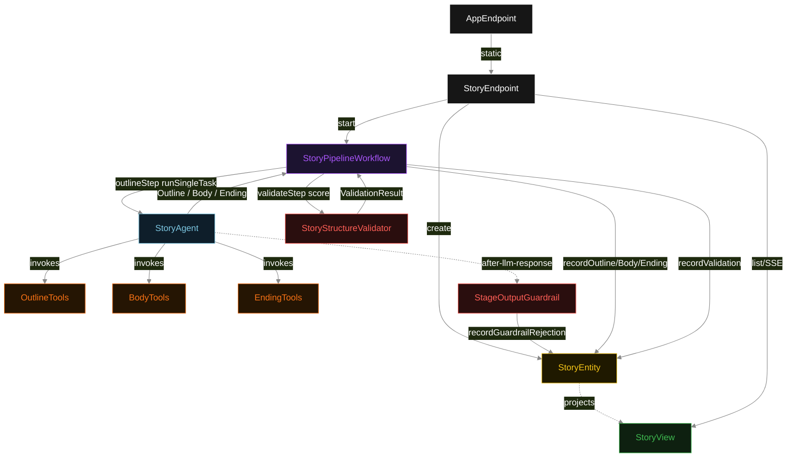
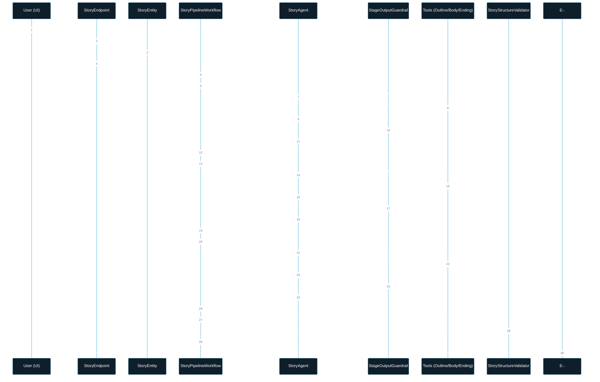
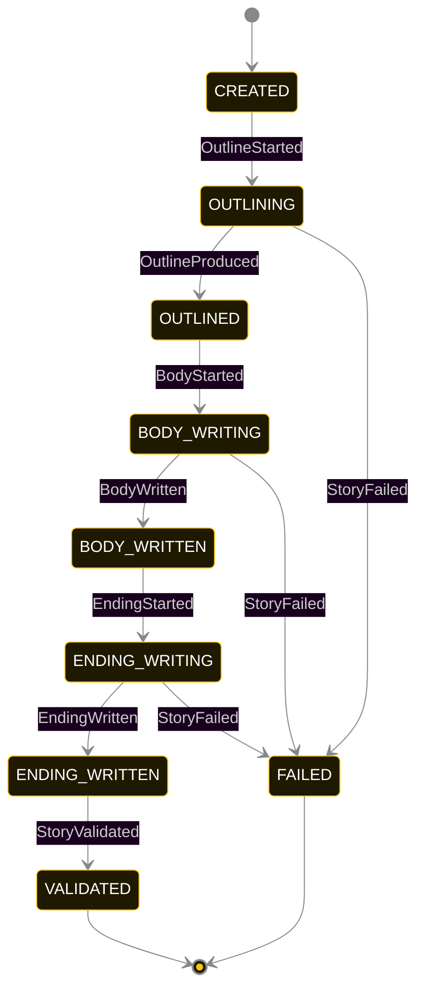
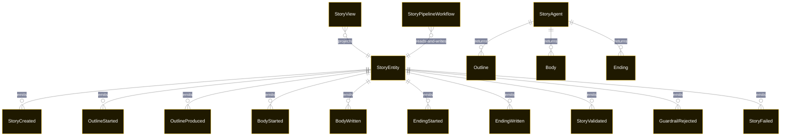

# PLAN — deterministic-multi-stage-agent-pipeline

Architectural sketch consumed by `/akka:plan` and rendered on the generated system's Architecture tab. The four mermaid diagrams below carry the theme variables and CSS overrides from Lesson 24; without them, state names render black-on-black and edge labels clip.

---

## Component graph

## Interaction sequence — J1 (happy path)

## State machine — `StoryEntity`

`GuardrailRejected` is a side-event recorded on the entity for audit; it does not change the status — the agent's retry stays inside the same task, and the workflow's step continues. Only an exhausted retry budget or a step timeout transitions to `FAILED`.

## Entity model

## Component table — Java file targets

| Component | Path (generated) |
|---|---|
| `StoryEndpoint` | `api/StoryEndpoint.java` |
| `AppEndpoint` | `api/AppEndpoint.java` |
| `StoryEntity` | `application/StoryEntity.java` (state in `domain/StoryRecord.java`, events in `domain/StoryEvent.java`) |
| `StoryPipelineWorkflow` | `application/StoryPipelineWorkflow.java` |
| `StoryAgent` | `application/StoryAgent.java` (tasks in `application/StoryTasks.java`) |
| `OutlineTools` | `application/OutlineTools.java` |
| `BodyTools` | `application/BodyTools.java` |
| `EndingTools` | `application/EndingTools.java` |
| `StageOutputGuardrail` | `application/StageOutputGuardrail.java` |
| `StoryStructureValidator` | `application/StoryStructureValidator.java` |
| `StoryView` | `application/StoryView.java` |
| `MockModelProvider` (option-a only) | `application/MockModelProvider.java` |
| Bootstrap | `Bootstrap.java` |

## Concurrency notes

- **Per-step timeout**: `outlineStep` 60 s, `bodyStep` 60 s, `endingStep` 60 s, `validateStep` 5 s, `error` 5 s. Default step recovery `maxRetries(2).failoverTo(StoryPipelineWorkflow::error)`. The 60 s on each agent-calling step accommodates LLM latency including tool round-trips (Lesson 4).
- **Idempotency**: each workflow uses `"pipeline-" + storyId` as the workflow id; restart of the same storyId is rejected by the workflow runtime. The agent instance id is `"agent-" + storyId` so each story has its own per-task conversation memory.
- **One agent per story**: `StoryAgent` runs three tasks per story — OUTLINE, WRITE_BODY, WRITE_ENDING — each with `capability(...).maxIterationsPerTask(4)`. The 4-iteration budget gives the guardrail room to reject a structurally incomplete result and still let the agent self-correct.
- **Guardrail-driven retry**: when `StageOutputGuardrail` rejects a result, the rejection is returned as a structured error to the agent loop. The loop counts toward `maxIterationsPerTask`; if all 4 iterations fail validation, the workflow step fails over to `error` and the entity transitions to `FAILED`.
- **Validation is synchronous and deterministic**: `StoryStructureValidator` runs in-process inside `validateStep`. No LLM call, no external service — the same story always scores the same. This is a deliberate single-agent invariant.
- **Task-boundary handoff is the dependency contract**: `outlineStep` writes `OutlineProduced` BEFORE returning; `bodyStep` reads the recorded `Outline` from the entity to build its task's instruction context; `endingStep` reads both `Outline` and `Body`. The agent itself is stateless across stages — it never holds outline + body + ending context in one conversation.
- **No saga / no compensation**: every step is either pure read, append-only event write, or a single-task agent call. A failed story stays at the last successful event; the UI shows the partial state for the user.
