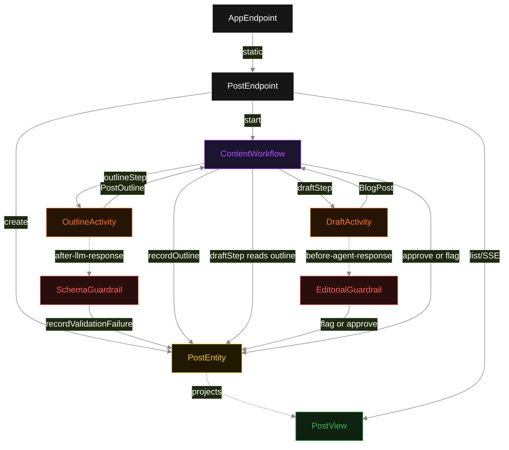
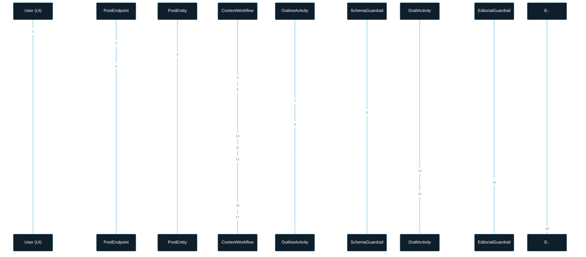
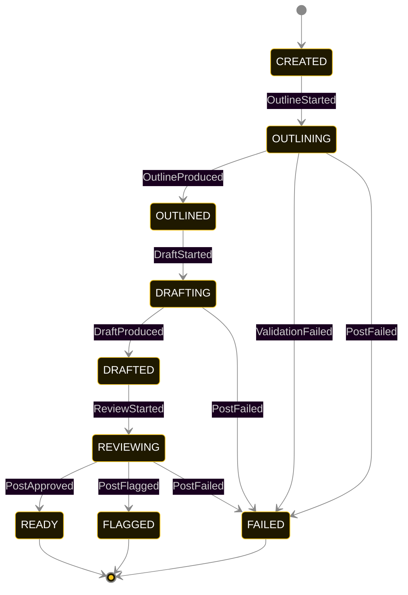
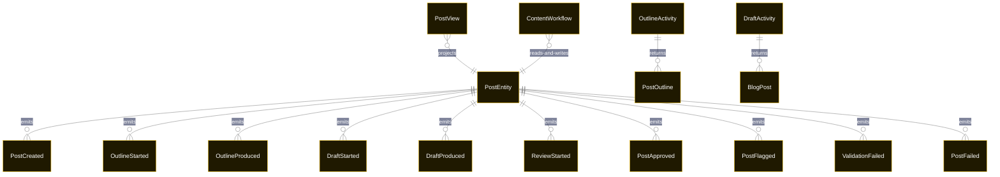

# PLAN — akka-llm-pipeline-workflow

Architectural sketch consumed by `/akka:plan` and rendered on the generated system's Architecture tab. The four mermaid diagrams below carry the theme variables and CSS overrides from Lesson 24; without them, state names render black-on-black and edge labels clip.

---

## Component graph

## Interaction sequence — J1 (happy path)

## State machine — `PostEntity`

`ValidationFailed` is recorded on the entity when `SchemaGuardrail` rejects the outline; it transitions the post directly to `FAILED` because the outline cannot be recovered within the same workflow run. `PostFlagged` transitions to `FLAGGED` (a distinct terminal state — the draft exists but requires editorial attention). `FAILED` and `FLAGGED` are both terminal; neither has a resume path.

## Entity model

## Component table — Java file targets

| Component | Path (generated) |
|---|---|
| `PostEndpoint` | `api/PostEndpoint.java` |
| `AppEndpoint` | `api/AppEndpoint.java` |
| `PostEntity` | `application/PostEntity.java` (state in `domain/PostRecord.java`, events in `domain/PostEvent.java`) |
| `ContentWorkflow` | `application/ContentWorkflow.java` |
| `OutlineActivity` | `application/OutlineActivity.java` |
| `DraftActivity` | `application/DraftActivity.java` |
| `SchemaGuardrail` | `application/SchemaGuardrail.java` |
| `EditorialGuardrail` | `application/EditorialGuardrail.java` |
| `PostView` | `application/PostView.java` |
| `MockModelProvider` (option-a only) | `application/MockModelProvider.java` |
| Bootstrap | `Bootstrap.java` |

## Concurrency notes

- **Per-step timeout**: `outlineStep` 60 s, `draftStep` 90 s, `reviewStep` 10 s, `failStep` 5 s. Default step recovery `maxRetries(2).failoverTo(ContentWorkflow::failStep)`. The 90 s on the draft step accommodates longer LLM generation for a full blog post (Lesson 4).
- **Idempotency**: each workflow uses `"workflow-" + postId` as the workflow id; restart of the same `postId` is rejected by the workflow runtime.
- **No agent**: there are zero `AutonomousAgent` instances. Both LLM calls are typed activities executed directly inside the workflow steps via the `ModelClient` API. The guardrails are registered on the activities, not on agents.
- **Typed handoff is the information contract**: `outlineStep` writes `OutlineProduced` BEFORE returning; `draftStep` reads the recorded `PostOutline` from the entity to build the draft LLM call's context. The raw topic is never passed to the draft call.
- **Guardrails are synchronous**: `SchemaGuardrail` runs in-process before `outlineStep` writes the outline. `EditorialGuardrail` runs in-process before `reviewStep` finalises the status. Neither makes an LLM call; both are rule-based and deterministic.
- **FLAGGED vs FAILED**: `FAILED` means the pipeline could not produce a valid output (e.g., schema validation error). `FLAGGED` means a complete output was produced but it did not pass editorial policy. Both are terminal; the distinction is surfaced in the UI with different card colours.
- **No saga / no compensation**: each step is either a pure read, an append-only event write, or a single typed LLM call. A failed post stays at the last successful event; the UI shows the partial state.
