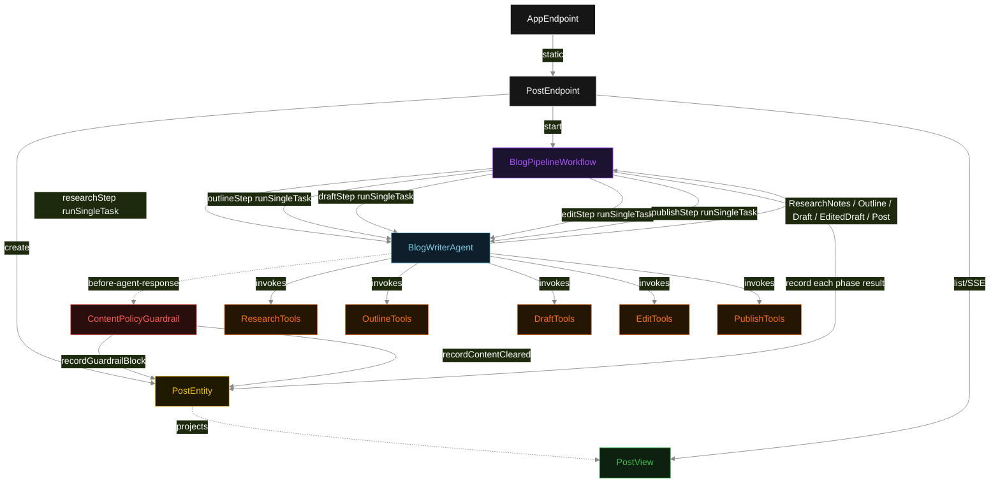
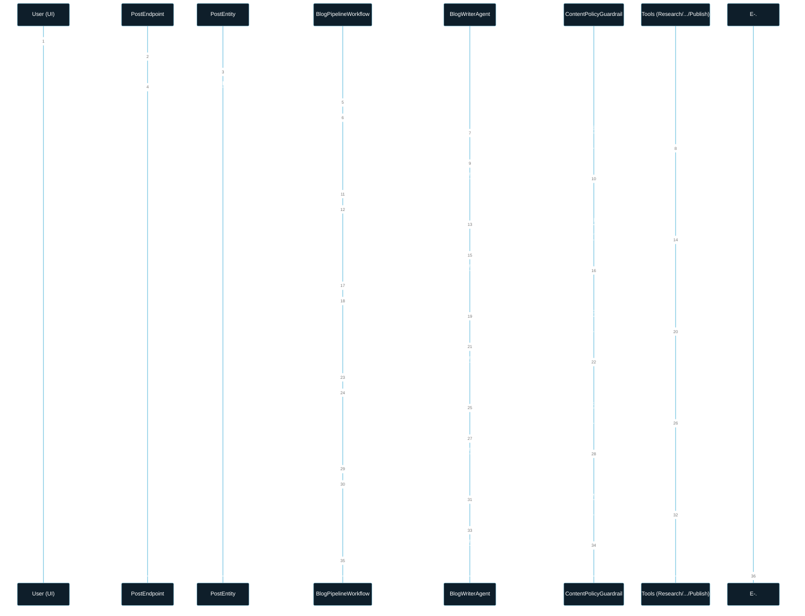
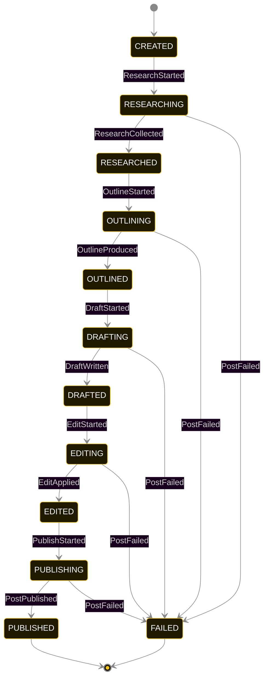
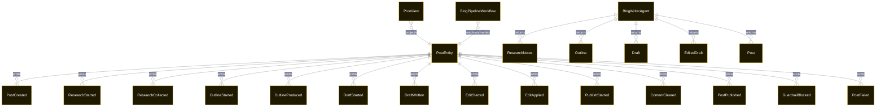

# PLAN — AI Blog Writer Pipeline with Ollama

Architectural sketch consumed by `/akka:plan` and rendered on the generated system's Architecture tab. The four mermaid diagrams below carry the theme variables and CSS overrides from Lesson 24; without them, state names render black-on-black and edge labels clip.

---

## Component graph

## Interaction sequence — J1 (happy path)

## State machine — `PostEntity`

`GuardrailBlocked` and `ContentCleared` are side-events recorded on the entity for audit; they do not change the status — the agent's retry stays inside the same task, and the workflow's step continues. Only an exhausted retry budget or a step timeout transitions to FAILED.

## Entity model

## Component table — Java file targets

| Component | Path (generated) |
|---|---|
| `PostEndpoint` | `api/PostEndpoint.java` |
| `AppEndpoint` | `api/AppEndpoint.java` |
| `PostEntity` | `application/PostEntity.java` (state in `domain/PostRecord.java`, events in `domain/PostEvent.java`) |
| `BlogPipelineWorkflow` | `application/BlogPipelineWorkflow.java` |
| `BlogWriterAgent` | `application/BlogWriterAgent.java` (tasks in `application/BlogTasks.java`) |
| `ResearchTools` | `application/ResearchTools.java` |
| `OutlineTools` | `application/OutlineTools.java` |
| `DraftTools` | `application/DraftTools.java` |
| `EditTools` | `application/EditTools.java` |
| `PublishTools` | `application/PublishTools.java` |
| `ContentPolicyGuardrail` | `application/ContentPolicyGuardrail.java` |
| `PostView` | `application/PostView.java` |
| `MockModelProvider` (option-a only) | `application/MockModelProvider.java` |
| Bootstrap | `Bootstrap.java` |

## Concurrency notes

- **Per-step timeout**: `researchStep` 90 s, `outlineStep` 90 s, `draftStep` 90 s, `editStep` 90 s, `publishStep` 90 s, `error` 5 s. Default step recovery `maxRetries(2).failoverTo(BlogPipelineWorkflow::error)`. The 90 s on each agent-calling step accommodates LLM latency including tool round-trips for Ollama's slower inference (Lesson 4).
- **Idempotency**: each workflow uses `"pipeline-" + postId` as the workflow id; restart of the same postId is rejected by the workflow runtime. The agent instance id is `"agent-" + postId` so each post has its own per-task conversation memory.
- **One agent per post**: `BlogWriterAgent` runs five tasks per post — RESEARCH, OUTLINE, DRAFT, EDIT, PUBLISH — each with `capability(...).maxIterationsPerTask(4)`. The 4-iteration budget gives the guardrail room to reject a non-compliant response and still let the agent self-correct.
- **Guardrail-driven retry**: when `ContentPolicyGuardrail` rejects a response, the rejection is returned as a structured error to the agent loop. The loop counts toward `maxIterationsPerTask`; if all 4 iterations fail policy, the workflow step fails over to `error` and the entity transitions to `FAILED`.
- **Guardrail is synchronous and deterministic**: `ContentPolicyGuardrail` runs in-process. No LLM call — the same prose always produces the same policy decision. This is a deliberate single-agent invariant.
- **Task-boundary handoff is the dependency contract**: `researchStep` writes `ResearchCollected` BEFORE advancing; `outlineStep` reads the recorded `ResearchNotes` from the entity to build its task's instruction context; `draftStep` reads both `ResearchNotes` and `Outline`. The agent itself is stateless across phases.
- **No saga / no compensation**: every step is either pure read, append-only event write, or a single-task agent call. A failed post stays at the last successful event; the UI shows the partial state for the user.
