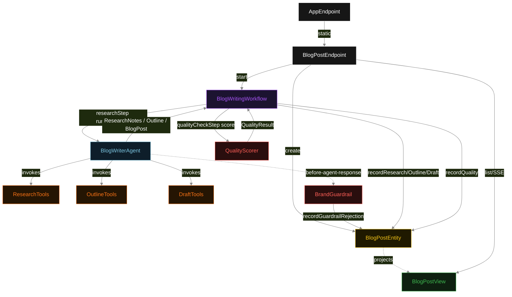
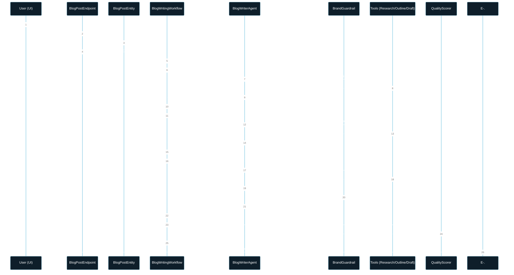
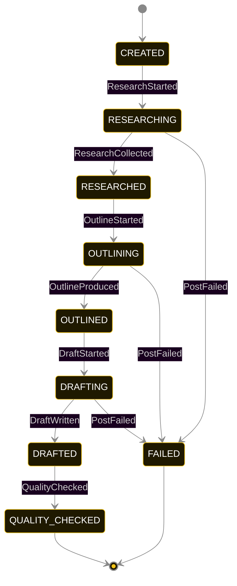
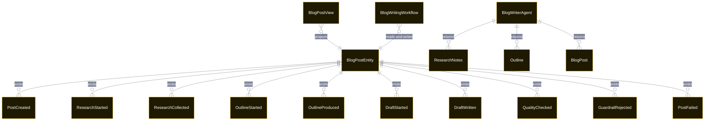

# PLAN — blog-writer-pipeline

Architectural sketch consumed by `/akka:plan` and rendered on the generated system's Architecture tab. The four mermaid diagrams below carry the theme variables and CSS overrides from Lesson 24; without them, state names render black-on-black and edge labels clip.

---

## Component graph

## Interaction sequence — J1 (happy path)

## State machine — `BlogPostEntity`

`GuardrailRejected` is a side-event recorded on the entity for audit; it does not change the status — the agent's retry stays inside the same `draftStep`, and the workflow step continues. Only an exhausted retry budget or a step timeout transitions to FAILED.

## Entity model

## Component table — Java file targets

| Component | Path (generated) |
|---|---|
| `BlogPostEndpoint` | `api/BlogPostEndpoint.java` |
| `AppEndpoint` | `api/AppEndpoint.java` |
| `BlogPostEntity` | `application/BlogPostEntity.java` (state in `domain/BlogPostRecord.java`, events in `domain/BlogPostEvent.java`) |
| `BlogWritingWorkflow` | `application/BlogWritingWorkflow.java` |
| `BlogWriterAgent` | `application/BlogWriterAgent.java` (tasks in `application/BlogTasks.java`) |
| `ResearchTools` | `application/ResearchTools.java` |
| `OutlineTools` | `application/OutlineTools.java` |
| `DraftTools` | `application/DraftTools.java` |
| `BrandGuardrail` | `application/BrandGuardrail.java` |
| `QualityScorer` | `application/QualityScorer.java` |
| `BlogPostView` | `application/BlogPostView.java` |
| `MockModelProvider` (option-a only) | `application/MockModelProvider.java` |
| Bootstrap | `Bootstrap.java` |

## Concurrency notes

- **Per-step timeout**: `researchStep` 60 s, `outlineStep` 60 s, `draftStep` 90 s (accommodates guardrail retry iterations), `qualityCheckStep` 5 s, `error` 5 s. Default step recovery `maxRetries(2).failoverTo(BlogWritingWorkflow::error)`. The 90 s on `draftStep` accommodates LLM latency plus up to two brand-guardrail rejection-and-retry cycles within the 4-iteration budget (Lesson 4).
- **Idempotency**: each workflow uses `"workflow-" + postId` as the workflow id; restart of the same postId is rejected by the workflow runtime. The agent instance id is `"agent-" + postId` so each post has its own per-task conversation memory.
- **One agent per post**: `BlogWriterAgent` runs three tasks per post — RESEARCH, OUTLINE, DRAFT — each with `capability(...).maxIterationsPerTask(4)`. The 4-iteration budget gives the brand guardrail room to reject a non-conformant draft and still let the agent self-correct.
- **Guardrail-driven retry**: when `BrandGuardrail` rejects a response, the rejection is returned as a structured error to the agent loop naming the failing rule. The loop counts toward `maxIterationsPerTask`; if all 4 iterations fail brand checks, the workflow step fails over to `error` and the entity transitions to FAILED.
- **Eval is synchronous and deterministic**: `QualityScorer` runs in-process inside `qualityCheckStep`. No LLM call, no external service — the same post always scores the same. This is a deliberate single-agent invariant.
- **Task-boundary handoff is the dependency contract**: `researchStep` writes `ResearchCollected` BEFORE returning; `outlineStep` reads the recorded `ResearchNotes` from the entity to build its task's instruction context; `draftStep` reads both `ResearchNotes` and `Outline`. The agent itself is stateless across phases — it never holds research + outline + draft context in one conversation.
- **No saga / no compensation**: every step is either pure read, append-only event write, or a single-task agent call. A failed post stays at the last successful event; the UI shows the partial state for the user.
