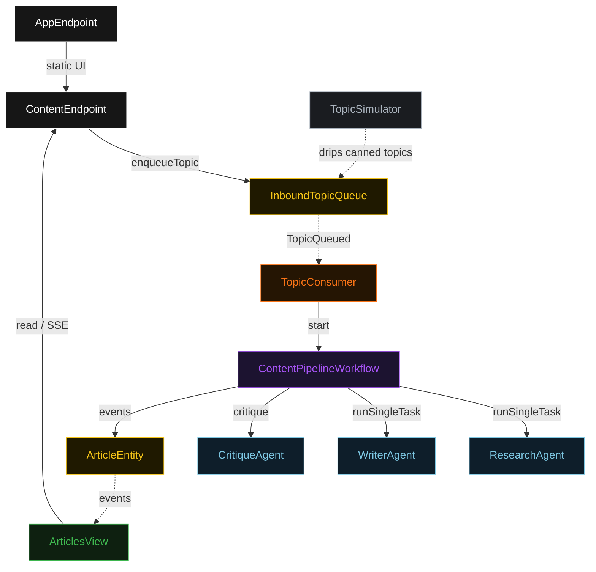
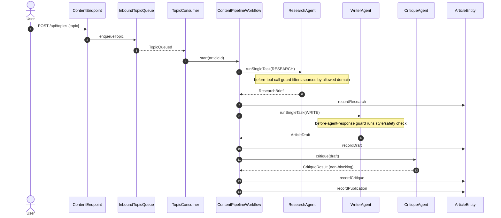
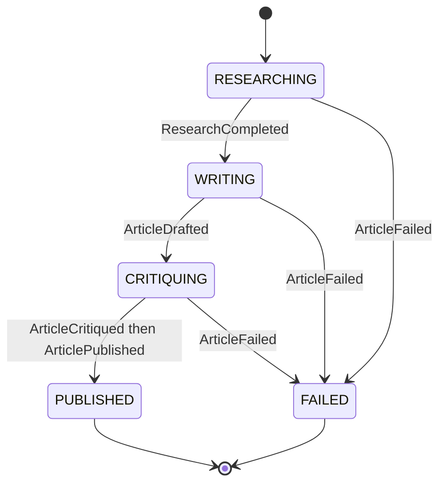
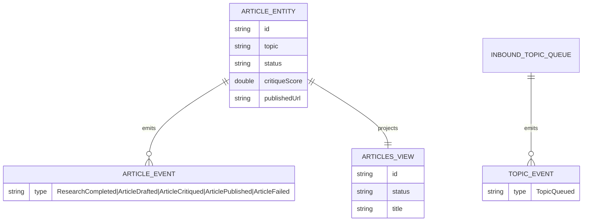

# PLAN — content-pipeline

Architectural sketch for the sequential-pipeline content-editorial system. All four mermaid diagrams + the component table are below. The generated UI renders these on the Architecture tab with the Lesson 24 CSS overrides.

---

## Component graph

## Interaction sequence

## State machine

## Entity model

## Component table

| Component | Akka primitive | Path (generated) |
|---|---|---|
| ResearchAgent | AutonomousAgent | `application/ResearchAgent.java` |
| WriterAgent | AutonomousAgent | `application/WriterAgent.java` |
| CritiqueAgent | Agent | `application/CritiqueAgent.java` |
| ContentPipelineWorkflow | Workflow | `application/ContentPipelineWorkflow.java` |
| ArticleEntity | EventSourcedEntity | `domain/ArticleEntity.java` |
| InboundTopicQueue | EventSourcedEntity | `domain/InboundTopicQueue.java` |
| ArticlesView | View | `application/ArticlesView.java` |
| TopicConsumer | Consumer | `application/TopicConsumer.java` |
| TopicSimulator | TimedAction | `application/TopicSimulator.java` |
| ContentEndpoint | HttpEndpoint | `api/ContentEndpoint.java` |
| AppEndpoint | HttpEndpoint | `api/AppEndpoint.java` |
| ContentPipelineTasks | companion | `application/ContentPipelineTasks.java` |

## Concurrency notes

- Workflow step timeouts: 60s on `researchStep`, `writeStep`, `critiqueStep` (agent calls run 10–30s; the 5s default times out — Lesson 4). `defaultStepRecovery(maxRetries(2).failoverTo(error))`; the `error` step writes `ArticleFailed`.
- Idempotency: `TopicConsumer` derives the workflow id from a fresh UUID per `TopicQueued` event; re-delivery of the same event starts at most one workflow because the workflow id is recorded on the article before the first step.
- No saga/compensation: the publish step is in-process and the pipeline is forward-only; a failure at any stage transitions the article to `FAILED` rather than rolling back prior stages.
- The critique stage is non-blocking — a low score records on the article but does not stop publishing.
