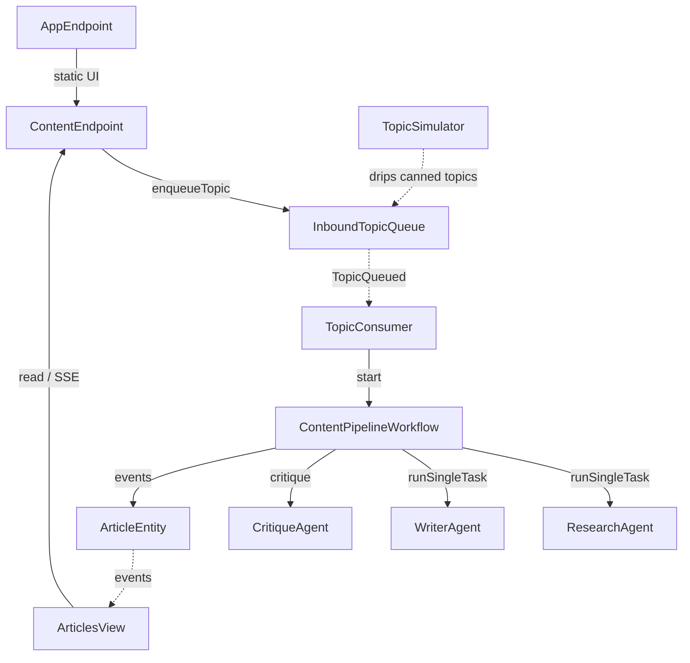
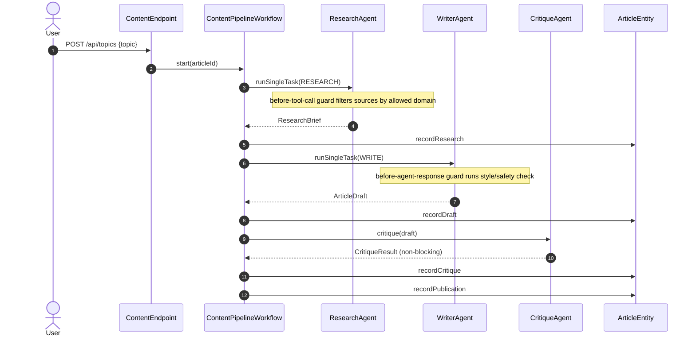
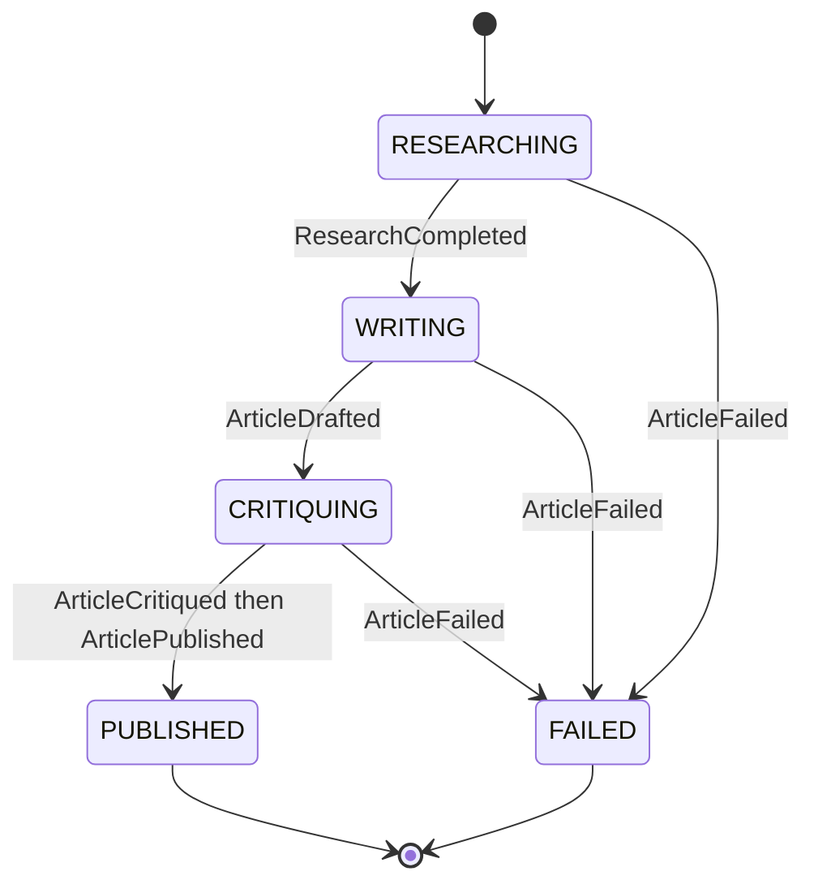
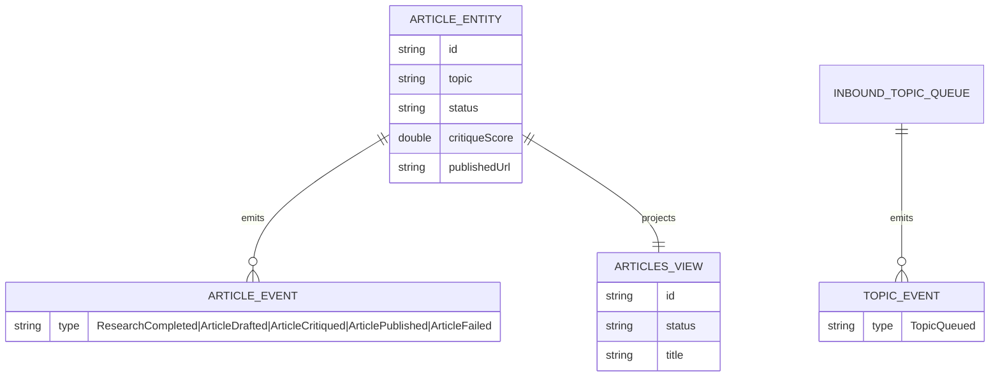

# Architecture — content-pipeline

The system is a sequential pipeline: one Workflow chains four stages, each handing a typed result to the next. The four mermaid diagrams below are the same sources the generated UI renders on the Architecture tab (with the Lesson 24 CSS overrides for state-diagram labels and edge-label `foreignObject` overflow).

## Component graph

Topics arrive from either the HTTP endpoint or the simulator, land on `InboundTopicQueue`, and a consumer starts one workflow per topic. The workflow drives the two AutonomousAgents and the critique Agent, writing each result as an event on `ArticleEntity`. `ArticlesView` projects those events for the UI list and SSE stream.

## Interaction sequence

The primary journey: submit a topic, then research → write → critique → publish, with the two guardrails firing inside the research and write stages.

## State machine

The article lifecycle. A failure in any agent-calling stage moves the article to `FAILED` (forward-only, no rollback).

## Entity model

See `../PLAN.md` for the component-to-file-path table and concurrency notes.
