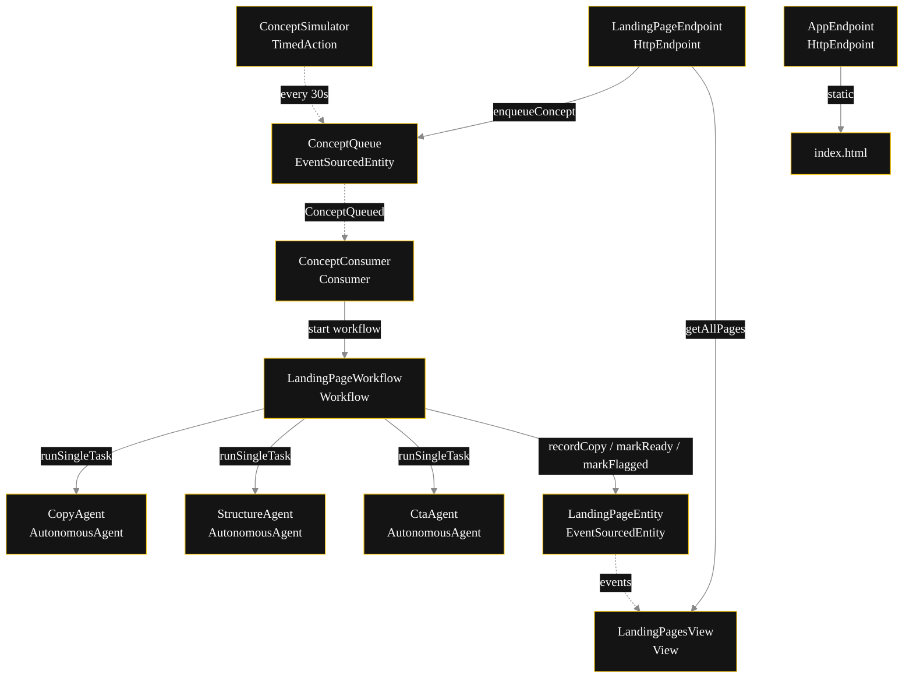
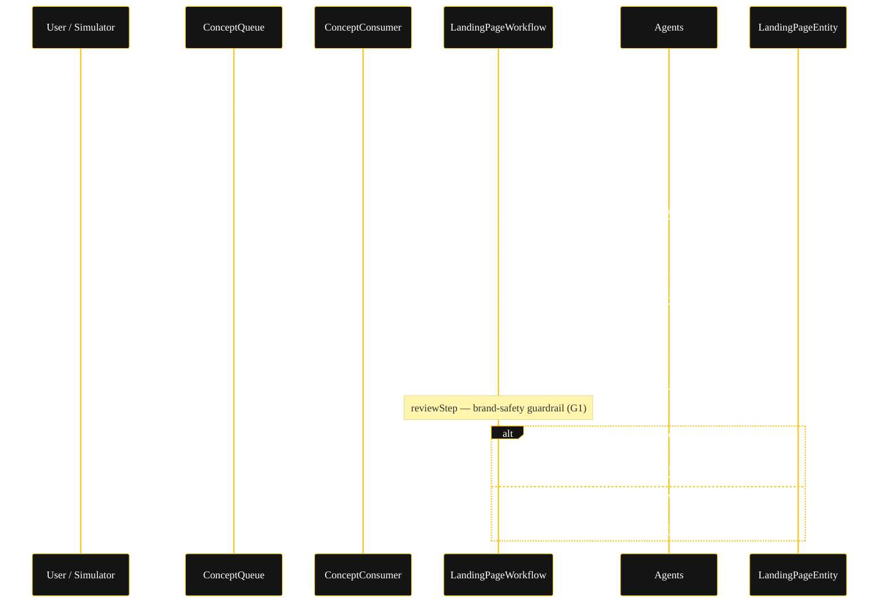
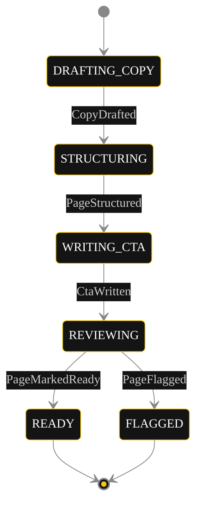
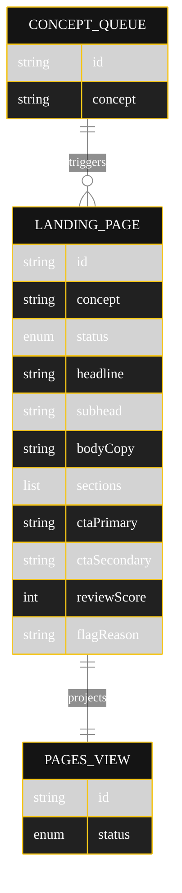

# PLAN — Landing Page Generator

Architectural sketch for the `sequential-pipeline.content-editorial.landing-page-generator` blueprint. Mermaid sources below are rendered on the Architecture tab of the generated UI. All diagrams use the Akka dark theme plus the Lesson 24 CSS overrides for state-diagram labels (state names forced white; edge-label `foreignObject` set to `overflow:visible`; `transitionLabelColor` `#cccccc`).

## Component graph

Solid arrows are synchronous commands; dashed arrows are event subscriptions; dotted arrows are scheduled ticks.

## Interaction sequence

## State machine

## Entity model

## Component table

| Component | Akka primitive | File path |
|---|---|---|
| `CopyAgent` | AutonomousAgent | `application/CopyAgent.java` |
| `StructureAgent` | AutonomousAgent | `application/StructureAgent.java` |
| `CtaAgent` | AutonomousAgent | `application/CtaAgent.java` |
| `LandingPageTasks` | task constants | `application/LandingPageTasks.java` |
| `LandingPageWorkflow` | Workflow | `application/LandingPageWorkflow.java` |
| `LandingPageEntity` | EventSourcedEntity | `application/LandingPageEntity.java` |
| `ConceptQueue` | EventSourcedEntity | `application/ConceptQueue.java` |
| `LandingPagesView` | View | `application/LandingPagesView.java` |
| `ConceptConsumer` | Consumer | `application/ConceptConsumer.java` |
| `ConceptSimulator` | TimedAction | `application/ConceptSimulator.java` |
| `LandingPageEndpoint` | HttpEndpoint | `api/LandingPageEndpoint.java` |
| `AppEndpoint` | HttpEndpoint | `api/AppEndpoint.java` |
| `LandingPage`, records | domain records | `domain/*.java` |

## Concurrency notes

- **Step timeouts.** Every workflow step calls an agent (or evaluates the page), so each gets an explicit `stepTimeout(60s)` override — the default 5s timeout would expire mid-LLM-call (Lesson 4).
- **Idempotency.** The workflow is keyed by `pageId` (a fresh UUID minted by `ConceptConsumer`). Re-delivery of the same `ConceptQueued` event re-uses the same page id, so entity commands are naturally idempotent per page.
- **Recovery / compensation.** `defaultStepRecovery(maxRetries(2).failoverTo(error))` retries transient agent failures twice, then routes to a terminal error step. No saga is needed — the pipeline is linear and the only externally visible state is the entity, written once per stage.
- **Review gate.** `reviewStep` is the single compensation point: a failing brand-safety evaluation routes to `markFlagged`, which is terminal and blocks the `READY` transition. This is the G1 guardrail boundary.
