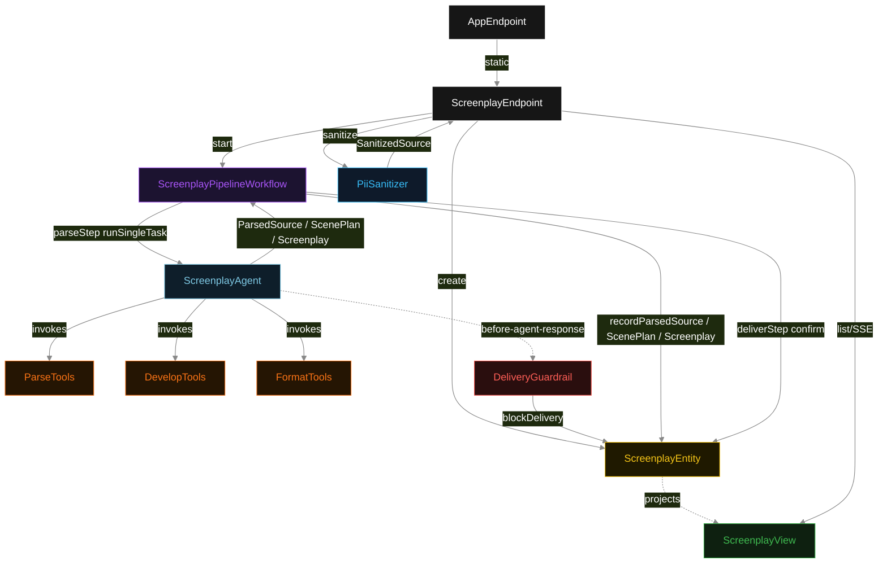
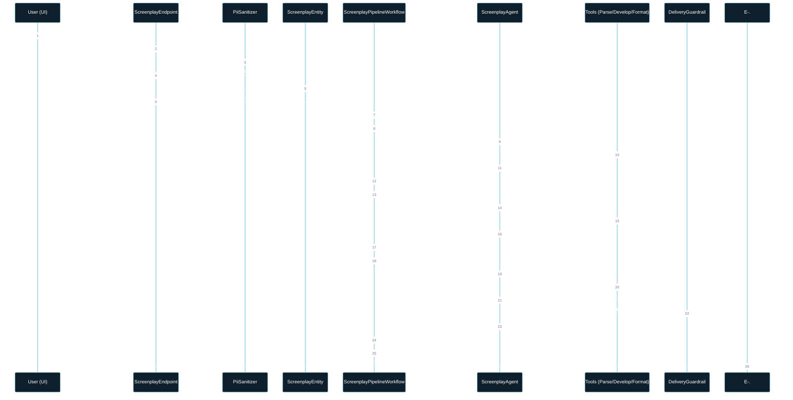
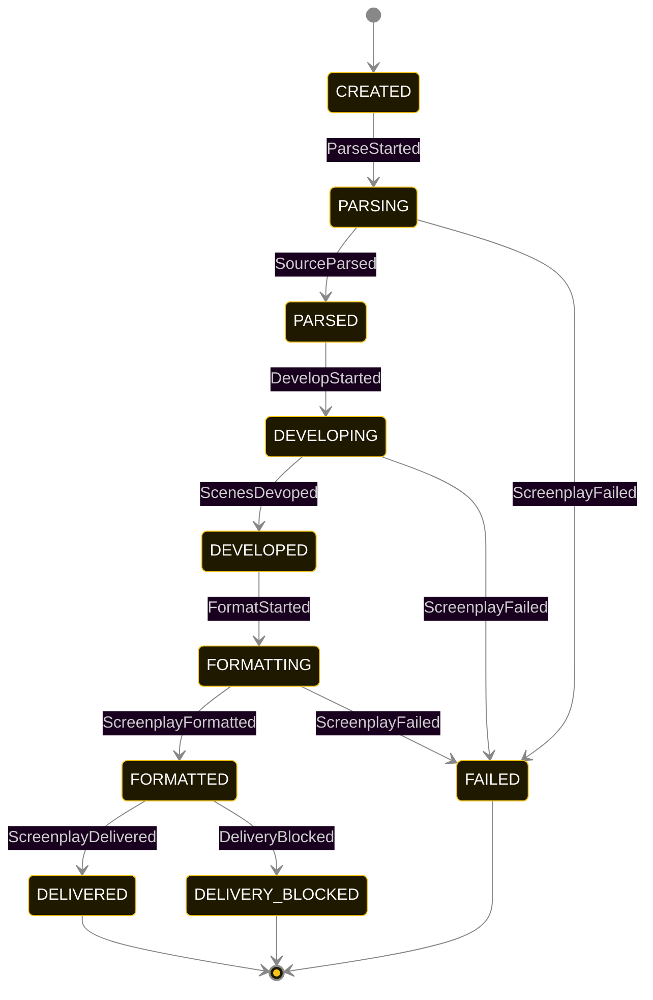
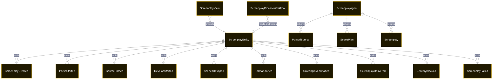

# PLAN — screenplay-writer-marketplace

Architectural sketch consumed by `/akka:plan` and rendered on the generated system's Architecture tab. The four mermaid diagrams below carry the theme variables and CSS overrides from Lesson 24; without them, state names render black-on-black and edge labels clip.

---

## Component graph

## Interaction sequence — J1 (happy path)

## State machine — `ScreenplayEntity`

DeliveryBlocked is a terminal state — the author must re-examine the source material and resubmit. DELIVERY_BLOCKED screenplays are never delivered; the guardrail rejection is preserved on the entity for audit.

## Entity model

## Component table — Java file targets

| Component | Path (generated) |
|---|---|
| `ScreenplayEndpoint` | `api/ScreenplayEndpoint.java` |
| `AppEndpoint` | `api/AppEndpoint.java` |
| `ScreenplayEntity` | `application/ScreenplayEntity.java` (state in `domain/ScreenplayRecord.java`, events in `domain/ScreenplayEvent.java`) |
| `ScreenplayPipelineWorkflow` | `application/ScreenplayPipelineWorkflow.java` |
| `ScreenplayAgent` | `application/ScreenplayAgent.java` (tasks in `application/ScreenplayTasks.java`) |
| `ParseTools` | `application/ParseTools.java` |
| `DevelopTools` | `application/DevelopTools.java` |
| `FormatTools` | `application/FormatTools.java` |
| `PiiSanitizer` | `application/PiiSanitizer.java` |
| `DeliveryGuardrail` | `application/DeliveryGuardrail.java` |
| `ScreenplayView` | `application/ScreenplayView.java` |
| `MockModelProvider` (option-a only) | `application/MockModelProvider.java` |
| Bootstrap | `Bootstrap.java` |

## Concurrency notes

- **Per-step timeout**: `parseStep` 60 s, `developStep` 60 s, `formatStep` 60 s, `deliverStep` 5 s, `error` 5 s. Default step recovery `maxRetries(2).failoverTo(ScreenplayPipelineWorkflow::error)`. The 60 s on each agent-calling step accommodates LLM latency including tool round-trips (Lesson 4).
- **Idempotency**: each workflow uses `"pipeline-" + screenplayId` as the workflow id; restart of the same screenplayId is rejected by the workflow runtime. The agent instance id is `"agent-" + screenplayId`.
- **One agent per screenplay**: `ScreenplayAgent` runs three tasks per screenplay — PARSE, DEVELOP, FORMAT — each with `capability(...).maxIterationsPerTask(4)`.
- **Guardrail is terminal at the egress boundary**: when `DeliveryGuardrail` rejects the agent's response, the workflow does not retry the FORMAT task — it routes to the error step and records `DeliveryBlocked`. The author must resubmit with cleaner source material.
- **Sanitizer is synchronous at ingestion**: `PiiSanitizer` runs in-thread inside `ScreenplayEndpoint.submitScreenplay()` before any async entity write. Its output is the only form of the source text that ever reaches the agent.
- **Task-boundary handoff is the dependency contract**: `parseStep` writes `SourceParsed` BEFORE returning; `developStep` reads the recorded `ParsedSource` from the entity to build its task's instruction context; `formatStep` reads both `ParsedSource` and `ScenePlan`. The agent is stateless across phases.
- **No saga / no compensation**: every step is either pure read, append-only event write, or a single-task agent call. A failed screenplay stays at the last successful event; the UI shows the partial state for the user.
