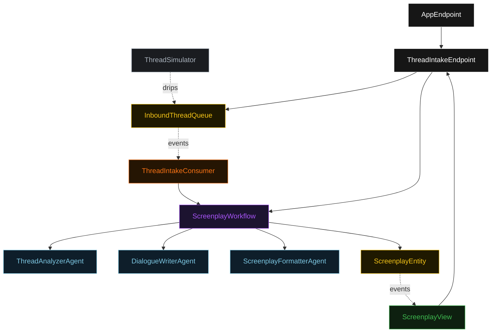
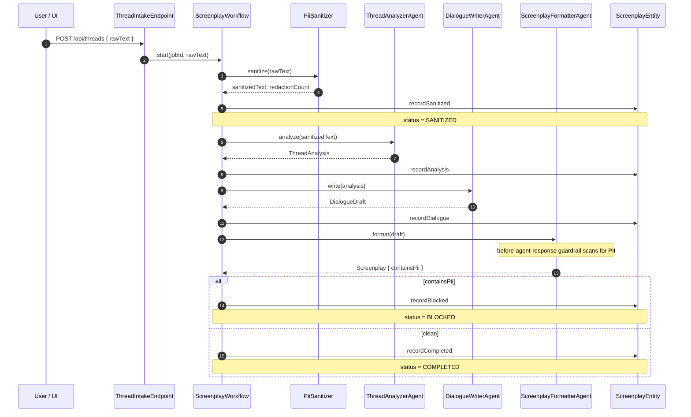
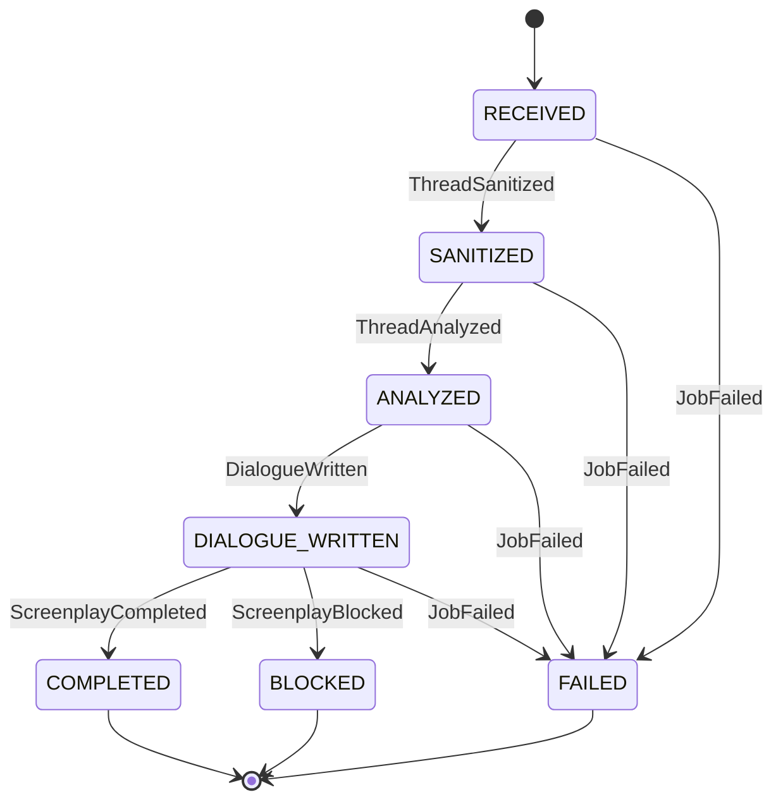
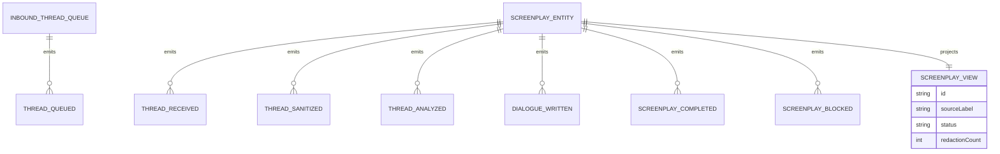

# PLAN — screenplay-writer

Architectural sketch. All four mermaid diagrams + the component table.

---

## Component graph

## Interaction sequence

## State machine

## Entity model

## Component table

| Component | Path (generated) |
|---|---|
| ThreadIntakeEndpoint | `api/ThreadIntakeEndpoint.java` |
| AppEndpoint | `api/AppEndpoint.java` |
| ScreenplayWorkflow | `application/ScreenplayWorkflow.java` |
| ThreadAnalyzerAgent | `application/ThreadAnalyzerAgent.java` |
| DialogueWriterAgent | `application/DialogueWriterAgent.java` |
| ScreenplayFormatterAgent | `application/ScreenplayFormatterAgent.java` |
| PiiSanitizer | `application/PiiSanitizer.java` |
| ScreenplayEntity | `domain/ScreenplayEntity.java` |
| ScreenplayView | `application/ScreenplayView.java` |
| InboundThreadQueue | `domain/InboundThreadQueue.java` |
| ThreadIntakeConsumer | `application/ThreadIntakeConsumer.java` |
| ThreadSimulator | `application/ThreadSimulator.java` |

## Concurrency notes

- Workflow step timeouts: 60s on `analyzeStep`, `dialogueStep`, `formatStep` (LLM latency, Lesson 4). `sanitizeStep` is deterministic and keeps the default timeout. `defaultStepRecovery(maxRetries(2).failoverTo(error))`.
- Idempotency: the workflow id is the `jobId`; the consumer derives one UUID per queued thread so re-delivery does not start duplicate workflows.
- No saga: stages are forward-only. A failure at any stage emits `JobFailed`; there is no external side effect to compensate (the publish target is in-process and the screenplay is only persisted on the entity).
- The final guardrail is a fast-fail, not a retry: `containsPii == true` ends the workflow in `BLOCKED` rather than re-prompting the agent.
