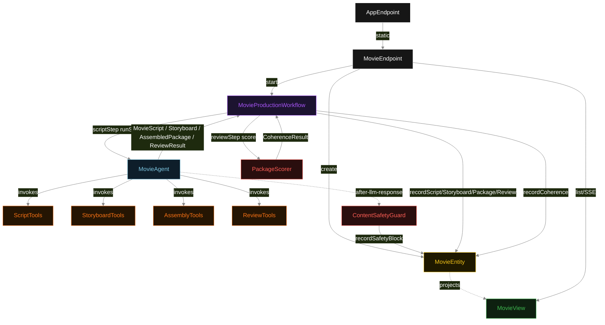
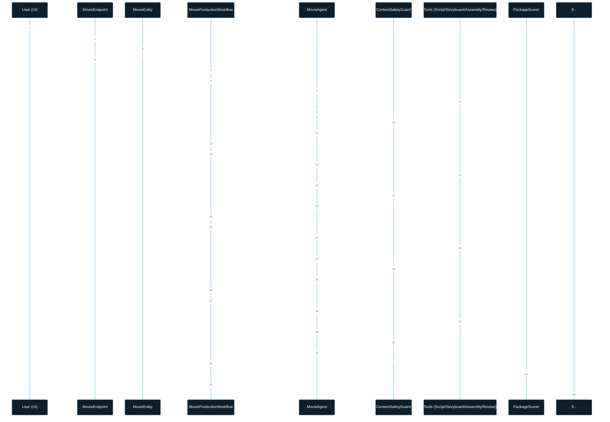
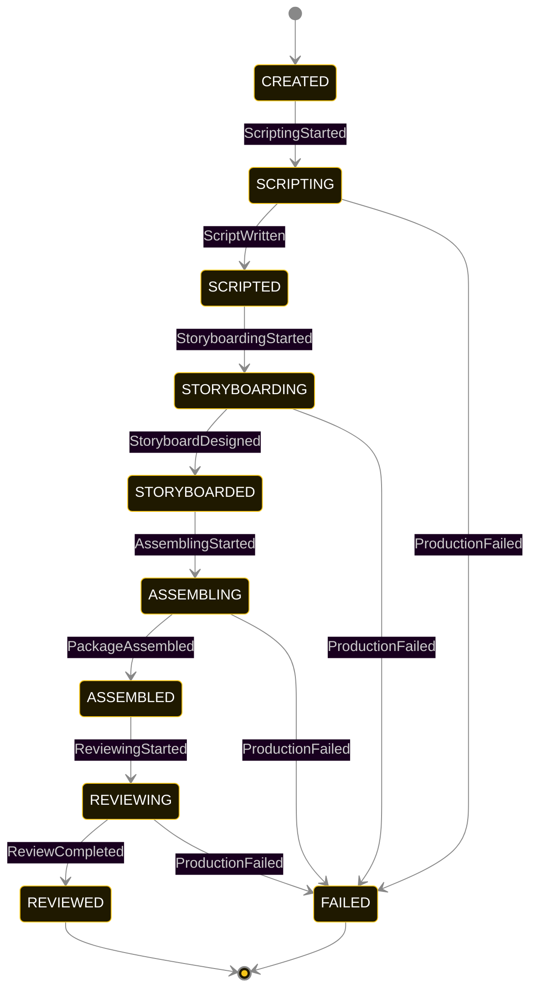
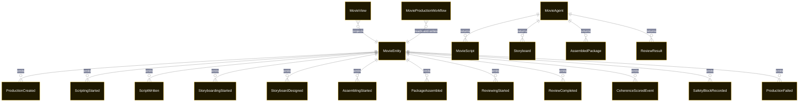

# PLAN — short-movie-agents

Architectural sketch consumed by `/akka:plan` and rendered on the generated system's Architecture tab. The four mermaid diagrams below carry the theme variables and CSS overrides from Lesson 24; without them, state names render black-on-black and edge labels clip.

---

## Component graph

## Interaction sequence — J1 (happy path)

## State machine — `MovieEntity`

`SafetyBlockRecorded` is a side-event recorded on the entity for audit; it does not change the status — the agent's retry stays inside the same task, and the workflow's step continues. Only an exhausted retry budget or a step timeout transitions to FAILED.

## Entity model

## Component table — Java file targets

| Component | Path (generated) |
|---|---|
| `MovieEndpoint` | `api/MovieEndpoint.java` |
| `AppEndpoint` | `api/AppEndpoint.java` |
| `MovieEntity` | `application/MovieEntity.java` (state in `domain/MovieRecord.java`, events in `domain/MovieEvent.java`) |
| `MovieProductionWorkflow` | `application/MovieProductionWorkflow.java` |
| `MovieAgent` | `application/MovieAgent.java` (tasks in `application/MovieTasks.java`) |
| `ScriptTools` | `application/ScriptTools.java` |
| `StoryboardTools` | `application/StoryboardTools.java` |
| `AssemblyTools` | `application/AssemblyTools.java` |
| `ReviewTools` | `application/ReviewTools.java` |
| `ContentSafetyGuard` | `application/ContentSafetyGuard.java` |
| `PackageScorer` | `application/PackageScorer.java` |
| `MovieView` | `application/MovieView.java` |
| `MockModelProvider` (option-a only) | `application/MockModelProvider.java` |
| Bootstrap | `Bootstrap.java` |

## Concurrency notes

- **Per-step timeout**: `scriptStep` 60 s, `storyboardStep` 60 s, `assembleStep` 60 s, `reviewStep` 60 s, `error` 5 s. Default step recovery `maxRetries(2).failoverTo(MovieProductionWorkflow::error)`. The 60 s on each agent-calling step accommodates LLM latency including tool round-trips (Lesson 4).
- **Idempotency**: each workflow uses `"pipeline-" + productionId` as the workflow id; restart of the same productionId is rejected by the workflow runtime. The agent instance id is `"agent-" + productionId` so each production has its own per-task conversation memory.
- **One agent per production**: `MovieAgent` runs four tasks per production — SCRIPT, STORYBOARD, ASSEMBLE, REVIEW — each with `capability(...).maxIterationsPerTask(4)`. The 4-iteration budget gives `ContentSafetyGuard` room to reject a policy-violating response and still let the agent self-correct.
- **Guardrail-driven retry**: when `ContentSafetyGuard` rejects a task result, the rejection is returned as a structured error to the agent loop. The loop counts toward `maxIterationsPerTask`; if all 4 iterations fail the safety check, the workflow step fails over to `error` and the entity transitions to `FAILED`.
- **Eval is synchronous and deterministic**: `PackageScorer` runs in-process inside `reviewStep`. No LLM call, no external service — the same package always scores the same.
- **Task-boundary handoff is the dependency contract**: `scriptStep` writes `ScriptWritten` BEFORE returning; `storyboardStep` reads the recorded `MovieScript` from the entity to build its task's instruction context; `assembleStep` reads both `MovieScript` and `Storyboard`; `reviewStep` reads all three. The agent itself is stateless across phases.
- **No saga / no compensation**: every step is either pure read, append-only event write, or a single-task agent call. A failed production stays at the last successful event; the UI shows the partial state for the user.
