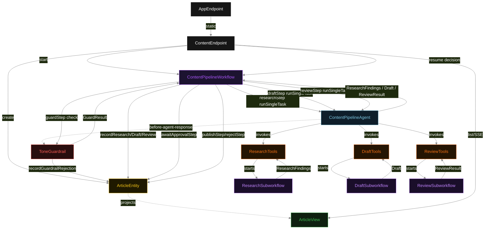
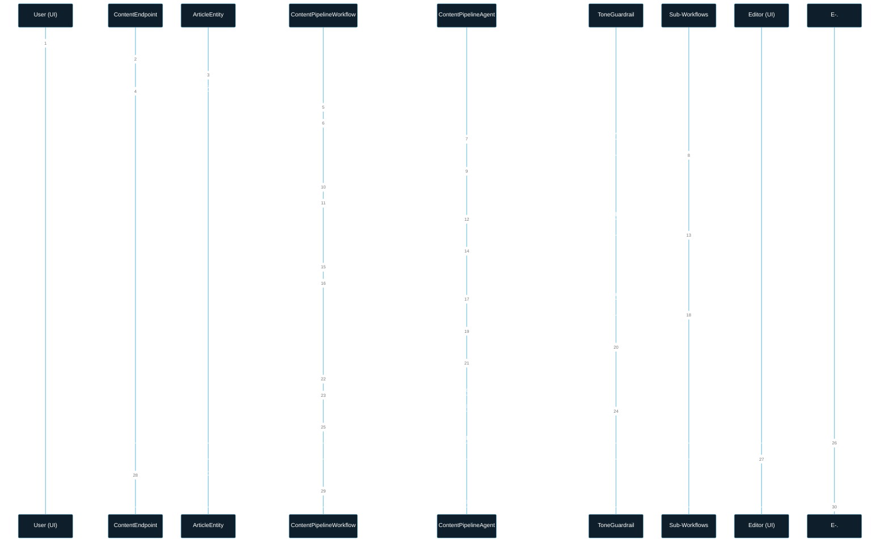
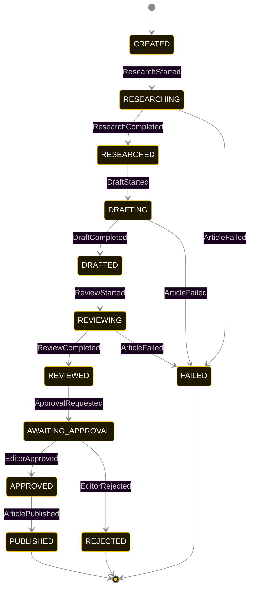

# PLAN — content-pipeline-subworkflow-orchestrator

Architectural sketch consumed by `/akka:plan` and rendered on the generated system's Architecture tab. The four mermaid diagrams below carry the theme variables and CSS overrides from Lesson 24; without them, state names render black-on-black and edge labels clip.

---

## Component graph

## Interaction sequence — J1 (happy path through PUBLISHED)

## State machine — `ArticleEntity`

`GuardrailRejected` is a side-event recorded on the entity for audit; it does not change the status — the agent's retry stays inside the same task. Only an exhausted retry budget or a step timeout transitions to `FAILED`.

## Entity model

```mermaid
%%{init: {'theme':'base','themeVariables':{'primaryColor':'#1f1900','primaryTextColor':'#ffffff','primaryBorderColor':'#F5C518','lineColor':'#888','nodeTextColor':'#ffffff','stateLabelColor':'#ffffff'}}}%%
erDiagram
  ArticleEntity ||--o{ ArticleCreated : emits
  ArticleEntity ||--o{ ResearchStarted : emits
  ArticleEntity ||--o{ ResearchCompleted : emits
  ArticleEntity ||--o{ DraftStarted : emits
  ArticleEntity ||--o{ DraftCompleted : emits
  ArticleEntity ||--o{ ReviewStarted : emits
  ArticleEntity ||--o{ ReviewCompleted : emits
  ArticleEntity ||--o{ GuardChecked : emits
  ArticleEntity ||--o{ ApprovalRequested : emits
  ArticleEntity ||--o{ EditorApproved : emits
  ArticleEntity ||--o{ EditorRejected : emits
  ArticleEntity ||--o{ ArticlePublished : emits
  ArticleEntity ||--o{ GuardrailRejected : emits
  ArticleEntity ||--o{ ArticleFailed : emits
  ArticleView }o--|| ArticleEntity : projects
  ContentPipelineWorkflow }o--|| ArticleEntity : reads-and-writes
  ResearchSubworkflow ||--o{ ResearchFindings : returns
  DraftSubworkflow ||--o{ Draft : returns
  ReviewSubworkflow ||--o{ ReviewResult : returns
  ContentPipelineAgent ||--o{ ResearchFindings : task-result
  ContentPipelineAgent ||--o{ Draft : task-result
  ContentPipelineAgent ||--o{ ReviewResult : task-result
```

## Component table — Java file targets

| Component | Path (generated) |
|---|---|
| `ContentEndpoint` | `api/ContentEndpoint.java` |
| `AppEndpoint` | `api/AppEndpoint.java` |
| `ArticleEntity` | `application/ArticleEntity.java` (state in `domain/ArticleRecord.java`, events in `domain/ArticleEvent.java`) |
| `ContentPipelineWorkflow` | `application/ContentPipelineWorkflow.java` |
| `ResearchSubworkflow` | `application/ResearchSubworkflow.java` |
| `DraftSubworkflow` | `application/DraftSubworkflow.java` |
| `ReviewSubworkflow` | `application/ReviewSubworkflow.java` |
| `ContentPipelineAgent` | `application/ContentPipelineAgent.java` (tasks in `application/ContentPipelineTasks.java`) |
| `ResearchTools` | `application/ResearchTools.java` |
| `DraftTools` | `application/DraftTools.java` |
| `ReviewTools` | `application/ReviewTools.java` |
| `ToneGuardrail` | `application/ToneGuardrail.java` |
| `ArticleView` | `application/ArticleView.java` |
| `MockModelProvider` (option-a only) | `application/MockModelProvider.java` |
| Bootstrap | `Bootstrap.java` |

## Concurrency notes

- **Per-step timeout**: `researchStep` 90 s, `draftStep` 90 s, `reviewStep` 90 s, `guardStep` 10 s, `awaitApprovalStep` no timeout (waits for editor), `publishStep` 5 s, `rejectStep` 5 s, `error` 5 s. Sub-workflow steps: ResearchSubworkflow 15 s each, DraftSubworkflow 15 s each, ReviewSubworkflow 10 s each.
- **Idempotency**: each main workflow uses `"pipeline-" + articleId` as its id; each sub-workflow uses `"research-" + articleId`, `"draft-" + articleId`, `"review-" + articleId`. Restart of the same articleId is rejected by the workflow runtime.
- **One agent per article**: `ContentPipelineAgent` instance id is `"agent-" + articleId`. Each task runs with `maxIterationsPerTask(4)`.
- **Guardrail-driven retry**: `ToneGuardrail` rejects non-compliant agent responses; the loop retries within 4 iterations. If all 4 fail, the step fails over to `error` and the article transitions to `FAILED`.
- **Sub-workflow transparency**: sub-workflows are implementation artifacts. From the sequential-pipeline's perspective, each tool call returns a typed value; whether that value came from a simple function or a multi-step workflow is invisible to the agent and to the pipeline's dependency contract.
- **HITL hard gate**: `awaitApprovalStep` is the only path to `publishStep`. No agent action or timeout can bypass it. The article sits at `AWAITING_APPROVAL` indefinitely until an editor decision arrives.
- **No saga / no compensation**: every step is append-only. A `FAILED` or `REJECTED` article retains its partial phase data; the UI shows what completed before the terminal event.
