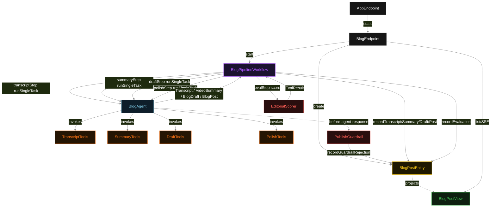
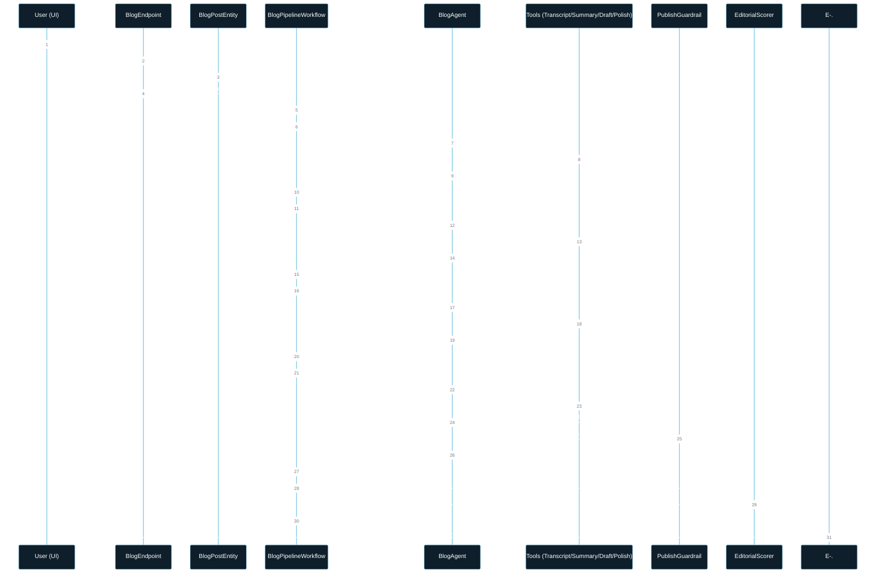
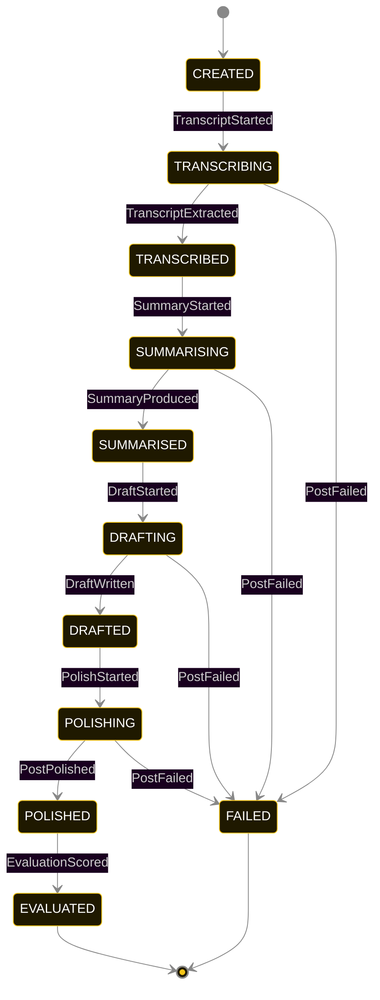
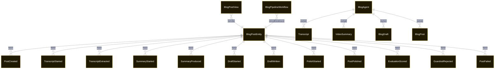

# PLAN — video-to-blog-pipeline

Architectural sketch consumed by `/akka:plan` and rendered on the generated system's Architecture tab. The four mermaid diagrams below carry the theme variables and CSS overrides from Lesson 24; without them, state names render black-on-black and edge labels clip.

---

## Component graph

## Interaction sequence — J1 (happy path)

## State machine — `BlogPostEntity`

GuardrailRejected is a side-event recorded on the entity for audit; it does not change the status — the agent's retry stays inside the same POLISH task, and the workflow's polishStep continues. Only an exhausted retry budget or a step timeout transitions to FAILED.

## Entity model

## Component table — Java file targets

| Component | Path (generated) |
|---|---|
| `BlogEndpoint` | `api/BlogEndpoint.java` |
| `AppEndpoint` | `api/AppEndpoint.java` |
| `BlogPostEntity` | `application/BlogPostEntity.java` (state in `domain/BlogPostRecord.java`, events in `domain/BlogPostEvent.java`) |
| `BlogPipelineWorkflow` | `application/BlogPipelineWorkflow.java` |
| `BlogAgent` | `application/BlogAgent.java` (tasks in `application/BlogTasks.java`) |
| `TranscriptTools` | `application/TranscriptTools.java` |
| `SummaryTools` | `application/SummaryTools.java` |
| `DraftTools` | `application/DraftTools.java` |
| `PolishTools` | `application/PolishTools.java` |
| `PublishGuardrail` | `application/PublishGuardrail.java` |
| `EditorialScorer` | `application/EditorialScorer.java` |
| `BlogPostView` | `application/BlogPostView.java` |
| `MockModelProvider` (option-a only) | `application/MockModelProvider.java` |
| Bootstrap | `Bootstrap.java` |

## Concurrency notes

- **Per-step timeout**: `transcriptStep` 90 s, `summaryStep` 60 s, `draftStep` 60 s, `polishStep` 60 s, `evalStep` 5 s, `error` 5 s. Default step recovery `maxRetries(2).failoverTo(BlogPipelineWorkflow::error)`. The 90 s on `transcriptStep` accommodates the transcript-fetch round-trip; 60 s on each subsequent agent-calling step accommodates LLM latency including tool round-trips (Lesson 4).
- **Idempotency**: each workflow uses `"pipeline-" + postId` as the workflow id; restart of the same postId is rejected by the workflow runtime. The agent instance id is `"agent-" + postId` so each post has its own per-task conversation memory.
- **One agent per post**: `BlogAgent` runs four tasks per post — TRANSCRIPT, SUMMARISE, DRAFT, POLISH — each with `capability(...).maxIterationsPerTask(3)`. The 3-iteration budget on the POLISH task gives the guardrail room to reject a prohibited-content response and still let the agent self-correct.
- **Guardrail-driven retry**: when `PublishGuardrail` rejects a POLISH response, the rejection is returned as a structured error to the agent loop. The loop counts toward `maxIterationsPerTask`; if all 3 iterations are rejected, the workflow step fails over to `error` and the entity transitions to `FAILED`.
- **Eval is synchronous and deterministic**: `EditorialScorer` runs in-process inside `evalStep`. No LLM call, no external service — the same post always scores the same. This is a deliberate single-agent invariant.
- **Task-boundary handoff is the dependency contract**: `transcriptStep` writes `TranscriptExtracted` BEFORE returning; `summaryStep` reads the recorded `Transcript` from the entity to build its task's instruction context; `draftStep` reads `VideoSummary`; `polishStep` reads `BlogDraft`. The agent itself is stateless across phases.
- **No saga / no compensation**: every step is either pure read, append-only event write, or a single-task agent call. A failed post stays at the last successful event; the UI shows the partial state for the user.
