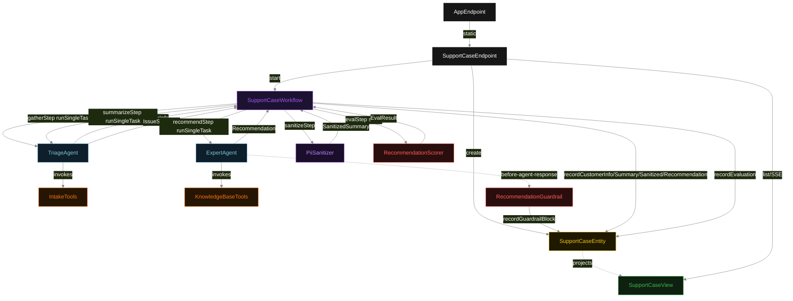
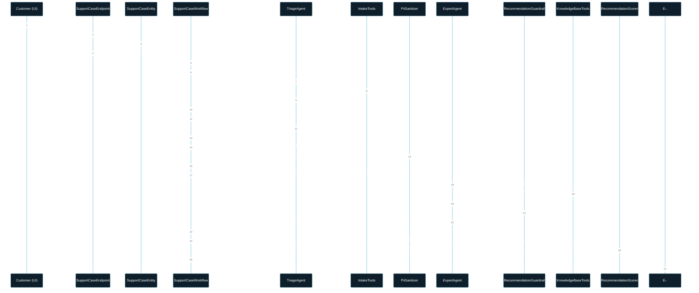
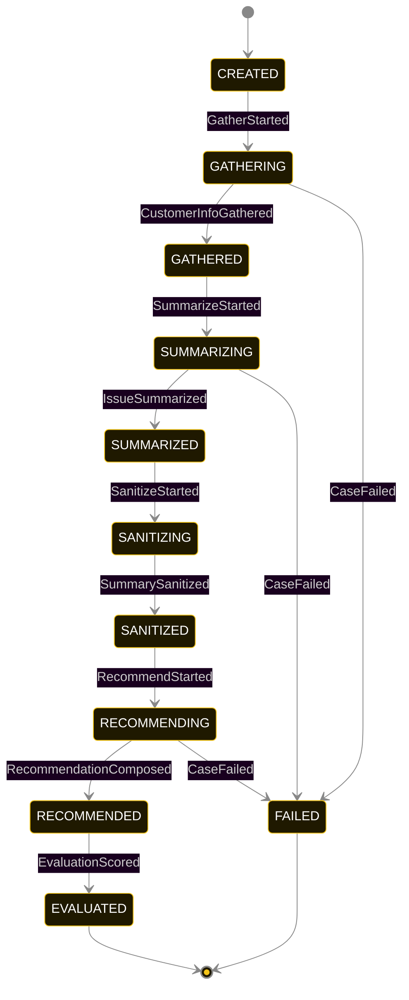
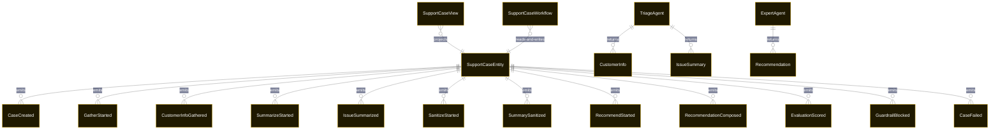

# PLAN — triage-expert-multi-agent-workflow

Architectural sketch consumed by `/akka:plan` and rendered on the generated system's Architecture tab. The four mermaid diagrams below carry the theme variables and CSS overrides from Lesson 24; without them, state names render black-on-black and edge labels clip.

---

## Component graph

## Interaction sequence — J1 (happy path)

## State machine — `SupportCaseEntity`

`GuardrailBlocked` is a side-event recorded on the entity for audit; it does not change the status — the expert agent's retry stays inside the same task, and the workflow's `recommendStep` continues. Only an exhausted retry budget or a step timeout transitions to `FAILED`.

## Entity model

## Component table — Java file targets

| Component | Path (generated) |
|---|---|
| `SupportCaseEndpoint` | `api/SupportCaseEndpoint.java` |
| `AppEndpoint` | `api/AppEndpoint.java` |
| `SupportCaseEntity` | `application/SupportCaseEntity.java` (state in `domain/SupportCaseRecord.java`, events in `domain/SupportCaseEvent.java`) |
| `SupportCaseWorkflow` | `application/SupportCaseWorkflow.java` |
| `TriageAgent` | `application/TriageAgent.java` (tasks in `application/TriageTasks.java`) |
| `ExpertAgent` | `application/ExpertAgent.java` (tasks in `application/ExpertTasks.java`) |
| `IntakeTools` | `application/IntakeTools.java` |
| `KnowledgeBaseTools` | `application/KnowledgeBaseTools.java` |
| `PiiSanitizer` | `application/PiiSanitizer.java` |
| `RecommendationGuardrail` | `application/RecommendationGuardrail.java` |
| `RecommendationScorer` | `application/RecommendationScorer.java` |
| `SupportCaseView` | `application/SupportCaseView.java` |
| `MockModelProvider` (option-a only) | `application/MockModelProvider.java` |
| Bootstrap | `Bootstrap.java` |

## Concurrency notes

- **Per-step timeout**: `gatherStep` 60 s, `summarizeStep` 60 s, `sanitizeStep` 5 s, `recommendStep` 90 s, `evalStep` 5 s, `error` 5 s. Default step recovery `maxRetries(2).failoverTo(SupportCaseWorkflow::error)`. The 90 s on `recommendStep` accommodates three guardrail retry iterations plus LLM latency (Lesson 4).
- **Idempotency**: each workflow uses `"workflow-" + caseId` as the workflow id; resubmitting the same caseId is rejected by the workflow runtime. The agent instance ids are `"triage-" + caseId` and `"expert-" + caseId` so each case has its own per-task conversation memory on each agent.
- **Two agents, one case**: `TriageAgent` runs two tasks per case (GATHER, SUMMARIZE); `ExpertAgent` runs one task (COMPOSE_RECOMMENDATION). Each with `maxIterationsPerTask(3)`. The 3-iteration budget on ExpertAgent gives the guardrail room to block a non-compliant response and let the agent self-correct.
- **Sanitizer is synchronous**: `PiiSanitizer` runs in-process inside `sanitizeStep`. No LLM call, no external service — fast and deterministic. The sanitized summary is the ONLY text forwarded to ExpertAgent; the original `IssueSummary` stays on the entity for authorized audit queries.
- **Guardrail-driven retry**: when `RecommendationGuardrail` blocks a response, the block is returned as a structured error to the agent loop. The loop counts toward `maxIterationsPerTask(3)`; if all 3 iterations are blocked, the workflow step fails over to `error` and the entity transitions to `FAILED`.
- **Eval is synchronous and deterministic**: `RecommendationScorer` runs in-process inside `evalStep`. No LLM call — the same recommendation always scores the same. This is deliberate: an evaluator that itself calls an LLM can drift; a rule-based scorer cannot.
- **No saga / no compensation**: every step is either a pure in-process call, an append-only event write, or a single-task agent call. A failed case stays at the last successful event; the UI shows the partial state.
