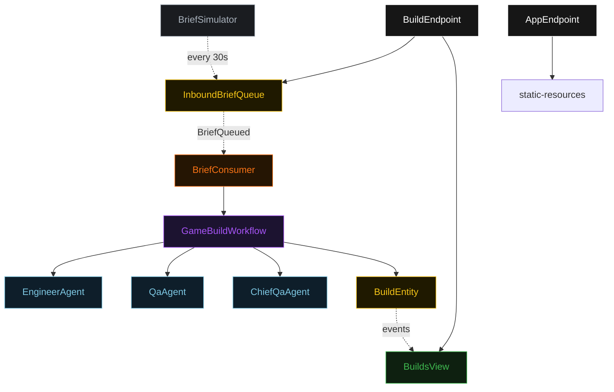
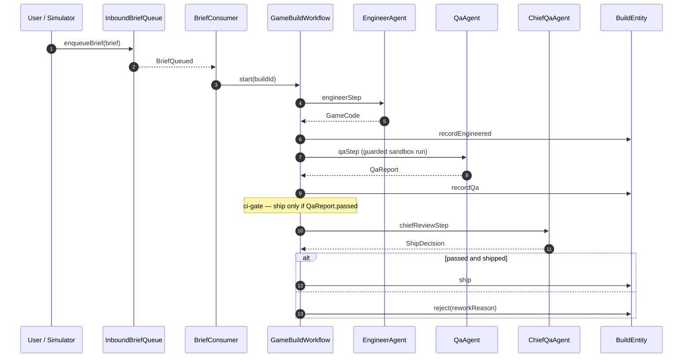
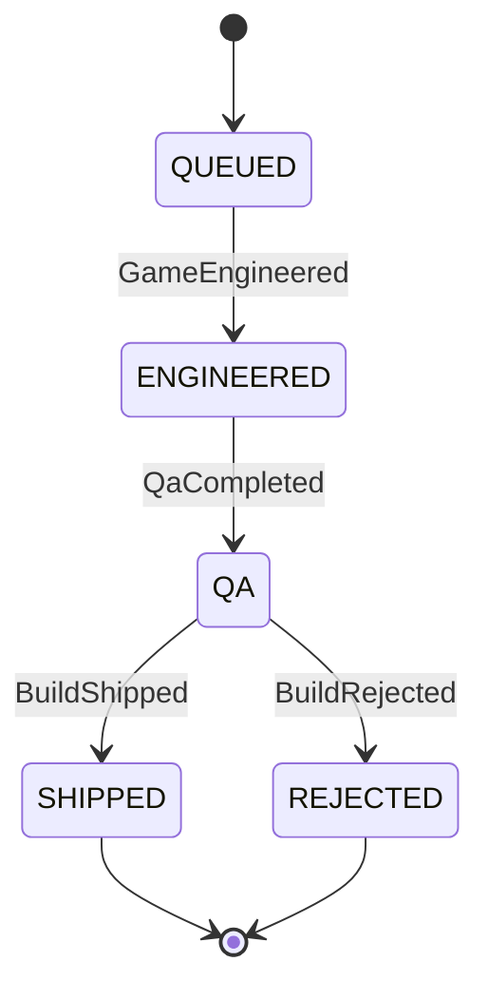
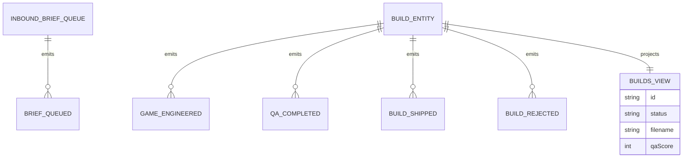

# PLAN — code-team-team

Architectural sketch for the Game Builder Team sample. Four mermaid diagrams + the component table.

---

## Component graph

Solid arrows are synchronous commands; dashed arrows are event subscriptions; dotted arrows are scheduled ticks.

## Interaction sequence

## State machine

## Entity model

## Component table

| Component | Path (generated) |
|---|---|
| EngineerAgent | `application/EngineerAgent.java` |
| QaAgent | `application/QaAgent.java` |
| ChiefQaAgent | `application/ChiefQaAgent.java` |
| BuildTasks | `application/BuildTasks.java` |
| GameBuildWorkflow | `application/GameBuildWorkflow.java` |
| BriefConsumer | `application/BriefConsumer.java` |
| BriefSimulator | `application/BriefSimulator.java` |
| BuildsView | `application/BuildsView.java` |
| BuildEntity | `domain/BuildEntity.java` |
| InboundBriefQueue | `domain/InboundBriefQueue.java` |
| BuildEndpoint | `api/BuildEndpoint.java` |
| AppEndpoint | `api/AppEndpoint.java` |

## Concurrency notes

- **Step timeouts.** `engineerStep`, `qaStep`, and `chiefReviewStep` each set `stepTimeout(ofSeconds(60))` because they call agents; the default 5 s timeout would expire mid-call (Lesson 4). `defaultStepRecovery(maxRetries(2).failoverTo(error))` routes exhausted retries to a terminal error step.
- **Idempotency.** One `buildId` (UUID) per queued brief; the workflow keys all entity commands by that id, so a replayed `BriefQueued` starts a distinct build rather than corrupting an existing one.
- **No compensation needed.** The pipeline is forward-only and the publish target is in-process; a rejected build is a terminal state, not a rollback. The ci-gate (ship only when QA passed) lives in `chiefReviewStep`, so there is no irreversible action to compensate.
- **View indexing.** `BuildsView` exposes a single `getAllBuilds` query with no `WHERE status` clause; status filtering happens client-side in the endpoint (Lesson 2).
