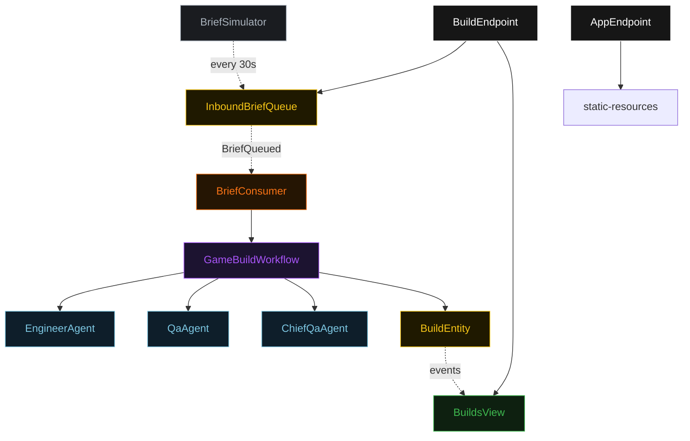
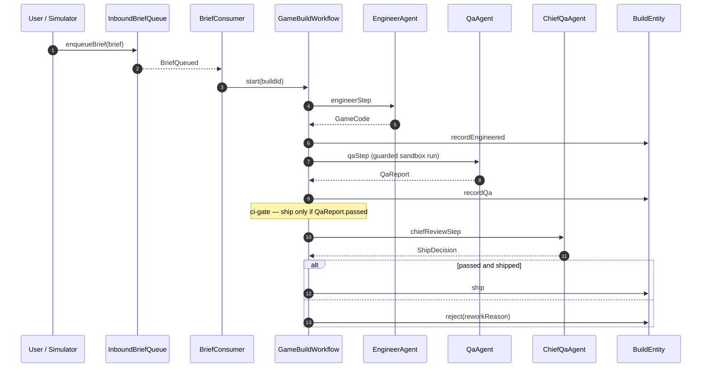
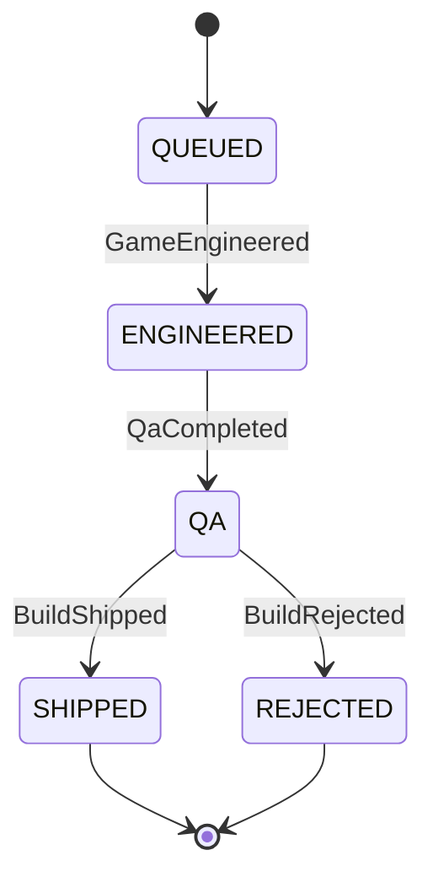
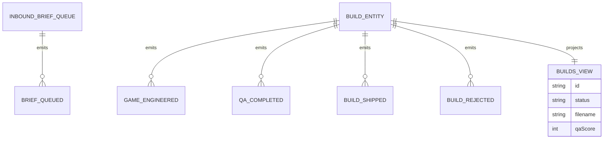

# Architecture — Game Builder Team

A sequential pipeline. One inbound brief produces one build that moves through three agent stages in a fixed order — engineer, QA, chief QA — and ends shipped or rejected. The diagrams below are the source the generated system renders on the Architecture tab.

## Component graph

A brief enters through either the `BuildEndpoint` (user POST) or the `BriefSimulator` timer. Both write to `InboundBriefQueue`. The `BriefConsumer` reacts to each `BriefQueued` event and starts one `GameBuildWorkflow`. The workflow drives the three agents and writes lifecycle events to `BuildEntity`, which the `BuildsView` projects for the endpoint to query and stream.

## Interaction sequence

The QA step is the in-band evaluation point: its `QaReport` carries the score that control E1 records, and the test outcome feeds the ci-gate (A1) that the chief-review step enforces. The guardrail (G1) fires inside `qaStep`, before the sandbox runs the candidate source.

## State machine

The lifecycle is forward-only. `SHIPPED` and `REJECTED` are terminal; there is no rollback because the publish target is in-process and a rejected build is simply a terminal state.

## Entity model

`InboundBriefQueue` and `BuildEntity` are the two event-sourced entities. `BuildsView` is the single read model; it exposes one `getAllBuilds` query with no `WHERE status` clause, so status filtering happens client-side in the endpoint (Akka cannot auto-index enum columns).
