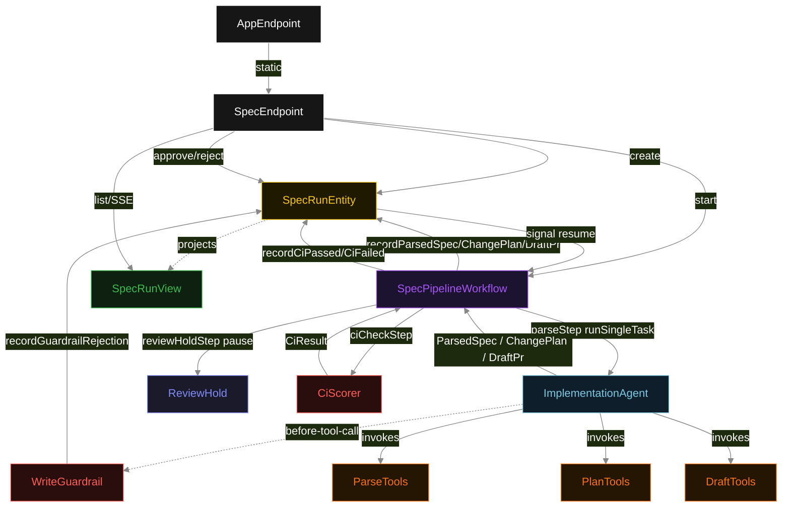
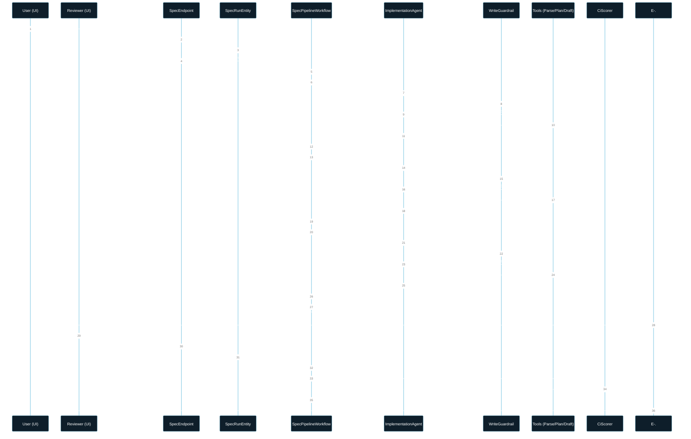
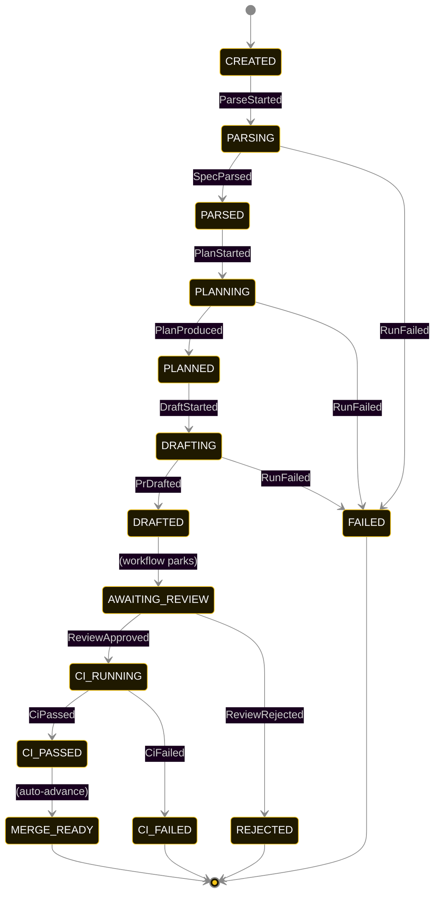
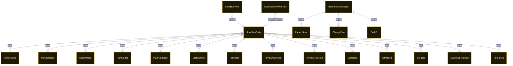

# PLAN — spec-to-pr

Architectural sketch consumed by `/akka:plan` and rendered on the generated system's Architecture tab. The four mermaid diagrams below carry the theme variables and CSS overrides from Lesson 24; without them, state names render black-on-black and edge labels clip.

---

## Component graph

## Interaction sequence — J1 + J3 (happy path with review)

## State machine — `SpecRunEntity`

GuardrailRejected is a side-event recorded on the entity for audit; it does not change the status. ReviewHold is a workflow pause with no timer — only an explicit human signal advances the run. CI_FAILED is terminal; a new run must be submitted if the deployer wants to retry.

## Entity model

## Component table — Java file targets

| Component | Path (generated) |
|---|---|
| `SpecEndpoint` | `api/SpecEndpoint.java` |
| `AppEndpoint` | `api/AppEndpoint.java` |
| `SpecRunEntity` | `application/SpecRunEntity.java` (state in `domain/SpecRunRecord.java`, events in `domain/SpecRunEvent.java`) |
| `SpecPipelineWorkflow` | `application/SpecPipelineWorkflow.java` |
| `ImplementationAgent` | `application/ImplementationAgent.java` (tasks in `application/SpecTasks.java`) |
| `ParseTools` | `application/ParseTools.java` |
| `PlanTools` | `application/PlanTools.java` |
| `DraftTools` | `application/DraftTools.java` |
| `WriteGuardrail` | `application/WriteGuardrail.java` |
| `CiScorer` | `application/CiScorer.java` |
| `SpecRunView` | `application/SpecRunView.java` |
| `MockModelProvider` (option-a only) | `application/MockModelProvider.java` |
| Bootstrap | `Bootstrap.java` |

## Concurrency notes

- **Per-step timeout**: `parseStep` 60 s, `planStep` 60 s, `draftStep` 60 s, `ciCheckStep` 10 s, `error` 5 s. `reviewHoldStep` has no timeout — the hold is unbounded by design; only an explicit `ReviewApproved` or `ReviewRejected` signal unblocks it.
- **HITL hold is not a timeout**: the workflow uses `Workflow.pause()` and resumes only on a human-triggered entity command that signals the workflow. Auto-advance after a timer is explicitly NOT wired.
- **Idempotency**: each workflow uses `"pipeline-" + runId` as the workflow id. The agent instance id is `"agent-" + runId` so each run has its own per-task conversation memory.
- **One agent per run**: `ImplementationAgent` runs three tasks per run — PARSE, PLAN, DRAFT — each with `capability(...).maxIterationsPerTask(4)`. The 4-iteration budget accommodates a guardrail rejection and a self-correction.
- **CI gate is synchronous and deterministic**: `CiScorer` runs in-process inside `ciCheckStep`. No LLM call — the same DraftPr always scores the same.
- **Task-boundary handoff is the dependency contract**: `parseStep` writes `SpecParsed` BEFORE returning; `planStep` reads the recorded `ParsedSpec` from the entity to build its task's instruction context; `draftStep` reads both `ParsedSpec` and `ChangePlan`. The agent is stateless across phases.
- **Guardrail-driven retry**: when `WriteGuardrail` rejects a tool call, the rejection is returned as a structured error to the agent loop. The loop counts toward `maxIterationsPerTask`; if all 4 iterations fail validation, the workflow step fails over to `error`.
