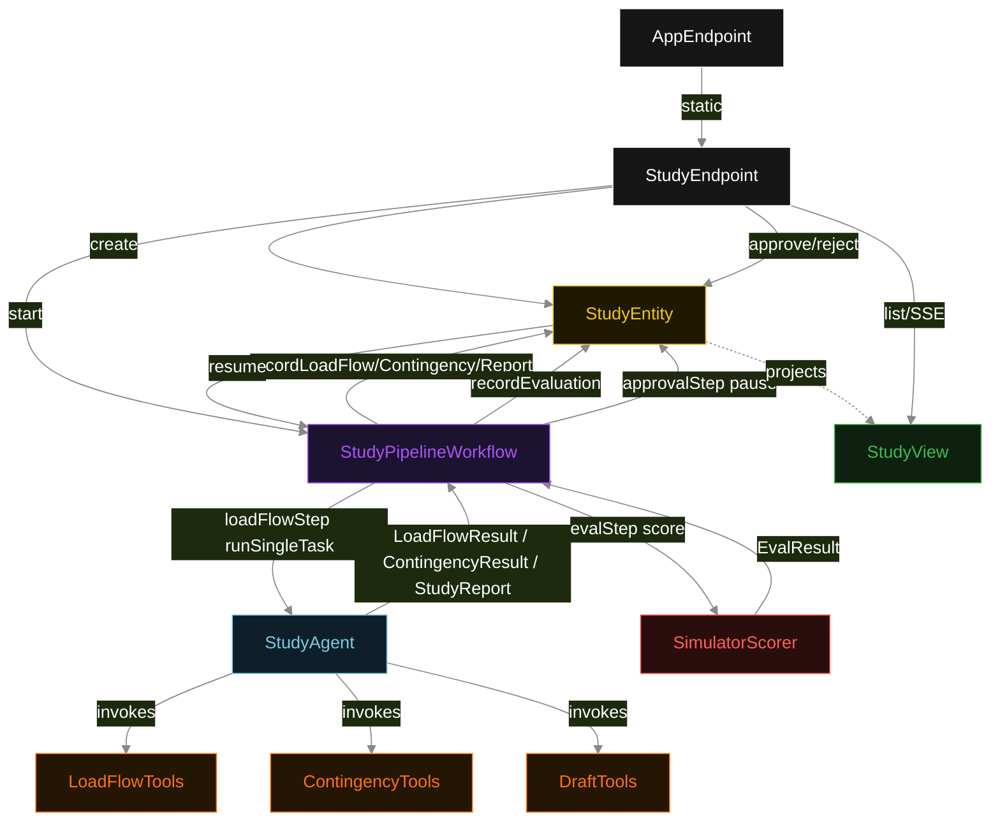
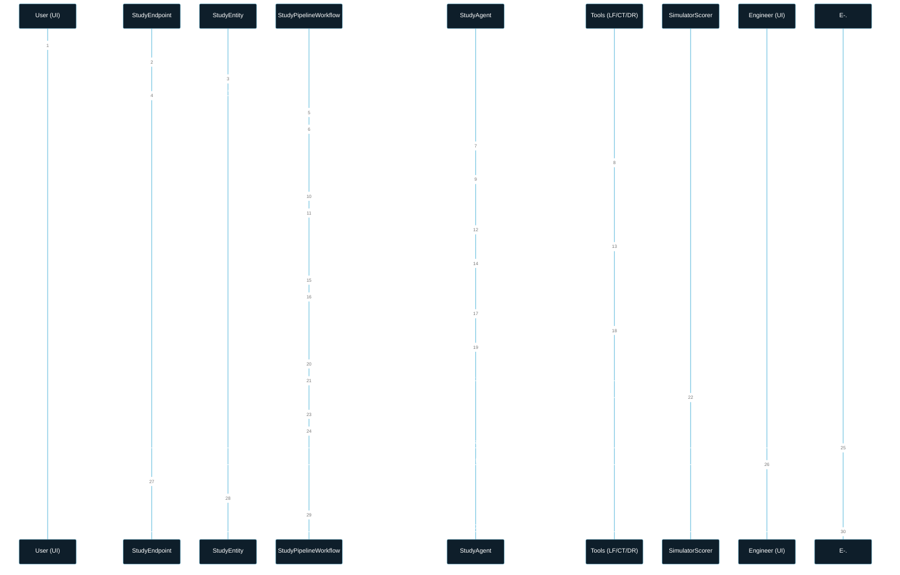
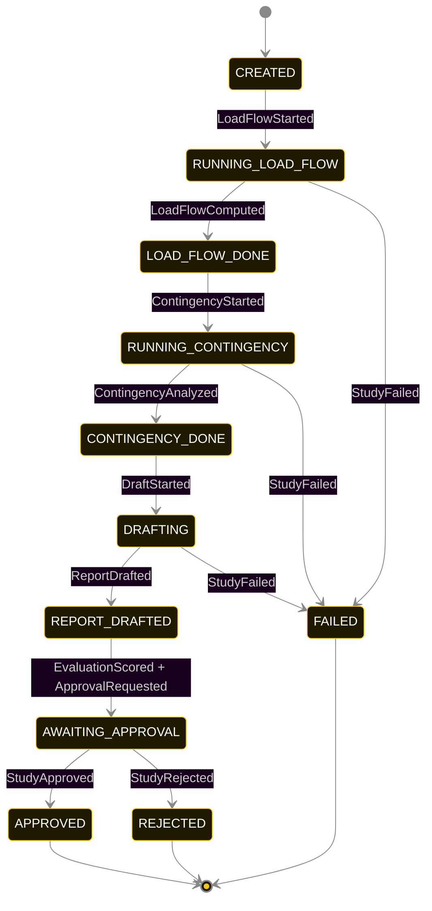
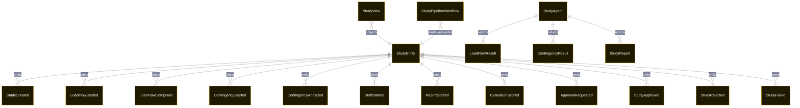

# PLAN — impact-study-runner

Architectural sketch consumed by `/akka:plan` and rendered on the generated system's Architecture tab. The four mermaid diagrams below carry the theme variables and CSS overrides from Lesson 24; without them, state names render black-on-black and edge labels clip.

---

## Component graph

## Interaction sequence — J1 + J2 (happy path with engineer approval)

## State machine — `StudyEntity`

ApprovalRequested is a side-transition to document the workflow's pause point; it does not change status on its own — the combined sequence `EvaluationScored` then `ApprovalRequested` both land before the status settles at `AWAITING_APPROVAL`.

## Entity model

## Component table — Java file targets

| Component | Path (generated) |
|---|---|
| `StudyEndpoint` | `api/StudyEndpoint.java` |
| `AppEndpoint` | `api/AppEndpoint.java` |
| `StudyEntity` | `application/StudyEntity.java` (state in `domain/StudyRecord.java`, events in `domain/StudyEvent.java`) |
| `StudyPipelineWorkflow` | `application/StudyPipelineWorkflow.java` |
| `StudyAgent` | `application/StudyAgent.java` (tasks in `application/StudyTasks.java`) |
| `LoadFlowTools` | `application/LoadFlowTools.java` |
| `ContingencyTools` | `application/ContingencyTools.java` |
| `DraftTools` | `application/DraftTools.java` |
| `SimulatorScorer` | `application/SimulatorScorer.java` |
| `StudyView` | `application/StudyView.java` |
| `MockModelProvider` (option-a only) | `application/MockModelProvider.java` |
| Bootstrap | `Bootstrap.java` |

## Concurrency notes

- **Per-step timeout**: `loadFlowStep` 60 s, `contingencyStep` 60 s, `draftStep` 60 s, `evalStep` 5 s, `approvalStep` null (waits indefinitely), `error` 5 s. Default step recovery `maxRetries(2).failoverTo(StudyPipelineWorkflow::error)`. The 60 s on each agent-calling step accommodates LLM latency including tool round-trips (Lesson 4).
- **Idempotency**: each workflow uses `"pipeline-" + studyId` as the workflow id; restart of the same studyId is rejected by the workflow runtime. The agent instance id is `"agent-" + studyId` so each study has its own per-task conversation memory.
- **One agent per study**: `StudyAgent` runs three tasks per study — LOAD_FLOW, CONTINGENCY, DRAFT — each with `capability(...).maxIterationsPerTask(4)`.
- **Eval is synchronous and deterministic**: `SimulatorScorer` runs in-process inside `evalStep`. No LLM call, no external service — the same report always scores the same.
- **Approval gate is durable**: `approvalStep` persists the waiting state inside the Akka workflow runtime. The engineer's action arrives as an external signal via `StudyEntity.approve` or `StudyEntity.reject`; neither the workflow nor the entity auto-approves on timeout.
- **Task-boundary handoff is the dependency contract**: `loadFlowStep` writes `LoadFlowComputed` BEFORE returning; `contingencyStep` reads the recorded `LoadFlowResult` from the entity to build its task's instruction context; `draftStep` reads both `LoadFlowResult` and `ContingencyResult`. The agent itself is stateless across phases.
- **No saga / no compensation**: every step is either pure read, append-only event write, a single-task agent call, or an external approval wait. A failed study stays at the last successful event; the UI shows the partial state.
