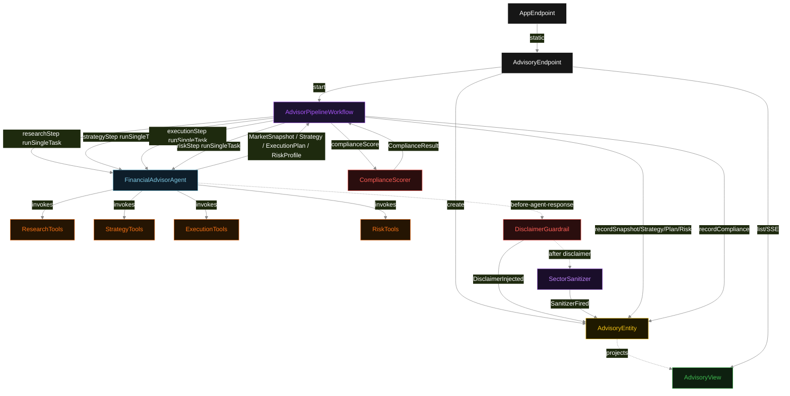
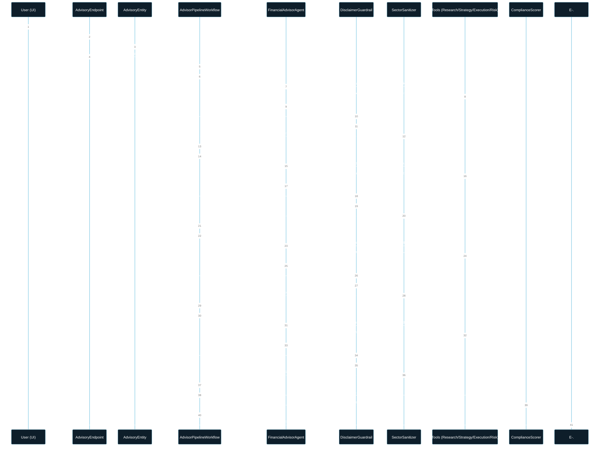
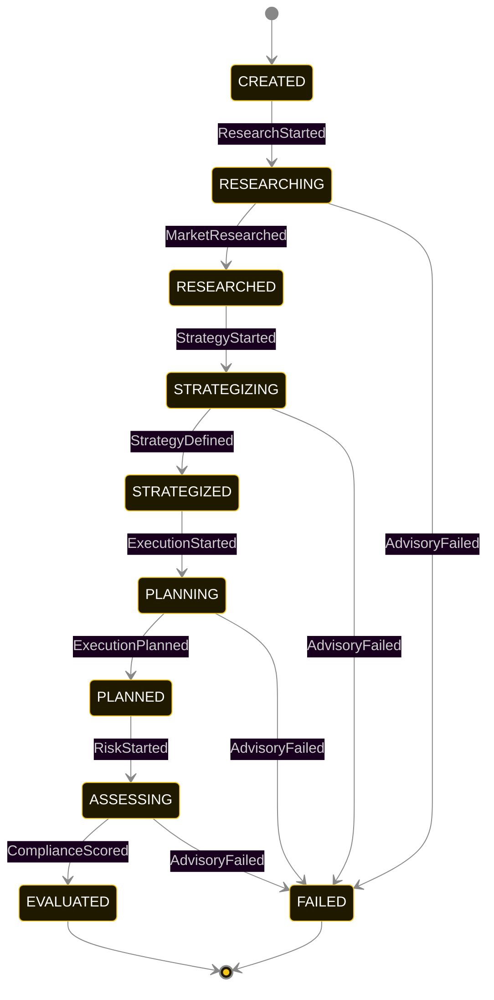

# PLAN — financial-advisor-pipeline

Architectural sketch consumed by `/akka:plan` and rendered on the generated system's Architecture tab. The four mermaid diagrams below carry the theme variables and CSS overrides from Lesson 24; without them, state names render black-on-black and edge labels clip.

---

## Component graph

## Interaction sequence — J1 (happy path)

## State machine — `AdvisoryEntity`

`DisclaimerInjected` and `SanitizerFired` are side-events recorded on the entity for audit; they do not change the `AdvisoryStatus`. A failed advisory preserves the partial state from all completed phases so the UI can show what was collected before the failure.

## Entity model

```mermaid
%%{init: {'theme':'base','themeVariables':{'primaryColor':'#1f1900','primaryTextColor':'#ffffff','primaryBorderColor':'#F5C518','lineColor':'#888','nodeTextColor':'#ffffff','stateLabelColor':'#ffffff'}}}%%
erDiagram
  AdvisoryEntity ||--o{ AdvisoryCreated : emits
  AdvisoryEntity ||--o{ ResearchStarted : emits
  AdvisoryEntity ||--o{ MarketResearched : emits
  AdvisoryEntity ||--o{ StrategyStarted : emits
  AdvisoryEntity ||--o{ StrategyDefined : emits
  AdvisoryEntity ||--o{ ExecutionStarted : emits
  AdvisoryEntity ||--o{ ExecutionPlanned : emits
  AdvisoryEntity ||--o{ RiskStarted : emits
  AdvisoryEntity ||--o{ RiskAssessed : emits
  AdvisoryEntity ||--o{ ReportAssembled : emits
  AdvisoryEntity ||--o{ ComplianceScored : emits
  AdvisoryEntity ||--o{ DisclaimerInjected : emits
  AdvisoryEntity ||--o{ SanitizerFired : emits
  AdvisoryEntity ||--o{ AdvisoryFailed : emits
  AdvisoryView }o--|| AdvisoryEntity : projects
  AdvisorPipelineWorkflow }o--|| AdvisoryEntity : reads-and-writes
  FinancialAdvisorAgent ||--o{ MarketSnapshot : returns
  FinancialAdvisorAgent ||--o{ Strategy : returns
  FinancialAdvisorAgent ||--o{ ExecutionPlan : returns
  FinancialAdvisorAgent ||--o{ RiskProfile : returns
```

## Component table — Java file targets

| Component | Path (generated) |
|---|---|
| `AdvisoryEndpoint` | `api/AdvisoryEndpoint.java` |
| `AppEndpoint` | `api/AppEndpoint.java` |
| `AdvisoryEntity` | `application/AdvisoryEntity.java` (state in `domain/AdvisoryRecord.java`, events in `domain/AdvisoryEvent.java`) |
| `AdvisorPipelineWorkflow` | `application/AdvisorPipelineWorkflow.java` |
| `FinancialAdvisorAgent` | `application/FinancialAdvisorAgent.java` (tasks in `application/AdvisorTasks.java`) |
| `ResearchTools` | `application/ResearchTools.java` |
| `StrategyTools` | `application/StrategyTools.java` |
| `ExecutionTools` | `application/ExecutionTools.java` |
| `RiskTools` | `application/RiskTools.java` |
| `DisclaimerGuardrail` | `application/DisclaimerGuardrail.java` |
| `SectorSanitizer` | `application/SectorSanitizer.java` |
| `ComplianceScorer` | `application/ComplianceScorer.java` |
| `AdvisoryView` | `application/AdvisoryView.java` |
| `MockModelProvider` (option-a only) | `application/MockModelProvider.java` |
| Bootstrap | `Bootstrap.java` |

## Concurrency notes

- **Per-step timeout**: `researchStep` 70 s, `strategyStep` 70 s, `executionStep` 70 s, `riskStep` 70 s, `error` 5 s. Default step recovery `maxRetries(2).failoverTo(AdvisorPipelineWorkflow::error)`. The 70 s on each agent-calling step accommodates LLM latency plus the disclaimer guardrail and sanitizer overhead (Lesson 4).
- **Idempotency**: each workflow uses `"advisory-" + advisoryId` as the workflow id; restart of the same advisoryId is rejected by the workflow runtime. The agent instance id is `"agent-" + advisoryId` so each advisory has its own per-task conversation memory.
- **One agent per advisory**: `FinancialAdvisorAgent` runs four tasks per advisory — RESEARCH, STRATEGY, EXECUTE, ASSESS — each with `capability(...).maxIterationsPerTask(4)`. The 4-iteration budget accommodates transient tool failures without letting the agent loop indefinitely.
- **Governance is output-side, not input-side**: unlike a phase-gate guardrail that checks tool-call order, `DisclaimerGuardrail` and `SectorSanitizer` operate on every outbound agent response, regardless of which task produced it. They fire on all four phases.
- **Eval is synchronous and deterministic**: `ComplianceScorer` runs in-process inside `riskStep` after the risk profile is recorded. No LLM call — the same report always scores the same.
- **Task-boundary handoff**: `researchStep` writes `MarketResearched` BEFORE advancing; `strategyStep` reads the recorded `MarketSnapshot` from the entity to build its instruction context; `executionStep` reads `Strategy`; `riskStep` reads all three. The agent is stateless across phases.
- **No saga / no compensation**: every step is either pure read, append-only event write, or a single-task agent call. A failed advisory stays at the last successful event; the UI shows the partial state.
- **Disclaimer audit completeness**: because `DisclaimerGuardrail` records `DisclaimerInjected` on the entity for every outbound response, the advisory's `disclaimerLog` always has exactly as many entries as there were successful phase responses. A missing entry is a gap the audit trail surfaces.
