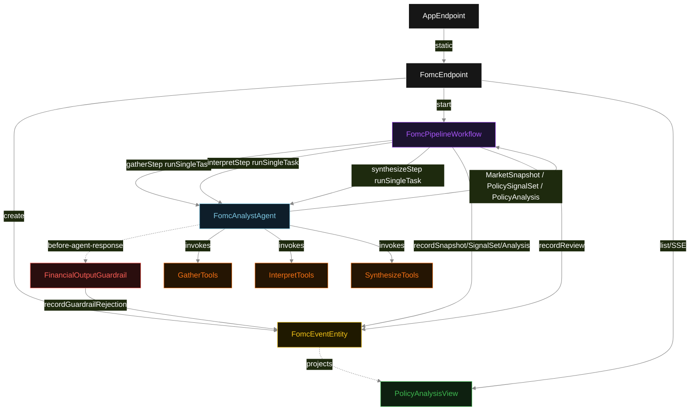
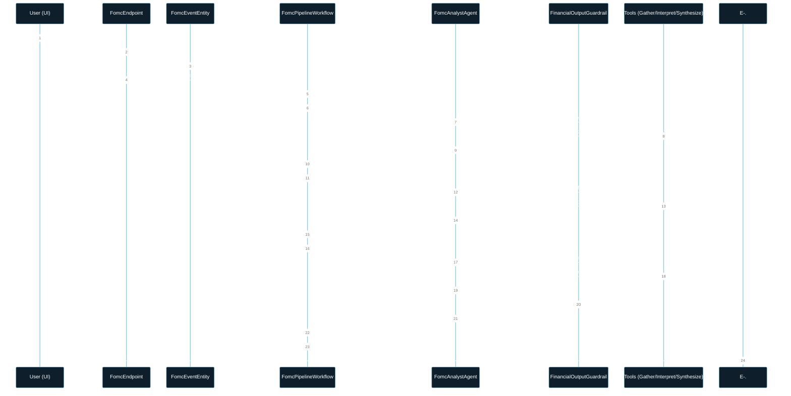
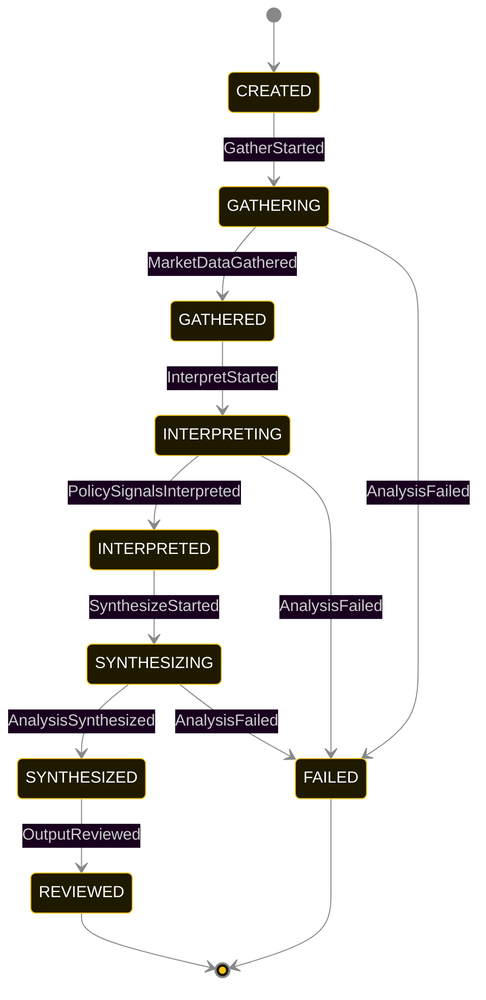
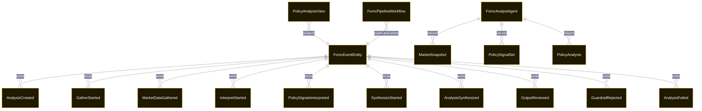

# PLAN — fomc-event-analyst

Architectural sketch consumed by `/akka:plan` and rendered on the generated system's Architecture tab. The four mermaid diagrams below carry the theme variables and CSS overrides from Lesson 24; without them, state names render black-on-black and edge labels clip.

---

## Component graph

## Interaction sequence — J1 (happy path)

## State machine — `FomcEventEntity`

`GuardrailRejected` is a side-event recorded on the entity for audit; it does not change the status — the agent's retry stays inside the same SYNTHESIZE task, and the workflow's step continues. Only an exhausted retry budget or a step timeout transitions to `FAILED`.

## Entity model

## Component table — Java file targets

| Component | Path (generated) |
|---|---|
| `FomcEndpoint` | `api/FomcEndpoint.java` |
| `AppEndpoint` | `api/AppEndpoint.java` |
| `FomcEventEntity` | `application/FomcEventEntity.java` (state in `domain/AnalysisRecord.java`, events in `domain/AnalysisEvent.java`) |
| `FomcPipelineWorkflow` | `application/FomcPipelineWorkflow.java` |
| `FomcAnalystAgent` | `application/FomcAnalystAgent.java` (tasks in `application/FomcTasks.java`) |
| `GatherTools` | `application/GatherTools.java` |
| `InterpretTools` | `application/InterpretTools.java` |
| `SynthesizeTools` | `application/SynthesizeTools.java` |
| `FinancialOutputGuardrail` | `application/FinancialOutputGuardrail.java` |
| `PolicyAnalysisView` | `application/PolicyAnalysisView.java` |
| `MockModelProvider` (option-a only) | `application/MockModelProvider.java` |
| Bootstrap | `Bootstrap.java` |

## Concurrency notes

- **Per-step timeout**: `gatherStep` 60 s, `interpretStep` 60 s, `synthesizeStep` 60 s, `reviewStep` 5 s, `error` 5 s. Default step recovery `maxRetries(2).failoverTo(FomcPipelineWorkflow::error)`. The 60 s on each agent-calling step accommodates LLM latency including tool round-trips (Lesson 4).
- **Idempotency**: each workflow uses `"pipeline-" + analysisId` as the workflow id; restart of the same analysisId is rejected by the workflow runtime. The agent instance id is `"agent-" + analysisId` so each analysis has its own per-task conversation memory.
- **One agent per analysis**: `FomcAnalystAgent` runs three tasks per analysis — GATHER, INTERPRET, SYNTHESIZE — each with `capability(...).maxIterationsPerTask(4)`. The 4-iteration budget gives the guardrail room to reject an ungrounded output and still let the agent self-correct.
- **Guardrail-driven retry**: when `FinancialOutputGuardrail` rejects the SYNTHESIZE task's response, the rejection is returned as a structured error to the agent loop. The loop counts toward `maxIterationsPerTask`; if all 4 iterations fail validation, the workflow step fails over to `error` and the entity transitions to `FAILED`.
- **No saga / no compensation**: every step is either pure read, append-only event write, or a single-task agent call. A failed analysis stays at the last successful event; the UI shows the partial state for the user.
- **Task-boundary handoff is the dependency contract**: `gatherStep` writes `MarketDataGathered` BEFORE returning; `interpretStep` reads the recorded `MarketSnapshot` to build the INTERPRET task's instruction context; `synthesizeStep` reads both `MarketSnapshot` and `PolicySignalSet`. The agent itself is stateless across phases.
